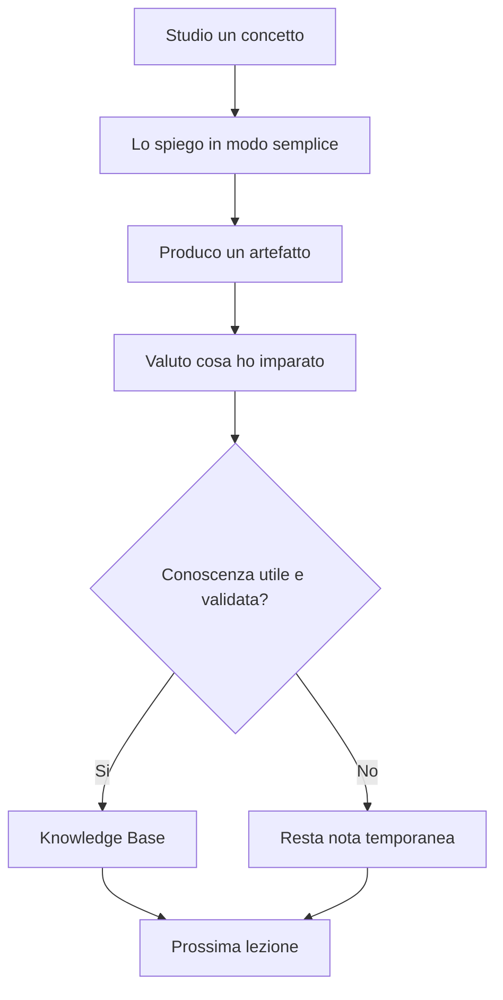

# 00 - Come usare questo manuale

## Obiettivo

Impostare il metodo di lavoro di AgentFactory.

Questo manuale non serve a raccogliere appunti casuali. Serve a costruire competenza progressiva fino alla progettazione di sistemi multi-agent professionali.

## Regola principale

Ogni lezione deve fare avanzare il percorso.

Una buona lezione deve rispondere a queste domande:

```text
Cosa ho capito?
Cosa so fare adesso che prima non sapevo fare?
Quale artefatto ho prodotto?
Quale conoscenza merita di restare?
Quale passo viene dopo?
```

## Come lavorare

1. Studiare un concetto alla volta.
2. Scriverlo in modo semplice.
3. Produrre un piccolo artefatto.
4. Salvare eventuali template riutilizzabili.
5. Decidere cosa entra nella knowledge base.
6. Passare al passo successivo solo quando il precedente e' chiaro.

## Schema del metodo



Questo schema mostra il principio del manuale: non accumulare testo, ma trasformare apprendimento in conoscenza utile.

## Tipi di file

- `lessons/`: lezioni del percorso.
- `templates/`: modelli riutilizzabili.
- `agents/`: schede degli agenti progettati.
- `experiments/`: prove reali e prototipi.
- `knowledge-base/`: conoscenza validata.
- `governance/`: regole di controllo e sicurezza.

## Artefatto prodotto

Questo file e' il primo artefatto del nuovo percorso: definisce come usare il manuale.

## Conoscenza da assorbire

Il manuale deve crescere solo con contenuti utili al percorso verso la Agent Factory.
