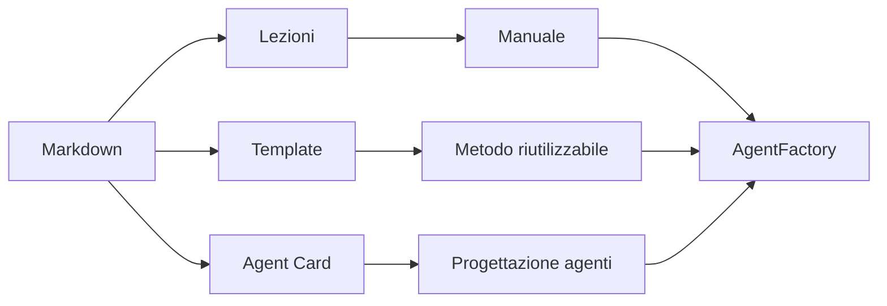
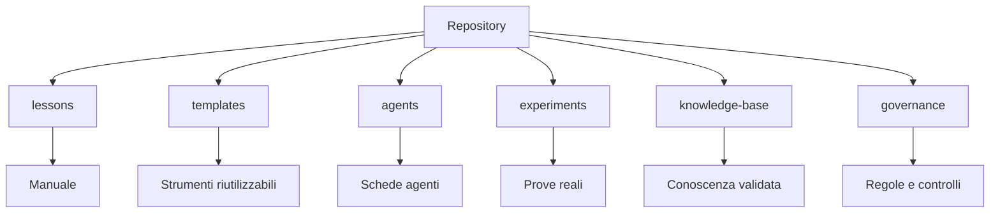

# 01 - Fondamenta operative

## Obiettivo

Capire i primi mattoni del percorso:

- Markdown;
- artefatto;
- template;
- Agent Card;
- repository come memoria versionata.

Senza questi concetti, progettare agenti diventa confuso.

## Mappa dei mattoni iniziali



Questa mappa chiarisce perche' partiamo da strumenti apparentemente semplici: Markdown, template e Agent Card sono i materiali di base con cui costruiremo il sistema.

## Markdown

Markdown e' un formato per scrivere documenti testuali semplici.

Un file Markdown ha estensione `.md`.

Esempio:

```md
# Titolo

## Sezione

- punto 1
- punto 2
```

Markdown e' utile per AgentFactory perche':

- e' leggibile;
- e' facile da modificare;
- funziona bene con Git;
- puo' diventare manuale, template, scheda agente o report.

## Artefatto

Un artefatto e' un risultato concreto del lavoro.

Esempi:

- una lezione;
- una Agent Card;
- un report;
- una checklist;
- un documento requisiti;
- un prompt operativo;
- un test plan.

Regola:

```text
Se non posso verificarlo, non e' ancora un buon artefatto.
```

## Template

Un template e' un modello riutilizzabile.

Serve a non ripartire ogni volta da zero.

Esempio: un template di lezione stabilisce sempre le stesse sezioni minime.

## Agent Card

Una Agent Card e' la scheda tecnica di un agente.

Risponde a domande come:

- qual e' la missione dell'agente?
- cosa riceve in input?
- cosa deve produrre?
- quali tool puo' usare?
- quali limiti ha?
- quando deve chiedere conferma?
- come si valuta il suo output?

## Repository come memoria versionata

GitHub non e' automaticamente memoria intelligente.

Pero' e' un ottimo posto per salvare:

- lezioni;
- template;
- agenti;
- esperimenti;
- regole;
- conoscenza validata.

La memoria nasce quando i file sono organizzati, mantenuti e riutilizzati.

## Repository come base della factory



Il repository non contiene solo pagine da leggere. Contiene anche gli elementi che diventeranno la base operativa della futura Agent Factory.

## Artefatto prodotto

Primo glossario operativo minimo:

- Markdown;
- artefatto;
- template;
- Agent Card;
- repository come memoria versionata.

## Prossimo passo

Capire che cos'e' davvero un AI Agent e perche' non coincide con un semplice prompt.
