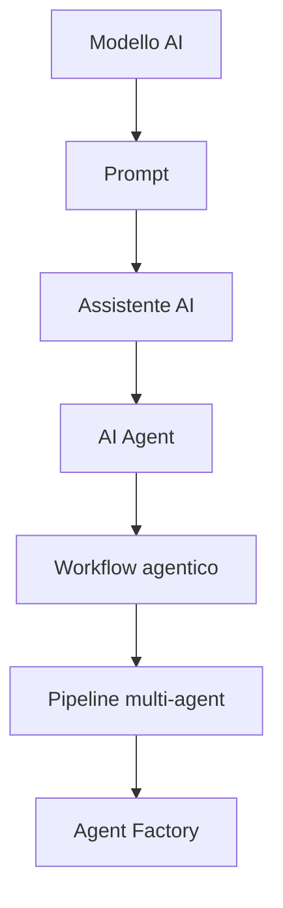
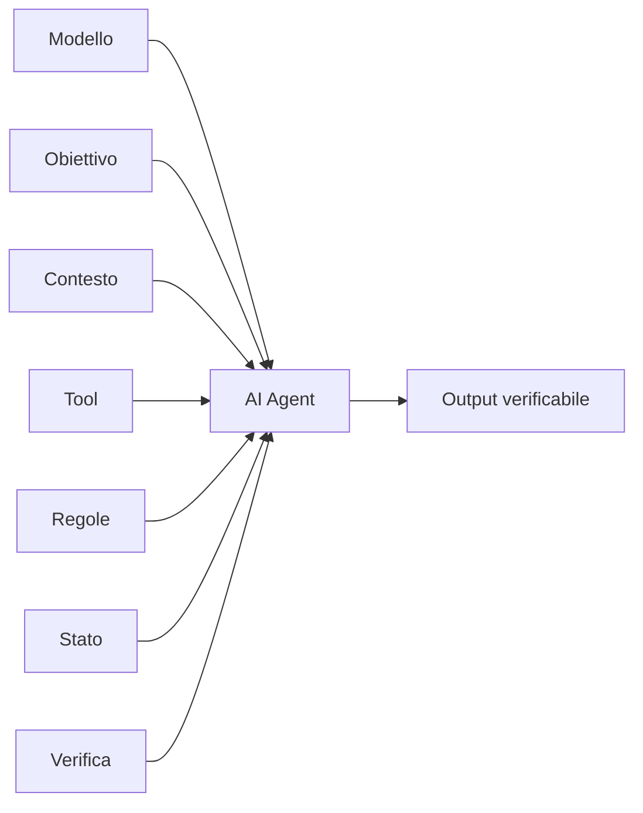
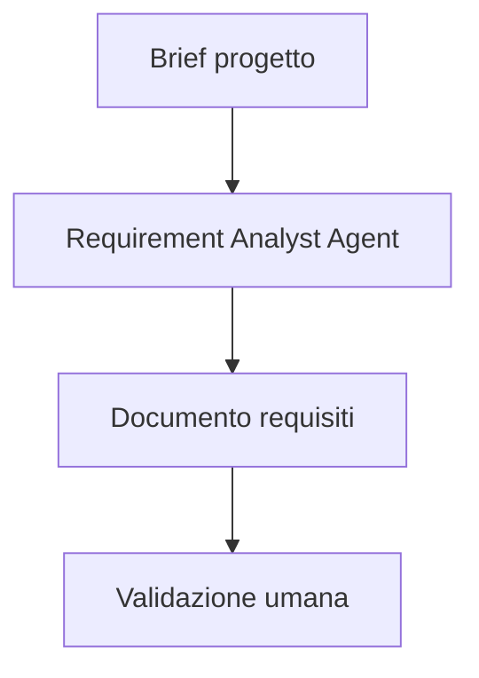
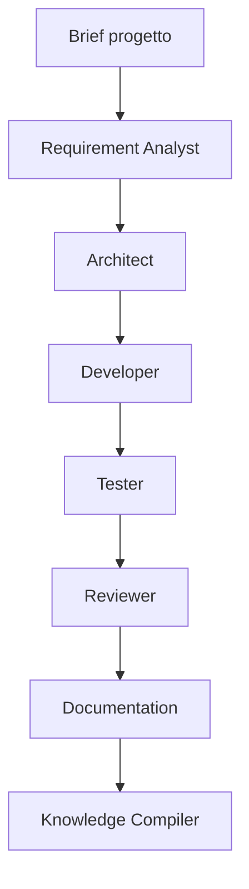
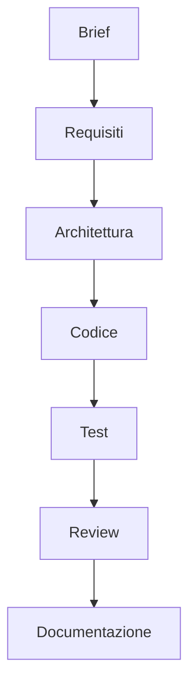
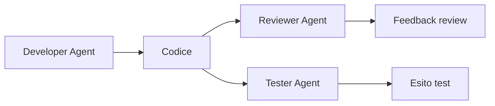
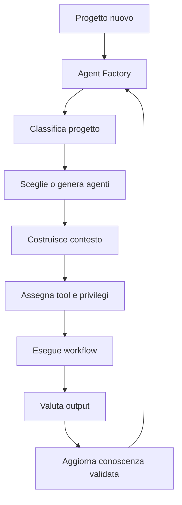

# 02 - Che cos'e' davvero un AI Agent

## Obiettivo della lezione

Questa lezione serve a chiarire una distinzione fondamentale: un AI Agent non e' semplicemente un modello AI che risponde a una domanda.

Alla fine di questa lezione devo saper distinguere:

- un modello AI;
- un prompt;
- un assistente AI;
- un AI Agent;
- un workflow agentico;
- una pipeline multi-agent;
- una Agent Factory.

Questa distinzione e' il primo passo serio per diventare capace di progettare sistemi agentici. Se sbaglio questa base, tutto il resto diventa confuso.

## Perche' questa lezione conta

Nel linguaggio comune, oggi si tende a chiamare "agente" qualunque cosa usi un modello linguistico.

Questo e' pericoloso per chi vuole lavorare seriamente.

Se chiamo agente un semplice prompt, rischio di sovrastimare quello che ho costruito. Se chiamo agente un assistente che risponde in chat, rischio di pensare di avere un sistema operativo quando in realta' ho solo una conversazione. Se non distinguo un agente da una pipeline, rischio di affidare troppe responsabilita' a un unico componente.

AgentFactory nasce per evitare questa confusione.

L'obiettivo non e' usare parole moderne. L'obiettivo e' imparare a progettare sistemi che:

- ricevono obiettivi;
- usano contesto;
- seguono regole;
- usano strumenti;
- producono artefatti verificabili;
- vengono valutati;
- migliorano nel tempo attraverso conoscenza validata.

Per questo serve una definizione operativa di AI Agent.

## Mappa della distinzione



Questa mappa non indica una classifica di valore. Indica livelli crescenti di struttura. Ogni livello aggiunge responsabilita', controllo e complessita'.

## Prerequisiti

Prima di questa lezione devo avere chiari i concetti introdotti nella lezione precedente:

- Markdown;
- artefatto;
- template;
- Agent Card;
- repository come memoria versionata.

In particolare, devo ricordare che un artefatto e' un output concreto e verificabile. Questo concetto tornera' continuamente, perche' un agente professionale deve produrre artefatti, non solo testo generico.

## Il problema: la parola "agente" viene usata troppo facilmente

Un errore comune e' pensare:

```text
Uso un modello AI.
Gli do un prompt lungo.
Quindi ho creato un agente.
```

Questa idea e' sbagliata.

Un prompt lungo puo' essere utile, ma non basta a definire un agente. Un agente non e' definito dalla lunghezza del prompt. E' definito dal ruolo che ha dentro un processo.

La domanda giusta non e':

```text
Quanto e' intelligente la risposta?
```

La domanda giusta e':

```text
Questo sistema ha un obiettivo, un contesto, regole, strumenti, limiti, output verificabili e un criterio di valutazione?
```

Se la risposta e' no, probabilmente non ho ancora un agente. Ho un prompt, un assistente o un pezzo di workflow.

## Prima distinzione: modello AI

Il modello AI e' il motore cognitivo.

Esempi:

```text
GPT-5.5
GPT-5.4 mini
un modello open source
un modello specializzato per codice
```

Il modello e' cio' che genera testo, ragiona, interpreta istruzioni e puo' scegliere azioni quando l'ambiente glielo permette.

Pero' il modello, da solo, non e' un agente.

Un paragone utile:

```text
Il modello e' come un motore.
L'agente e' il veicolo completo: motore, telaio, volante, regole di guida, percorso, sensori, limiti e destinazione.
```

Un motore potente e' importante, ma non basta. Senza struttura, direzione e controllo, non ho un sistema affidabile.

## Seconda distinzione: prompt

Un prompt e' una richiesta data al modello.

Esempio:

```text
Scrivimi una funzione Python che somma due numeri.
```

Questo e' un prompt semplice.

Un prompt puo' anche essere piu' articolato:

```text
Agisci come un esperto Python.
Scrivi una funzione pulita, commentata e con un esempio di utilizzo.
```

Questo prompt e' migliore del primo, ma resta un prompt.

Perche'?

Perche' non definisce ancora un sistema completo. Non ci sono veri strumenti, non c'e' uno stato operativo, non c'e' un processo di verifica esterno, non c'e' un output inserito in una pipeline, non c'e' responsabilita' duratura.

Il prompt e' il modo in cui comunico con il modello.

L'agente e' il modo in cui organizzo il modello dentro un processo.

## Terza distinzione: assistente AI

Un assistente AI e' piu' ampio di un singolo prompt.

Esempio:

```text
Ti mando un documento.
Aiutami a capirlo, riassumerlo e migliorarlo.
```

Qui c'e' un contesto. L'assistente puo' seguire la conversazione, ricordare cosa e' stato detto nel thread corrente, proporre miglioramenti.

Questo e' gia' piu' utile di un prompt isolato.

Ma non e' automaticamente un agente professionale.

Un assistente puo' aiutarmi a ragionare. Un agente deve avere una responsabilita' operativa piu' precisa.

La differenza e' sottile ma fondamentale:

```text
Assistente: mi aiuta a lavorare.
Agente: lavora dentro un ruolo definito, con input, output, regole e criteri di qualita'.
```

## Definizione operativa di AI Agent

Per AgentFactory useremo questa formula:

```text
AI Agent = Modello + Obiettivo + Contesto + Tool + Regole + Stato + Verifica + Output
```



Questa formula e' importante perche' obbliga a progettare l'agente come sistema.

Vediamo ogni elemento.

## Modello

Il modello e' il componente AI che interpreta, ragiona e genera.

Scegliere un modello migliore puo' aumentare la qualita', ma non risolve da solo problemi di progettazione.

Un agente progettato male resta fragile anche se usa un modello potente.

## Obiettivo

L'obiettivo dice cosa l'agente deve ottenere.

Obiettivo debole:

```text
Analizza questo progetto.
```

Obiettivo migliore:

```text
Analizza questo brief grezzo e produci un documento requisiti con fatti, ipotesi, domande aperte, requisiti funzionali, requisiti non funzionali e rischi.
```

Nel secondo caso e' piu' chiaro cosa deve essere prodotto.

Un agente senza obiettivo chiaro tende a diventare un assistente generico.

## Contesto

Il contesto e' l'insieme delle informazioni che l'agente puo' usare per lavorare.

Esempi:

- richiesta dell'utente;
- file del repository;
- documentazione;
- template;
- regole operative;
- output di altri agenti;
- vincoli di progetto.

Il contesto non deve essere infinito. Deve essere selezionato.

Un agente professionale non riceve "tutto". Riceve cio' che serve per il compito.

Questo sara' un tema enorme del percorso: Context Engineering.

## Tool

I tool sono gli strumenti che l'agente puo' usare.

Esempi:

- leggere file;
- scrivere file;
- cercare nel repository;
- usare GitHub;
- eseguire test;
- chiamare API;
- interrogare un database;
- usare un browser.

Senza tool, un agente puo' ragionare e scrivere, ma non puo' agire davvero sull'ambiente.

Pero' i tool aumentano anche il rischio.

Un agente che puo' leggere file e' poco pericoloso. Un agente che puo' scrivere codice, cancellare file, fare deploy o modificare permessi deve essere governato molto meglio.

Qui nasce il tema dei privilegi.

## Regole

Le regole definiscono come l'agente deve comportarsi.

Esempi:

```text
Non inventare requisiti non presenti.
Marca ogni deduzione come ipotesi.
Non modificare file senza conferma.
Produci output in Markdown.
Se mancano informazioni critiche, fai domande.
```

Le regole sono fondamentali perche' danno confini al comportamento dell'agente.

Un agente senza regole puo' produrre output apparentemente utili ma pericolosi, perche' potrebbe mescolare fatti e ipotesi, saltare passaggi, agire troppo presto o nascondere incertezza.

## Stato

Lo stato e' cio' che l'agente mantiene durante il lavoro.

Esempi:

- quali file ha gia' letto;
- quali requisiti ha gia' identificato;
- quali domande restano aperte;
- quale step della pipeline e' in corso;
- quali errori sono stati trovati.

Lo stato puo' essere temporaneo o persistente.

Per ora basta capire questo: un agente professionale non vive solo nella singola risposta. Lavora dentro un processo che puo' avere fasi, memoria di lavoro e avanzamento.

## Verifica

La verifica serve a capire se l'output e' buono.

Esempi:

- checklist;
- test automatici;
- review umana;
- confronto con criteri di qualita';
- validazione del formato;
- controllo di completezza.

Senza verifica, l'agente puo' produrre testo convincente ma sbagliato.

Questo e' uno dei punti piu' importanti del percorso: non dobbiamo fidarci dell'agente solo perche' scrive bene.

Un sistema professionale deve controllare.

## Output

L'output e' cio' che l'agente produce.

Per AgentFactory, l'output ideale e' un artefatto verificabile.

Esempi:

- documento requisiti;
- Agent Card;
- report di analisi;
- checklist;
- test plan;
- proposta di architettura;
- pull request;
- lesson learned.

Un agente che produce solo una risposta generica e' poco utile in una pipeline.

Un agente che produce un artefatto strutturato puo' passare il lavoro all'agente successivo.

## Esempio semplice: dalla richiesta al piccolo agente

Prompt semplice:

```text
Fammi una lista di requisiti per una webapp di ticket.
```

Risultato probabile:

```text
Il modello genera una lista plausibile.
```

Problema:

```text
Non so quali requisiti derivano dal brief, quali sono ipotesi e quali sono invenzioni.
```

Versione da assistente:

```text
Ti do una descrizione del progetto. Aiutami a chiarire i requisiti e fammi domande se qualcosa manca.
```

Risultato migliore:

```text
L'assistente collabora, ma il formato e la responsabilita' restano poco stabili.
```

Versione da agente:

```text
Agisci come Requirement Analyst Agent.

Obiettivo:
Trasformare un brief grezzo in un documento requisiti verificabile.

Regole:
- separa fatti, ipotesi e domande aperte;
- non inventare requisiti;
- numera i requisiti;
- separa requisiti funzionali e non funzionali;
- segnala cosa richiede validazione umana.

Output:
Documento Markdown con sezioni obbligatorie.
```

Qui siamo piu' vicini a un agente, perche' abbiamo definito ruolo, obiettivo, regole, output e criteri.

## Esempio professionale: Requirement Analyst Agent

Immaginiamo un contesto reale.

Un cliente dice:

```text
Vorremmo una piattaforma interna per gestire le richieste ferie.
I dipendenti devono poter inviare richieste.
I responsabili devono approvarle.
L'amministrazione deve consultare lo storico.
Sarebbe utile avere notifiche e calendario.
```

Un assistente generico potrebbe rispondere con una lista di funzionalita'.

Un Requirement Analyst Agent professionale dovrebbe invece produrre un artefatto strutturato:

```text
Fatti certi:
- Il sistema riguarda richieste ferie.
- I dipendenti inviano richieste.
- I responsabili approvano o rifiutano.
- L'amministrazione consulta lo storico.

Ipotesi:
- Potrebbe servire autenticazione.
- Potrebbero esistere ruoli diversi.
- Il calendario potrebbe essere mensile o annuale.

Domande aperte:
- Quali tipi di permesso vanno gestiti?
- Esistono regole contrattuali diverse?
- Le notifiche devono essere email, app o altro?

Requisiti funzionali:
- RF-001: il sistema deve permettere al dipendente di creare una richiesta.
- RF-002: il sistema deve permettere al responsabile di approvare o rifiutare.

Requisiti non funzionali:
- RNF-001: il sistema deve mantenere tracciabilita' delle decisioni.

Validazione umana richiesta:
- regole ferie;
- ruoli;
- notifiche;
- storico.
```

Questa differenza e' enorme.

Nel primo caso ho una risposta utile.

Nel secondo caso ho un artefatto che puo' essere passato a un Architect Agent, a un Developer Agent o a un Tester Agent.

## Quando un agente e' utile

Un agente e' utile quando il task richiede:

- interpretazione di input ambigui;
- decisioni basate su contesto;
- produzione di artefatti;
- uso di strumenti;
- controllo di qualita';
- passaggio di lavoro ad altri ruoli;
- tracciamento di cosa e' stato fatto;
- miglioramento tramite lezioni apprese.

Esempi di task adatti a un agente:

- analizzare un brief di progetto;
- leggere un repository e produrre un report;
- trasformare requisiti in backlog;
- creare un test plan;
- revisionare una pull request;
- estrarre lesson learned da un progetto finito.

## Quando NON conviene usare un agente

Non tutto deve diventare agentico.

Se un processo e' semplice, ripetitivo e deterministico, spesso basta un'automazione.

Esempio:

```text
Ogni giorno alle 8:00 invia una mail con il report generato ieri.
```

Questo non richiede un agente. Richiede uno script o un'automazione schedulata.

Usare un agente dove basta un'automazione crea complessita' inutile.

Regola:

```text
Gli agenti servono dove serve interpretazione, giudizio, contesto o produzione ragionata di artefatti.
```

## Workflow agentico

Un workflow agentico e' una sequenza di passaggi in cui uno o piu' agenti lavorano con un obiettivo.

Esempio:



Qui non c'e' ancora una grande pipeline. Ma c'e' gia' un processo:

1. arriva un input;
2. un agente lo trasforma;
3. viene prodotto un artefatto;
4. una persona valida.

Questo e' molto piu' professionale di una semplice conversazione.

## Pipeline multi-agent

Una pipeline multi-agent usa piu' agenti specializzati.

Esempio:



Ogni agente ha una responsabilita' diversa.

Questo e' fondamentale.

Se un solo agente fa tutto, puo' funzionare per compiti piccoli, ma diventa fragile su progetti complessi.

Una pipeline multi-agent permette di separare:

- analisi;
- progettazione;
- implementazione;
- verifica;
- documentazione;
- apprendimento.

La separazione delle responsabilita' serve a migliorare controllo, qualita' e tracciabilita'.

## Perche' un agente singolo diventa fragile su progetti complessi

Un agente singolo puo' funzionare molto bene su task piccoli o medi.

Diventa fragile quando il progetto cresce perche' aumentano contemporaneamente:

- quantita' di informazioni;
- numero di decisioni;
- numero di vincoli;
- numero di artefatti;
- numero di responsabilita';
- rischio di errore;
- necessita' di verifica.

Il problema non e' solo il contesto, ma il contesto e' una parte importante del problema.

Quando un agente deve fare tutto, deve tenere insieme troppe cose:

```text
requisiti
architettura
codice
test
documentazione
vincoli
decisioni
errori
priorita'
memoria del progetto
```

Questo crea almeno quattro rischi.

### Rischio 1 - Sovraccarico di contesto

Il contesto operativo dell'agente diventa troppo grande o troppo rumoroso.

Se carico troppi file, troppe regole e troppe conversazioni, l'agente puo':

- perdere dettagli importanti;
- dare peso a informazioni secondarie;
- confondere decisioni vecchie e nuove;
- non distinguere bene fatti, ipotesi e preferenze;
- produrre risposte apparentemente coerenti ma non davvero controllate.

Il problema non e' solo "quanti token entrano". Il problema e' anche la qualita' del contesto.

Un contesto grande ma disordinato puo' essere peggiore di un contesto piccolo ma ben selezionato.

### Rischio 2 - Conflitto di ruolo

Un agente che analizza, progetta, sviluppa, testa e documenta deve cambiare ruolo continuamente.

Questo e' fragile perche' ogni ruolo ha criteri diversi.

Esempio:

```text
Requirement Analyst: deve evitare soluzioni premature.
Architect: deve proporre soluzioni tecniche.
Developer: deve implementare.
Tester: deve cercare difetti.
Reviewer: deve essere critico.
Documentation Agent: deve spiegare.
```

Se un solo agente fa tutto, puo' mischiare mentalita' diverse.

Potrebbe progettare mentre dovrebbe ancora chiarire requisiti.

Potrebbe difendere il codice che ha appena scritto invece di criticarlo.

Potrebbe documentare una scelta non validata.

### Rischio 3 - Verifica debole

Quando lo stesso agente produce e verifica il proprio lavoro, il controllo e' piu' debole.

Non perche' l'agente sia "pigro", ma perche' tende a valutare il risultato dentro lo stesso contesto mentale con cui lo ha generato.

Se ha fatto una scelta sbagliata durante la generazione, puo' portarsi dietro la stessa assunzione anche nella revisione.

Esempio:

```text
L'agente interpreta male un requisito.
Scrive codice basato su quell'interpretazione.
Poi controlla il codice continuando a considerare corretta l'interpretazione iniziale.
```

Un altro agente, con ruolo di Reviewer o Tester, puo' ricevere un contesto diverso e una missione diversa:

```text
Non devi difendere la soluzione.
Devi cercare errori, ambiguita', rischi e violazioni dei criteri.
```

Questa separazione aumenta la probabilita' di trovare problemi.

### Rischio 4 - Responsabilita' non tracciabile

Se un solo agente fa tutto, quando qualcosa va male e' piu' difficile capire dove e' nato l'errore.

Errore nei requisiti?

Errore di architettura?

Errore di implementazione?

Errore di test?

Errore di documentazione?

Con una pipeline multi-agent, ogni fase produce un artefatto. Questo rende il processo piu' osservabile.



Ogni freccia e' un punto in cui posso controllare cosa e' successo.

## Perche' un agente che scrive codice non dovrebbe essere l'unico a controllarlo

Un agente che scrive codice puo' fare una prima autoverifica.

Questo e' utile.

Ma non dovrebbe essere l'unico controllo.

La ragione e' che generazione e revisione sono due attivita' diverse.

Chi genera tende a portarsi dietro:

- assunzioni fatte all'inizio;
- interpretazioni implicite;
- preferenze di soluzione;
- omissioni non viste;
- fiducia nel proprio percorso.

Un agente revisore deve invece avere una missione diversa:

```text
Cerca bug, rischi, requisiti non rispettati, test mancanti, confusione, regressioni e assunzioni non validate.
```

Questa separazione non garantisce perfezione, ma migliora il controllo.

E' lo stesso principio del lavoro umano:

```text
Chi scrive codice puo' controllarlo.
Ma una code review indipendente trova spesso problemi diversi.
```

Nel multi-agent, questa separazione diventa architettura:



Il Developer Agent produce.

Il Reviewer Agent critica.

Il Tester Agent verifica rispetto ai comportamenti attesi.

Questa divisione riduce il rischio che lo stesso errore mentale attraversi tutte le fasi senza essere visto.

## Agent Factory

Una Agent Factory e' un livello ancora superiore.

Non e' solo una pipeline fissa.

E' un sistema che, dato un progetto, puo':

- capire che tipo di lavoro serve;
- scegliere quali agenti usare;
- creare agenti temporanei se necessario;
- assegnare contesto specifico;
- definire privilegi;
- orchestrare il workflow;
- valutare risultati;
- assorbire conoscenza utile;
- migliorare template, regole e agenti.

Schema:



Questa e' la destinazione finale del percorso.

Non voglio solo imparare a creare un agente.

Voglio imparare a creare il sistema che crea, governa e migliora agenti.

## Criterio pratico: e' davvero un agente?

Per riconoscere se qualcosa e' davvero un agente, posso usare questa checklist:

```text
- Ha un obiettivo chiaro?
- Ha input definiti?
- Ha un contesto controllato?
- Ha regole operative?
- Ha tool o possibilita' di azione?
- Ha limiti espliciti?
- Produce un artefatto verificabile?
- Ha criteri di qualita'?
- Sa quando fermarsi o chiedere conferma?
- Il suo output puo' essere usato da un altro agente o da una persona?
```

Se mancano quasi tutti questi elementi, non ho un agente.

Ho un prompt o un assistente.

## Anti-pattern ed errori comuni

### Errore 1 - Confondere modello e agente

Errore:

```text
Uso un modello molto potente, quindi ho un agente potente.
```

Perche' e' sbagliato:

```text
Il modello e' solo un componente. Senza obiettivo, regole, tool, output e verifica non ho un sistema agentico robusto.
```

Correzione:

```text
Progettare l'agente come sistema, non come semplice chiamata al modello.
```

### Errore 2 - Confondere prompt lungo e agente

Errore:

```text
Il prompt e' lungo e dettagliato, quindi e' un agente.
```

Perche' e' sbagliato:

```text
La lunghezza del prompt non garantisce responsabilita', stato, verifica o integrazione in un workflow.
```

Correzione:

```text
Definire Agent Card, input, output, regole e criteri di qualita'.
```

### Errore 3 - Usare agenti dove basta automazione

Errore:

```text
Creo un agente per ogni task.
```

Perche' e' sbagliato:

```text
Gli agenti introducono costo, rischio e variabilita'. Se il task e' deterministico, un'automazione e' spesso migliore.
```

Correzione:

```text
Prima classificare il problema, poi decidere se serve un agente.
```

### Errore 4 - Dare troppe responsabilita' a un solo agente

Errore:

```text
Un solo agente analizza, progetta, sviluppa, testa, rilascia e aggiorna la memoria.
```

Perche' e' rischioso:

```text
Si perdono controllo, separazione delle responsabilita' e qualita' della verifica.
```

Correzione:

```text
Separare ruoli e creare una pipeline multi-agent quando il task cresce.
```

## Collegamento con AgentFactory

Questa lezione definisce il primo mattone teorico del percorso.

AgentFactory non deve diventare una collezione di prompt. Deve diventare un sistema di progettazione.

Per arrivarci, ogni agente futuro dovra' essere descritto almeno con:

- nome;
- missione;
- responsabilita';
- input;
- output;
- tool;
- privilegi;
- regole;
- criteri di qualita';
- punti di stop;
- modalita' di miglioramento.

Questi elementi finiranno nelle Agent Card.

La prossima fase del percorso servira' proprio a capire quando usare un agente e quando invece scegliere automazione, workflow, pipeline o Agent Factory.

## Artefatto prodotto

Questa lezione produce la prima definizione operativa di AI Agent per AgentFactory:

```text
AI Agent = Modello + Obiettivo + Contesto + Tool + Regole + Stato + Verifica + Output
```

Produce anche una checklist pratica per riconoscere un agente:

```text
Obiettivo
Input
Contesto
Regole
Tool
Limiti
Output verificabile
Criteri di qualita'
Punti di stop
Handoff possibile
```

## Verifica personale

Dopo questa lezione devo saper rispondere con parole mie:

```text
1. Perche' un modello AI non e' automaticamente un agente?
2. Qual e' la differenza tra prompt, assistente e agente?
3. Quali elementi minimi servono per progettare un agente?
4. Perche' un agente deve produrre artefatti verificabili?
5. Quando conviene non usare un agente?
6. Che differenza c'e' tra agente singolo, workflow agentico, pipeline multi-agent e Agent Factory?
7. Perche' separare responsabilita' tra agenti migliora la qualita'?
```

## Conoscenza da assorbire

- Il modello AI e' il motore, non l'intero agente.
- Un prompt non basta per definire un agente.
- Un assistente aiuta, ma un agente lavora dentro un ruolo operativo.
- Un agente professionale deve avere obiettivo, contesto, regole, tool, output e verifica.
- Gli agenti devono produrre artefatti verificabili.
- Non tutto deve essere agentico: dove basta automazione, usare automazione.
- La pipeline multi-agent serve a separare responsabilita' e migliorare controllo.
- La Agent Factory non e' un singolo agente: e' il sistema che crea, coordina e migliora agenti.

## Prossimo passo

Capire quando usare automazione, workflow, agente singolo, pipeline multi-agent o Agent Factory.
