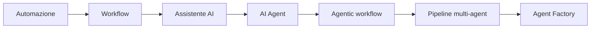
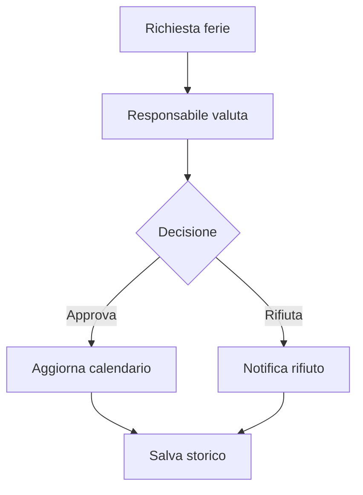
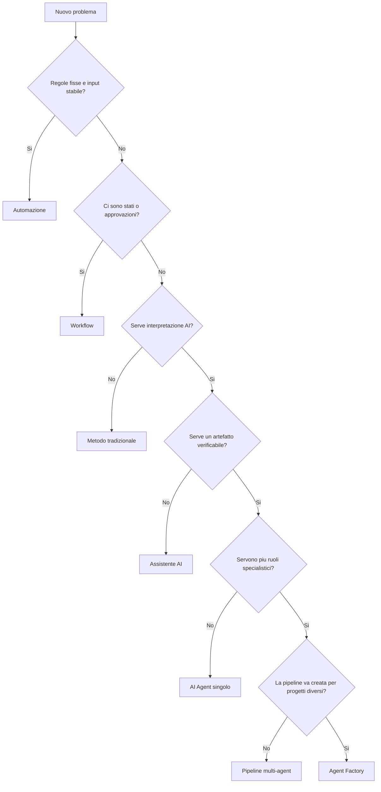
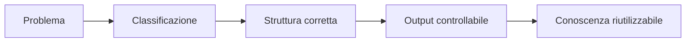

# 03 - Quando usare automazione, workflow, agente o Agent Factory

## Obiettivo della lezione

Questa lezione serve a imparare una competenza fondamentale: scegliere la struttura giusta per un problema.

Non basta sapere cos'e' un AI Agent. Bisogna capire quando usarlo, quando non usarlo, quando basta una semplice automazione, quando serve un workflow, quando serve un agente singolo, quando serve una pipeline multi-agent e quando ha senso parlare di Agent Factory.

Alla fine di questa lezione devo saper distinguere:

- automazione;
- workflow;
- assistente AI;
- AI Agent;
- agentic workflow;
- pipeline multi-agent;
- Agent Factory.

Devo anche saper guardare un problema reale e dire:

```text
Per questo caso serve questa struttura, non un'altra.
```

## Perche' questa lezione conta

Uno degli errori piu' comuni nel mondo AI e' usare l'AI dove non serve.

Un altro errore e' usare un singolo agente dove servirebbe una pipeline.

Un altro ancora e' costruire una pipeline multi-agent quando basterebbe una funzione, uno script o una checklist.

Chi vuole diventare forte professionalmente deve imparare a scegliere il livello giusto di complessita'.

La domanda non e':

```text
Posso usare un agente qui?
```

La domanda vera e':

```text
Qual e' la struttura minima che risolve bene il problema, mantenendo qualita', controllo, costi e sicurezza?
```

Questa e' una domanda da architetto, non da semplice utilizzatore di tool.

AgentFactory deve insegnare proprio questo: progettare sistemi agentici quando servono, non applicare agenti ovunque.

## Prerequisiti

Prima di questa lezione devo avere chiari:

- cosa e' un artefatto;
- cosa e' un template;
- cosa e' una Agent Card;
- perche' un modello AI non e' automaticamente un agente;
- la formula operativa:

```text
AI Agent = Modello + Obiettivo + Contesto + Tool + Regole + Stato + Verifica + Output
```

Questa formula resta il riferimento.

## Il problema: non tutti i task sono uguali

Nel lavoro reale, i problemi arrivano in forme molto diverse.

Esempio 1:

```text
Ogni venerdi' alle 18 invia una mail con il report settimanale.
```

Esempio 2:

```text
Quando arriva una richiesta ferie, falla approvare dal responsabile e poi notifica l'amministrazione.
```

Esempio 3:

```text
Analizza questo brief ambiguo e trasformalo in requisiti verificabili.
```

Esempio 4:

```text
Prendi questo progetto software, analizzalo, proponi architettura, implementa una prima versione, testa e documenta.
```

Esempio 5:

```text
Voglio un sistema che, per ogni nuovo progetto, capisca quali agenti servono, li configuri, li coordini e migliori la conoscenza dopo ogni esecuzione.
```

Questi cinque esempi non richiedono la stessa soluzione.

Se tratto tutti come "problemi da AI Agent", progetto male.

## Scala di complessita'



Questa scala aiuta a non saltare subito alla soluzione piu' complessa. Il lavoro professionale consiste nel salire di livello solo quando il problema lo richiede.

## Livello 1: automazione

Una automazione e' un processo che esegue istruzioni predefinite.

Funziona bene quando:

- l'input e' chiaro;
- le regole sono stabili;
- non serve interpretazione;
- il risultato atteso e' sempre simile;
- gli errori sono prevedibili;
- il processo puo' essere descritto in modo deterministico.

Esempio:

```text
Ogni giorno alle 7:00 scarica un file CSV da una cartella, rinominalo con la data e salvalo in archivio.
```

Qui non serve un agente.

Serve una automazione.

Un agente aggiungerebbe costo, variabilita' e rischio senza portare vero valore.

## Perche' l'automazione e' importante anche in AgentFactory

AgentFactory non deve sostituire le automazioni.

Deve usarle quando sono la scelta migliore.

Un sistema professionale non e' quello che usa sempre AI. E' quello che sa combinare:

- automazioni deterministiche;
- workflow;
- agenti;
- controlli umani;
- strumenti esterni.

Gli agenti devono occuparsi delle parti che richiedono interpretazione, giudizio e adattamento.

Le automazioni devono occuparsi delle parti ripetitive e deterministiche.

## Livello 2: workflow

Un workflow e' una sequenza di passaggi.

Non deve per forza contenere AI.

Esempio:

```text
Richiesta ferie
  -> invio al responsabile
  -> approvazione o rifiuto
  -> notifica al dipendente
  -> aggiornamento calendario
  -> salvataggio storico
```

Questo e' un workflow.

Ci sono stati, passaggi e responsabilita'.

Ma non necessariamente serve un AI Agent.

Se le regole sono chiare, il workflow puo' essere implementato con software tradizionale.

## Differenza tra automazione e workflow

Una automazione e' spesso un'azione o una sequenza semplice.

Un workflow e' un processo piu' strutturato, con stati e passaggi.

Automazione:

```text
Alle 8:00 manda una mail.
```

Workflow:

```text
Quando arriva una richiesta, controlla stato, assegna approvatore, attendi decisione, notifica e archivia.
```

Il workflow puo' includere automazioni.

Esempio:

```text
Nel workflow ferie, l'invio della notifica e' una automazione.
```



## Livello 3: assistente AI

Un assistente AI aiuta una persona a ragionare, scrivere, chiarire o produrre materiale.

Esempio:

```text
Leggi questa bozza di email e aiutami a renderla piu' chiara.
```

Oppure:

```text
Aiutami a capire se questo brief e' ambiguo.
```

L'assistente e' utile quando voglio supporto cognitivo, ma non ho ancora un ruolo operativo formalizzato.

Non sempre serve progettare un agente.

A volte basta usare bene un assistente.

## Livello 4: AI Agent singolo

Un AI Agent singolo serve quando voglio affidare a un componente un ruolo preciso.

Esempio:

```text
Requirement Analyst Agent
```

Missione:

```text
Trasformare un brief grezzo in un documento requisiti chiaro, verificabile e pronto per gli agenti successivi.
```

Qui non sto solo chiedendo aiuto.

Sto progettando un ruolo.

Un agente singolo e' adatto quando:

- il task ha un obiettivo chiaro;
- l'input puo' essere variabile o ambiguo;
- serve interpretazione;
- serve un output strutturato;
- il risultato puo' essere verificato;
- non serve ancora dividere il lavoro tra molti agenti.

## Esempio di agente singolo

Input:

```text
Una piccola azienda vuole una piattaforma per gestire richieste ferie e permessi.
I dipendenti inviano richieste.
I responsabili approvano.
L'amministrazione consulta lo storico.
```

Agente:

```text
Requirement Analyst Agent
```

Output:

```text
Documento requisiti con fatti, ipotesi, domande aperte, requisiti funzionali, requisiti non funzionali, rischi e punti di validazione.
```

Questo e' un buon caso per un agente singolo, almeno nella prima fase.

## Livello 5: agentic workflow

Un agentic workflow e' un workflow in cui almeno una parte e' gestita da un agente.

Esempio:

```text
Brief progetto
  -> Requirement Analyst Agent
  -> documento requisiti
  -> human gate
  -> creazione issue
```

Qui abbiamo:

- un input;
- un agente;
- un artefatto;
- una validazione;
- un'azione successiva.

Non e' ancora una pipeline multi-agent completa.

Ma e' gia' un processo agentico.

## Livello 6: pipeline multi-agent

Una pipeline multi-agent serve quando il lavoro e' abbastanza complesso da richiedere ruoli diversi.

Esempio:

```text
Brief progetto
  -> Requirement Analyst Agent
  -> Architect Agent
  -> Developer Agent
  -> Tester Agent
  -> Reviewer Agent
  -> Documentation Agent
  -> Knowledge Compiler
```

Qui ogni agente ha una responsabilita' specifica.

Questa separazione e' importante per tre motivi:

1. riduce confusione;
2. migliora la qualita' degli output;
3. rende piu' facile capire dove nasce un errore.

Se un requisito e' sbagliato, il problema nasce forse nel Requirement Analyst Agent.

Se l'architettura e' fragile, il problema riguarda l'Architect Agent.

Se i test sono incompleti, guardo il Tester Agent.

La pipeline rende il sistema piu' osservabile.

## Quando serve una pipeline multi-agent

Una pipeline multi-agent ha senso quando:

- il problema ha piu' fasi distinte;
- ogni fase richiede competenze diverse;
- gli output intermedi devono essere verificati;
- serve separazione delle responsabilita';
- il rischio di errore e' alto;
- il lavoro deve essere tracciabile;
- serve riassorbire conoscenza da piu' punti del processo.

Esempio tipico:

```text
Costruire un progetto software da un brief iniziale.
```

Questo non e' solo "scrivere codice".

Significa:

- capire requisiti;
- progettare architettura;
- implementare;
- testare;
- revisionare;
- documentare;
- imparare dal progetto.

Ogni fase puo' meritare un agente diverso.

## Livello 7: Agent Factory

La Agent Factory non e' semplicemente una pipeline multi-agent.

Una pipeline multi-agent puo' essere fissa.

Esempio:

```text
Ogni progetto passa sempre dagli stessi sette agenti.
```

Una Agent Factory e' piu' potente.

Dato un progetto, deve capire:

- che tipo di progetto e';
- quali agenti servono;
- quali agenti non servono;
- quali privilegi assegnare;
- quale contesto dare a ciascun agente;
- quali artefatti produrre;
- quali gate umani inserire;
- quale conoscenza riassorbire alla fine.

La Agent Factory non e' solo esecuzione.

E' progettazione dinamica del sistema agentico.

## Esempio di Agent Factory

Input:

```text
Voglio costruire una webapp per gestire ticket interni IT.
```

La factory potrebbe decidere:

```text
Servono:
- Requirement Analyst Agent
- UX Analyst Agent
- Architect Agent
- Developer Agent
- Tester Agent
- Reviewer Agent
- Documentation Agent
- Knowledge Compiler

Non servono per ora:
- Data Scientist Agent
- Marketing Agent
- Voice Agent
```

Poi potrebbe assegnare privilegi:

```text
Requirement Analyst Agent:
- puo' leggere brief e documenti;
- puo' scrivere documento requisiti;
- non puo' modificare codice.

Developer Agent:
- puo' leggere requisiti e architettura;
- puo' modificare codice su branch;
- non puo' fare deploy in produzione.

Knowledge Compiler:
- puo' proporre aggiornamenti alla knowledge base;
- non puo' scriverli direttamente senza validazione.
```

Questo e' il tipo di ragionamento che voglio imparare.

## Criterio decisionale principale

La scelta dipende da quattro domande:

```text
1. Quanto e' variabile l'input?
2. Quanto serve interpretazione?
3. Quanto e' rischiosa l'azione?
4. Quanto e' importante verificare e riutilizzare l'output?
```



Se l'input e' stabile e le regole sono chiare, probabilmente basta automazione.

Se ci sono stati, approvazioni e passaggi, serve workflow.

Se serve interpretare input ambiguo e produrre un artefatto, serve un agente.

Se ci sono piu' responsabilita' distinte, serve pipeline multi-agent.

Se devo generare o configurare agenti diversi per progetti diversi, serve Agent Factory.

## Matrice decisionale

| Caso | Serve AI? | Struttura consigliata |
|---|---:|---|
| Task ripetitivo con regole fisse | No | Automazione |
| Processo con stati e approvazioni | Non sempre | Workflow |
| Supporto a una persona | Forse | Assistente AI |
| Input ambiguo da trasformare in artefatto | Si | AI Agent |
| Processo con una fase agentica e gate umano | Si | Agentic workflow |
| Progetto con piu' responsabilita' specialistiche | Si | Pipeline multi-agent |
| Sistema che crea/configura agenti per progetti diversi | Si | Agent Factory |

Questa matrice non e' una regola matematica.

E' uno strumento di ragionamento.

## Esempio 1: invio report settimanale

Richiesta:

```text
Ogni venerdi' alle 18 invia il report settimanale al team.
```

Analisi:

- input stabile;
- regole chiare;
- nessuna interpretazione;
- output sempre simile;
- basso rischio.

Decisione:

```text
Automazione.
```

Non serve un agente.

## Esempio 2: approvazione ferie

Richiesta:

```text
Il dipendente invia richiesta ferie, il responsabile approva o rifiuta, l'amministrazione vede lo storico.
```

Analisi:

- ci sono stati;
- ci sono ruoli;
- ci sono approvazioni;
- le regole possono essere definite;
- non serve AI per ogni passaggio.

Decisione:

```text
Workflow.
```

L'AI potrebbe aiutare a progettarlo, ma il processo finale puo' essere tradizionale.

## Esempio 3: brief ambiguo

Richiesta:

```text
Vorremmo una piattaforma interna per gestire meglio i ticket IT.
```

Analisi:

- input ambiguo;
- servono domande;
- bisogna separare fatti e ipotesi;
- serve produrre requisiti;
- serve validazione umana.

Decisione:

```text
AI Agent singolo: Requirement Analyst Agent.
```

## Esempio 4: costruzione progetto completo

Richiesta:

```text
Da questo brief voglio arrivare a una prima versione funzionante con requisiti, architettura, codice, test e documentazione.
```

Analisi:

- molte fasi;
- responsabilita' diverse;
- output intermedi;
- rischio tecnico;
- necessita' di review;
- possibilita' di apprendere dal progetto.

Decisione:

```text
Pipeline multi-agent.
```

## Esempio 5: sistema riutilizzabile per progetti diversi

Richiesta:

```text
Voglio un sistema che prenda progetti diversi e costruisca ogni volta la pipeline agentica piu' adatta.
```

Analisi:

- non basta una pipeline fissa;
- serve scegliere agenti;
- serve generare o configurare ruoli;
- serve context engineering;
- serve memoria;
- serve riassorbimento conoscenza.

Decisione:

```text
Agent Factory.
```

## Anti-pattern ed errori comuni

### Errore 1 - Usare AI per tutto

Errore:

```text
Ogni problema deve essere risolto con un agente.
```

Perche' e' sbagliato:

```text
Aggiunge costo, latenza, rischio e variabilita' dove magari bastava una regola deterministica.
```

Correzione:

```text
Prima classificare il problema. Poi decidere se serve AI.
```

### Errore 2 - Costruire pipeline troppo presto

Errore:

```text
Per ogni progetto creo subito dieci agenti.
```

Perche' e' sbagliato:

```text
Molti task iniziali possono essere gestiti da un agente singolo o anche solo da un assistente.
```

Correzione:

```text
Partire dalla struttura minima efficace e aumentare complessita' solo quando serve.
```

### Errore 3 - Un agente fa tutto

Errore:

```text
Creo un super agente che analizza, progetta, sviluppa, testa, rilascia e aggiorna la memoria.
```

Perche' e' rischioso:

```text
Mischia responsabilita', rende difficile controllare errori e aumenta il rischio operativo.
```

Correzione:

```text
Separare ruoli quando il lavoro ha fasi diverse e verificabili.
```

### Errore 4 - Nessun gate umano

Errore:

```text
L'agente decide e modifica tutto da solo.
```

Perche' e' rischioso:

```text
Alcune decisioni hanno impatto su requisiti, sicurezza, costi, dati o reputazione.
```

Correzione:

```text
Inserire human gate nei punti critici.
```

### Errore 5 - Riassorbire tutto nella memoria

Errore:

```text
Ogni output dell'agente diventa conoscenza permanente.
```

Perche' e' sbagliato:

```text
La memoria permanente diventa rumorosa, contraddittoria e poco affidabile.
```

Correzione:

```text
La conoscenza deve essere selezionata, pulita, validata e solo dopo assorbita.
```

## Collegamento con AgentFactory

Questa lezione introduce un principio architetturale centrale:

```text
Prima classificare il problema, poi scegliere la struttura.
```

Questo principio protegge AgentFactory da due estremi:

- fare troppo poco, usando prompt generici dove servirebbe un sistema;
- fare troppo, usando pipeline complesse dove basterebbe una automazione.

La futura Agent Factory dovra' contenere un passaggio iniziale di classificazione.

Prima di creare agenti, dovra' chiedersi:

```text
Questo problema richiede automazione, workflow, agente singolo, pipeline multi-agent o Agent Factory?
```

Solo dopo potra' progettare il sistema corretto.

## Artefatto prodotto

Questa lezione produce una prima matrice decisionale:

```text
Task deterministico -> Automazione
Processo con stati -> Workflow
Supporto cognitivo -> Assistente AI
Input ambiguo + artefatto -> AI Agent
Processo con agente + gate -> Agentic Workflow
Piu' ruoli specialistici -> Pipeline multi-agent
Sistema che crea/configura agenti -> Agent Factory
```

Produce anche il primo principio operativo:

```text
Prima classificare il problema, poi scegliere la struttura agentica.
```



## Verifica personale

Dopo questa lezione devo saper rispondere:

```text
1. Quando basta una automazione?
2. Che differenza c'e' tra automazione e workflow?
3. Quando un assistente AI e' sufficiente?
4. Quando serve un AI Agent singolo?
5. Quando ha senso una pipeline multi-agent?
6. Quando si puo' parlare davvero di Agent Factory?
7. Perche' usare agenti ovunque e' un errore?
8. Perche' riassorbire tutta la conoscenza senza filtro e' pericoloso?
```

## Conoscenza da assorbire

- Non ogni task richiede AI.
- Non ogni uso di AI richiede un agente.
- Non ogni agente richiede una pipeline.
- Non ogni pipeline e' una Agent Factory.
- La struttura deve dipendere da input, variabilita', rischio, interpretazione, output e necessita' di verifica.
- Gli agenti devono occuparsi delle parti che richiedono giudizio, contesto e produzione di artefatti.
- Le automazioni devono occuparsi delle parti deterministiche.
- La Agent Factory deve partire da una classificazione del problema.

## Prossimo passo

Imparare a progettare il primo agente in modo formale usando una Agent Card.
