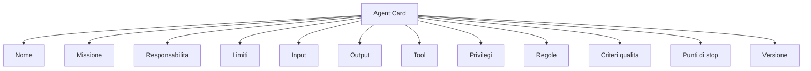
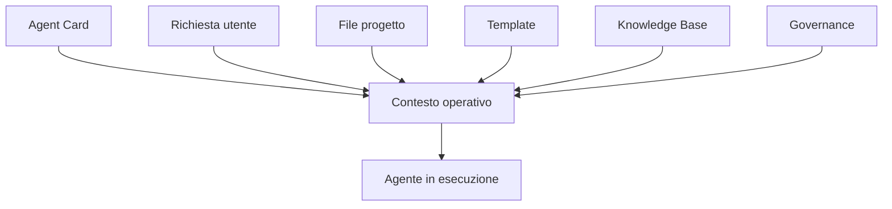
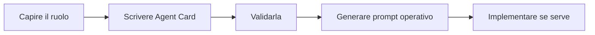
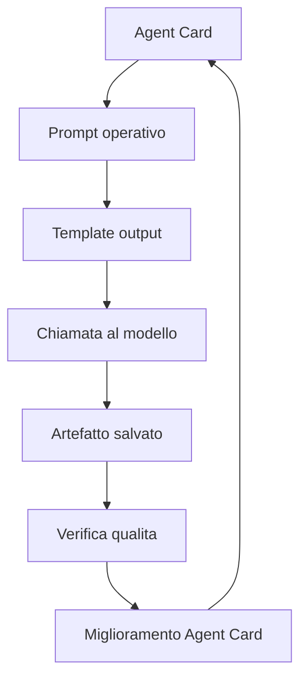
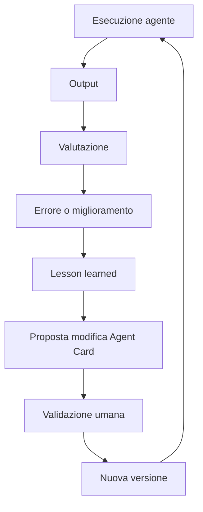
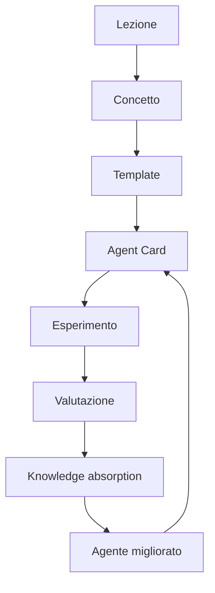

# 04 - Progettare un agente con una Agent Card

## Obiettivo della lezione

Questa lezione serve a imparare il primo vero strumento operativo per progettare agenti: la Agent Card.

Finora ho chiarito:

- che il manuale e' la traccia del percorso;
- che il repository e' anche la base della futura Agent Factory;
- che un AI Agent non e' solo un modello;
- che non tutti i problemi richiedono agenti.

Adesso faccio un passo in piu':

```text
Come progetto un agente prima di costruirlo?
```

La risposta e':

```text
con una Agent Card.
```

Alla fine di questa lezione devo saper:

- spiegare cos'e' una Agent Card;
- capire perche' serve;
- distinguere missione, responsabilita', input, output, tool, privilegi e limiti;
- progettare una prima Agent Card in Markdown;
- capire perche' una Agent Card e' diversa da un prompt;
- capire come una Agent Card puo' diventare la base di un agente reale.

## Perche' questa lezione conta

Questa e' una lezione centrale.

Se voglio diventare capace di costruire una pipeline multi-agent seria, non posso partire dal codice. Devo prima imparare a progettare ruoli.

Un agente senza progettazione e' pericoloso perche':

- non e' chiaro cosa deve fare;
- non e' chiaro cosa non deve fare;
- non e' chiaro cosa puo' leggere;
- non e' chiaro cosa puo' modificare;
- non e' chiaro quando deve fermarsi;
- non e' chiaro come valutare se ha lavorato bene;
- non e' chiaro quale output deve passare agli agenti successivi.

La Agent Card serve a evitare tutto questo.

In pratica, una Agent Card e' la scheda tecnica di un agente.

Ma e' anche qualcosa di piu':

```text
E' il contratto operativo dell'agente.
```

Un agente non deve essere definito solo da un prompt.

Deve essere definito da un documento che chiarisce:

- identita';
- missione;
- responsabilita';
- confini;
- input;
- output;
- tool;
- privilegi;
- regole;
- criteri di qualita';
- rischi;
- punti di stop;
- versione.

Questi elementi sono il primo passo verso agenti professionali.

## Anatomia della Agent Card



Questo schema mostra che una Agent Card non e' un prompt allungato. E' una descrizione strutturata del ruolo operativo dell'agente.

## Prerequisiti

Prima di questa lezione devo avere chiari:

- cosa e' un artefatto;
- cosa e' un template;
- cosa e' un AI Agent;
- perche' un prompt non basta;
- quando usare o non usare agenti.

In particolare devo ricordare questa formula:

```text
AI Agent = Modello + Obiettivo + Contesto + Tool + Regole + Stato + Verifica + Output
```

La Agent Card e' il documento che mi aiuta a progettare questi elementi prima di eseguire l'agente.

## Cos'e' una Agent Card

Una Agent Card e' un file Markdown che descrive un agente.

Esempio:

```text
agents/requirement-analyst-agent.md
```

La Agent Card risponde a domande fondamentali:

```text
Chi e' questo agente?
Perche' esiste?
Cosa deve fare?
Cosa non deve fare?
Cosa riceve?
Cosa produce?
Quali strumenti puo' usare?
Quali privilegi ha?
Quali regole deve seguire?
Quando deve fermarsi?
Come valuto se ha lavorato bene?
Quali rischi introduce?
Che versione e'?
```

Queste domande sembrano semplici, ma sono il cuore della progettazione agentica.

Se non so rispondere a queste domande, non sono ancora pronto a costruire l'agente.

## Agent Card come contratto operativo

La parola "card" puo' far pensare a una scheda leggera.

In realta', in AgentFactory la Agent Card e' un contratto.

Contratto significa:

```text
Questo agente ha questo ruolo, questi input, questi output, questi limiti e queste regole.
```

Il contratto serve a tre cose:

1. progettare l'agente prima di usarlo;
2. far lavorare piu' agenti senza confusione;
3. verificare se l'agente ha rispettato il suo ruolo.

Senza contratto, un agente tende a diventare generico.

Con il contratto, diventa un componente di sistema.

## Perche' una Agent Card e' diversa da un prompt

Un prompt e' un'istruzione data al modello in un momento specifico.

Una Agent Card e' una descrizione stabile dell'agente.

Prompt:

```text
Analizza questo brief e scrivi i requisiti.
```

Agent Card:

```text
Nome agente: Requirement Analyst Agent
Missione: trasformare brief grezzi in requisiti verificabili.
Input: brief, documenti, note, issue.
Output: documento requisiti.
Regole: separare fatti, ipotesi e domande aperte.
Limiti: non scegliere tecnologie se non richiesto.
Quando fermarsi: se mancano obiettivo, scope o vincoli critici.
```

La differenza e' enorme.

Il prompt dice cosa fare adesso.

La Agent Card dice che tipo di agente e', come lavora e quali confini deve rispettare.

In futuro, il prompt operativo potra' essere generato dalla Agent Card.

Questo e' un punto importante:

```text
La Agent Card viene prima del prompt operativo.
```

## Agent Card, contesto e memoria

Un dubbio importante e':

```text
Il contesto di un agente e' la sua Agent Card caricata in memoria?
```

Risposta breve:

```text
No. La Agent Card e' una parte del contesto, ma non coincide con tutto il contesto.
```

La Agent Card descrive il ruolo stabile dell'agente:

- missione;
- responsabilita';
- limiti;
- input;
- output;
- tool;
- privilegi;
- regole;
- criteri di qualita'.

Quando eseguo l'agente, posso trasformare la Agent Card in istruzioni operative da caricare nel prompt o nel sistema di esecuzione.

Ma il contesto operativo include anche altro:

- richiesta specifica dell'utente;
- file del progetto;
- brief;
- template di output;
- regole di governance;
- conoscenza recuperata dalla knowledge base;
- output di altri agenti;
- stato del task corrente;
- risultati dei tool.

Quindi:

```text
Agent Card = identita' e contratto dell'agente.
Contesto = informazioni disponibili per il task corrente.
Memoria permanente = conoscenza validata recuperabile in futuro.
```

Schema:



Questa distinzione e' fondamentale.

Se confondo Agent Card, contesto e memoria, rischio di progettare agenti disordinati.

La Agent Card dice chi e' l'agente.

Il contesto dice cosa sa adesso per questo task.

La memoria permanente contiene conoscenza validata che puo' essere recuperata quando serve.

## Da quali file e' composto fisicamente un agente

Un punto fondamentale:

```text
un agente non e' fisicamente solo la sua Agent Card.
```

La Agent Card e' il documento identitario.

Ma quando un agente diventa reale, e' composto da un package di file.

In AgentFactory devo pensare cosi':

```text
Agent package = Agent Card + prompt + template + runtime + stato + review + knowledge + governance
```

La composizione fisica tipica e':

| Tipo file | Esempio | Funzione |
|---|---|---|
| Agent Card | `agents/requirement-analyst-agent.md` | Definisce identita', missione, responsabilita', tool e privilegi |
| Package manifest | `agents/requirement-analyst-package.md` | Elenca tutti i file fisici collegati all'agente |
| Prompt operativo | `prompts/requirement-analyst-agent-prompt.md` | Trasforma l'identita' dell'agente in istruzioni eseguibili |
| Output template | `templates/requirement-analysis-output-template.md` | Definisce la forma dell'artefatto prodotto |
| Review checklist | `templates/requirement-analysis-review-checklist.md` | Definisce come valutare l'output |
| Runtime | `runtime/run_requirement_analyst.py` | Esegue l'agente o collega l'agente al modello |
| Config esempio | `runtime/config.example.env` | Documenta variabili senza salvare segreti reali |
| Input/run plan/pre-flight | `experiments/*input*.md`, `*run-plan*.md`, `*preflight*.md` | Prepara esecuzioni controllate |
| Run record | `experiments/*run-record*.md` | Traccia cosa e' successo in una esecuzione |
| Output prodotti | `experiments/*.md` | Artefatti generati o simulati dall'agente |
| Knowledge base | `knowledge-base/*.md` | Regole validate recuperabili quando servono |
| Governance | `governance/*.md` | Regole di sicurezza, privilegi, budget e human gate |
| Evals/test | `evals/`, `tests/` | Misurazioni future della qualita' |
| State store | `state/` | Stato operativo futuro di agenti e pipeline |
| Archive | `archive/` | Versioni vecchie o deprecate |

Non tutti questi file esistono subito.

Un agente in fase di progettazione puo' avere solo:

```text
Agent Card
```

Un agente pronto per essere eseguito dovrebbe avere almeno:

```text
Agent Card
Prompt operativo
Output template
Runtime o runner
Input dichiarato
Output path
Run record path
Review prevista
Regole di sicurezza
```

Un agente maturo dovrebbe avere anche:

```text
evals
metriche
versioni
state store
archivio
manutenzione periodica
```

Questa distinzione evita un errore comune:

```text
mettere tutto dentro la Agent Card.
```

La Agent Card deve restare leggibile.

Il package manifest serve proprio a dire:

```text
questo agente e' composto da questi file,
questi file sono attivi,
questi sono futuri,
questi sono deprecati,
questi sono condivisi con altri agenti.
```

Per questo da ora in poi ogni agente reale dovrebbe avere anche un manifest fisico.

## Perche' non partire subito dal codice

Potrei pensare:

```text
Voglio creare un agente, quindi scrivo subito Python.
```

Ma questo rischia di essere prematuro.

Se non so progettare l'agente in Markdown, il codice amplifica la confusione.

Il codice dovrebbe arrivare quando sono chiari:

- ruolo;
- input;
- output;
- regole;
- tool;
- privilegi;
- criteri di qualita';
- gestione degli errori.

Quindi il percorso corretto e':



Questo e' un approccio professionale.

## Struttura minima di una Agent Card

Nel repository esiste gia' un template:

```text
templates/agent-card-template.md
```

La struttura minima e':

```text
Nome agente
Missione
Responsabilita'
Cosa non deve fare
Input
Output
Tool consentiti
Privilegi
Regole operative
Quando deve fermarsi
Criteri di qualita'
Rischi
Versione
```

Vediamo ogni sezione con calma.

## Nome agente

Il nome deve essere chiaro e specifico.

Nome debole:

```text
Project Agent
```

Problema:

```text
Troppo generico. Non dice cosa fa davvero.
```

Nome migliore:

```text
Requirement Analyst Agent
```

Perche' e' migliore:

```text
Dice che l'agente si occupa di analisi requisiti.
```

Un buon nome aiuta a evitare confusione nella pipeline.

## Missione

La missione e' la ragione di esistenza dell'agente.

Deve essere scritta in una frase chiara.

Missione debole:

```text
Aiutare con i progetti.
```

Missione migliore:

```text
Trasformare input progettuali grezzi in un documento requisiti chiaro, verificabile e pronto per gli agenti successivi.
```

La missione deve rispondere a:

```text
Perche' questo agente esiste?
```

Se non riesco a scriverla in modo chiaro, probabilmente l'agente e' progettato male.

## Responsabilita'

Le responsabilita' descrivono cosa l'agente deve fare.

Esempio per un Requirement Analyst Agent:

```text
- leggere il brief;
- identificare fatti certi;
- distinguere ipotesi;
- formulare domande aperte;
- proporre requisiti funzionali;
- proporre requisiti non funzionali;
- evidenziare rischi;
- preparare handoff per gli agenti successivi.
```

Le responsabilita' devono essere concrete.

Responsabilita' debole:

```text
- migliorare il progetto.
```

Responsabilita' migliore:

```text
- separare fatti, ipotesi e domande aperte nel brief iniziale.
```

Piu' una responsabilita' e' concreta, piu' e' verificabile.

## Cosa non deve fare

Questa e' una delle sezioni piu' importanti.

Un agente professionale non e' definito solo da cio' che puo' fare, ma anche da cio' che non deve fare.

Esempio:

```text
Il Requirement Analyst Agent non deve:
- scegliere tecnologie;
- progettare architettura;
- scrivere codice;
- inventare requisiti;
- modificare la knowledge base permanente;
- aprire issue senza validazione.
```

Questa sezione serve a evitare sconfinamenti.

In una pipeline multi-agent, ogni agente deve rispettare il proprio ruolo.

Se il Requirement Analyst inizia a scegliere database e framework, sta invadendo il ruolo dell'Architect Agent.

Se il Developer Agent modifica la memoria permanente, sta invadendo il ruolo del Knowledge Compiler o del supervisore umano.

Separare i confini e' una competenza chiave.

## Input

Gli input sono cio' che l'agente riceve.

Esempi:

```text
- brief progetto;
- email cliente;
- documento esistente;
- issue GitHub;
- repository;
- output di un altro agente;
- template;
- vincoli tecnici;
- vincoli organizzativi.
```

Definire gli input e' importante perche' l'agente non deve lavorare nel vuoto.

Un agente senza input chiari tende a inventare.

Un agente con input chiari puo' distinguere:

- cosa sa;
- cosa deduce;
- cosa manca;
- cosa deve chiedere.

## Output

L'output e' l'artefatto che l'agente deve produrre.

Esempi:

```text
- documento requisiti;
- report analisi repository;
- piano architetturale;
- test plan;
- checklist review;
- lesson learned;
- proposta di aggiornamento knowledge base.
```

L'output deve essere verificabile.

Output debole:

```text
Una risposta utile.
```

Output migliore:

```text
Un documento Markdown con sezioni obbligatorie: sintesi, fatti, ipotesi, domande aperte, requisiti funzionali, requisiti non funzionali, rischi, handoff.
```

Un output ben definito rende l'agente molto piu' controllabile.

## Tool consentiti

I tool sono gli strumenti che l'agente puo' usare.

Esempi:

```text
- lettura file;
- scrittura file;
- ricerca nel repository;
- GitHub issues;
- terminale;
- test runner;
- browser;
- API esterne.
```

Ogni tool aumenta la capacita' dell'agente, ma anche il rischio.

Quindi i tool devono essere assegnati con criterio.

Non tutti gli agenti devono avere tutti i tool.

Esempio:

```text
Requirement Analyst Agent:
- puo' leggere brief e documenti;
- puo' scrivere documento requisiti;
- non puo' eseguire comandi;
- non puo' fare deploy.
```

Esempio:

```text
Tester Agent:
- puo' leggere codice;
- puo' eseguire test;
- puo' produrre test report;
- non puo' fare merge su main.
```

La scelta dei tool e' gia' progettazione di governance.

## Privilegi

I privilegi sono il livello di accesso concesso all'agente.

Esempi:

```text
Lettura: puo' leggere file progetto.
Scrittura: puo' scrivere solo nella cartella output.
Esecuzione comandi: puo' eseguire solo test.
Accesso esterno: non consentito.
```

Questa sezione e' fondamentale perche' un agente non deve avere piu' potere del necessario.

Principio:

```text
Minimo privilegio necessario.
```

Significa:

```text
Do all'agente solo i permessi che servono per svolgere il suo compito.
```

Un agente che analizza requisiti non deve poter cancellare file.

Un agente che scrive documentazione non deve poter fare deploy.

Un agente che propone miglioramenti alla memoria non deve poterli rendere permanenti senza validazione.

Questo principio diventera' centrale quando parleremo di governance.

## Regole operative

Le regole operative dicono come l'agente deve lavorare.

Esempi:

```text
1. Non inventare informazioni non presenti negli input.
2. Marca ogni deduzione come ipotesi.
3. Separa fatti, ipotesi e domande aperte.
4. Produci output in Markdown.
5. Se mancano informazioni critiche, fermati e chiedi conferma.
```

Le regole devono essere pratiche e controllabili.

Regola debole:

```text
Lavora bene.
```

Regola migliore:

```text
Ogni requisito deve avere un identificativo stabile.
```

Una buona regola deve aiutare a valutare il comportamento dell'agente.

## Quando deve fermarsi

Un agente professionale deve sapere quando non procedere.

Questa e' una differenza enorme rispetto a un sistema ingenuo.

Esempi:

```text
Fermati se manca l'obiettivo di business.
Fermati se mancano vincoli di sicurezza.
Fermati se l'utente chiede di modificare dati sensibili.
Fermati se dovresti aumentare i tuoi privilegi.
Fermati se l'output richiede validazione umana.
```

Un agente che non sa fermarsi puo' produrre danni.

Fermarsi non e' un fallimento.

In un sistema professionale, fermarsi al momento giusto e' segno di qualita'.

## Criteri di qualita'

I criteri di qualita' servono a valutare l'output.

Esempi per un Requirement Analyst Agent:

```text
- i fatti sono separati dalle ipotesi;
- le domande aperte sono esplicite;
- i requisiti sono numerati;
- i requisiti sono verificabili;
- lo scope e' chiaro;
- i rischi sono indicati;
- l'handoff per gli agenti successivi e' presente.
```

Senza criteri di qualita', non posso sapere se l'agente ha lavorato bene.

La qualita' non deve dipendere solo dall'impressione.

Deve dipendere da criteri controllabili.

## Rischi

Ogni agente introduce rischi.

Esempi:

```text
- inventare informazioni;
- agire fuori ruolo;
- usare tool non necessari;
- produrre output troppo generici;
- saltare validazioni;
- modificare conoscenza permanente senza controllo;
- confondere ipotesi e fatti.
```

Scrivere i rischi nella Agent Card serve a progettare contromisure.

Esempio:

```text
Rischio: inventare requisiti.
Contromisura: ogni requisito deve essere collegato a un fatto o marcato come ipotesi.
```

Questo e' progettare professionalmente.

## Versione

Ogni Agent Card deve avere una versione.

Esempio:

```text
v0.1
```

Perche' serve?

Perche' gli agenti devono migliorare nel tempo.

Se modifico una Agent Card, devo sapere cosa e' cambiato.

In futuro potro' avere:

```text
Requirement Analyst Agent v0.1
Requirement Analyst Agent v0.2
Requirement Analyst Agent v1.0
```

Ogni versione dovrebbe migliorare sulla base di:

- errori trovati;
- output valutati;
- lesson learned;
- nuove regole;
- nuovi template;
- nuovi rischi emersi.

Questo collega la Agent Card al tema del miglioramento continuo.

## Esempio semplice di Agent Card

Esempio volutamente semplice:

```text
Nome agente:
Simple Summary Agent

Missione:
Riassumere un testo in modo chiaro e fedele.

Responsabilita':
- leggere il testo fornito;
- identificare i punti principali;
- produrre un riassunto breve;
- segnalare eventuali parti poco chiare.

Cosa non deve fare:
- non aggiungere informazioni esterne;
- non inventare dettagli;
- non cambiare il significato del testo.

Input:
- testo da riassumere.

Output:
- riassunto in Markdown.

Tool consentiti:
- nessuno.

Privilegi:
Lettura: solo input fornito.
Scrittura: solo output della risposta.
Esecuzione comandi: no.
Accesso esterno: no.

Regole operative:
1. Riassumi solo cio' che e' presente nel testo.
2. Se il testo e' ambiguo, segnalalo.
3. Mantieni il riassunto sotto 10 righe.

Quando deve fermarsi:
- se il testo non e' presente;
- se il testo e' illeggibile.

Criteri di qualita':
- il riassunto e' fedele;
- non contiene invenzioni;
- e' piu' breve dell'input.

Rischi:
- semplificare troppo;
- perdere dettagli importanti.

Versione:
v0.1
```

Questo e' un agente molto semplice.

Ma gia' si vede la differenza rispetto a un prompt generico.

## Esempio professionale: Requirement Analyst Agent

Ora immaginiamo il primo agente importante per AgentFactory.

```text
Nome agente:
Requirement Analyst Agent

Missione:
Trasformare input progettuali grezzi in un documento requisiti chiaro, verificabile e pronto per gli agenti successivi.

Responsabilita':
- leggere il brief iniziale;
- identificare fatti certi;
- identificare ipotesi;
- formulare domande aperte;
- distinguere requisiti funzionali e non funzionali;
- indicare rischi;
- preparare handoff per Architect Agent, Developer Agent e Tester Agent.

Cosa non deve fare:
- non scegliere tecnologie;
- non progettare architettura;
- non scrivere codice;
- non inventare requisiti;
- non modificare la knowledge base permanente;
- non procedere se mancano informazioni critiche.

Input:
- brief progetto;
- documenti;
- note cliente;
- issue;
- output di conversazioni precedenti;
- vincoli dichiarati.

Output:
- documento requisiti in Markdown.

Tool consentiti:
- lettura file;
- ricerca nel repository;
- uso di template requisiti.

Privilegi:
Lettura: documenti di progetto e template.
Scrittura: solo documento requisiti.
Esecuzione comandi: no.
Accesso esterno: no, salvo autorizzazione.

Regole operative:
1. Separare sempre fatti, ipotesi e domande aperte.
2. Non inventare requisiti.
3. Ogni deduzione deve essere marcata come ipotesi.
4. Ogni requisito deve essere verificabile.
5. Evidenziare cosa richiede validazione umana.

Quando deve fermarsi:
- se manca l'obiettivo di business;
- se lo scope e' troppo ambiguo;
- se mancano vincoli critici;
- se emergono dati sensibili non gestiti.

Criteri di qualita':
- fatti e ipotesi sono separati;
- le domande aperte sono chiare;
- i requisiti sono numerati;
- i rischi sono espliciti;
- l'output puo' essere usato dagli agenti successivi.

Rischi:
- inventare requisiti;
- scegliere soluzioni tecniche premature;
- produrre un documento leggibile ma non operativo.

Versione:
v0.1
```

Questa non e' ancora implementazione.

Ma e' gia' progettazione.

Da qui posso creare:

- un prompt operativo;
- un template di output;
- test di qualita';
- una prima versione eseguibile;
- una pipeline in cui questo agente passa output ad altri agenti.

## Come una Agent Card diventa agente reale

La Agent Card non e' il punto finale.

E' il punto di partenza.

Il passaggio puo' essere:



Questo e' il ciclo che useremo.

Prima progettiamo.

Poi eseguiamo.

Poi valutiamo.

Poi miglioriamo.

## Agent Card e pipeline multi-agent

In una pipeline multi-agent, ogni agente deve avere la propria Agent Card.

Esempio:

```text
Requirement Analyst Agent
Architect Agent
Developer Agent
Tester Agent
Reviewer Agent
Documentation Agent
Knowledge Compiler Agent
Supervisor Agent
```

Per ogni agente dovro' sapere:

- quali input riceve;
- da chi li riceve;
- quale output produce;
- a chi passa l'output;
- quali tool puo' usare;
- quali privilegi ha;
- quando deve fermarsi.

Questa struttura rende possibile progettare una pipeline senza confusione.

Senza Agent Card, la pipeline diventa una catena di prompt.

Con le Agent Card, diventa un sistema di ruoli.

## Agent Card e privilegi

La sezione privilegi e' uno dei motivi per cui la Agent Card e' cosi' importante.

Nel lavoro reale, non tutti gli agenti devono poter fare tutto.

Esempio:

```text
Requirement Analyst Agent:
- puo' leggere brief;
- puo' scrivere requisiti;
- non puo' modificare codice.

Developer Agent:
- puo' leggere requisiti;
- puo' modificare codice su branch;
- puo' eseguire test;
- non puo' fare deploy.

Knowledge Compiler:
- puo' proporre conoscenza da assorbire;
- non puo' aggiornare la memoria permanente senza validazione.
```

Questo e' il primo passo verso una Agent Factory governata.

Non basta creare agenti intelligenti.

Bisogna creare agenti con responsabilita' e privilegi corretti.

## Agent Card e miglioramento nel tempo

Un agente puo' migliorare nel tempo solo se so cosa sto migliorando.

Se ho solo un prompt sparso in una conversazione, migliorarlo e' difficile.

Se ho una Agent Card versionata, posso dire:

```text
Nella v0.1 l'agente confondeva ipotesi e fatti.
Nella v0.2 abbiamo aggiunto una regola per separarle.
Nella v0.3 abbiamo aggiunto un criterio di qualita' sui requisiti verificabili.
```

Questo e' miglioramento controllato.

L'agente non si modifica da solo in modo caotico.

Il sistema osserva errori, estrae lesson learned, propone modifiche e aggiorna la Agent Card dopo validazione.

Schema:



Questo e' uno dei nuclei della futura Agent Factory.

## Anti-pattern ed errori comuni

### Errore 1 - Scrivere una Agent Card troppo vaga

Errore:

```text
Missione: aiutare nel progetto.
```

Perche' e' sbagliato:

```text
Non definisce una responsabilita' concreta.
```

Correzione:

```text
Missione: trasformare brief grezzi in requisiti verificabili.
```

### Errore 2 - Non scrivere cosa l'agente non deve fare

Errore:

```text
Descrivo solo le capacita' dell'agente.
```

Perche' e' rischioso:

```text
L'agente puo' invadere ruoli di altri agenti o compiere azioni non autorizzate.
```

Correzione:

```text
Aggiungere sempre una sezione "Cosa non deve fare".
```

### Errore 3 - Dare troppi tool

Errore:

```text
Tutti gli agenti possono leggere, scrivere, eseguire comandi, accedere a internet e modificare memoria.
```

Perche' e' pericoloso:

```text
Aumenta rischio e rende difficile attribuire responsabilita'.
```

Correzione:

```text
Applicare il minimo privilegio necessario.
```

### Errore 4 - Output non verificabile

Errore:

```text
Output: risposta utile.
```

Perche' e' debole:

```text
Non posso verificare se l'agente ha prodotto cio' che serviva.
```

Correzione:

```text
Output: documento Markdown con sezioni obbligatorie.
```

### Errore 5 - Nessun criterio di qualita'

Errore:

```text
Mi fido del risultato perche' sembra scritto bene.
```

Perche' e' sbagliato:

```text
Un output puo' essere elegante ma incompleto o falso.
```

Correzione:

```text
Definire criteri di qualita' controllabili.
```

### Errore 6 - Nessun versioning

Errore:

```text
Modifico l'agente senza traccia.
```

Perche' e' un problema:

```text
Non so cosa e' cambiato, perche' e se ha migliorato davvero.
```

Correzione:

```text
Versionare Agent Card, prompt e template.
```

## Collegamento con AgentFactory

Questa lezione e' il primo ponte tra teoria e costruzione reale.

Il manuale spiega.

La Agent Card progetta.

Gli esperimenti eseguono.

La knowledge base assorbe.

La governance controlla.

Quindi il percorso e':



La Agent Card e' uno dei primi mattoni concreti della futura Agent Factory.

## Artefatto prodotto

Questa lezione consolida il template:

```text
templates/agent-card-template.md
```

Produce anche la prima regola operativa:

```text
Non si costruisce un agente reale finche' non esiste una Agent Card chiara.
```

## Verifica personale

Dopo questa lezione devo saper rispondere:

```text
1. Che cos'e' una Agent Card?
2. Perche' una Agent Card e' diversa da un prompt?
3. Perche' devo scrivere cosa un agente non deve fare?
4. Che differenza c'e' tra tool e privilegi?
5. Perche' un output deve essere verificabile?
6. Perche' ogni agente deve avere criteri di qualita'?
7. Come una Agent Card puo' migliorare nel tempo?
8. Perche' una pipeline multi-agent richiede Agent Card separate?
```

## Conoscenza da assorbire

- Una Agent Card e' il contratto operativo dell'agente.
- La Agent Card viene prima del prompt operativo.
- Un agente deve essere definito anche dai suoi limiti.
- Tool e privilegi devono essere assegnati con il principio del minimo privilegio.
- Un output deve essere un artefatto verificabile.
- I criteri di qualita' servono a valutare l'agente.
- Il versioning della Agent Card abilita miglioramento controllato.
- Una pipeline multi-agent e' solida solo se ogni agente ha ruolo, confini e output chiari.

## Prossimo passo

Creare la prima Agent Card reale del percorso:

```text
Requirement Analyst Agent
```

Questa sara' la prima scheda agente concreta della AgentFactory.
