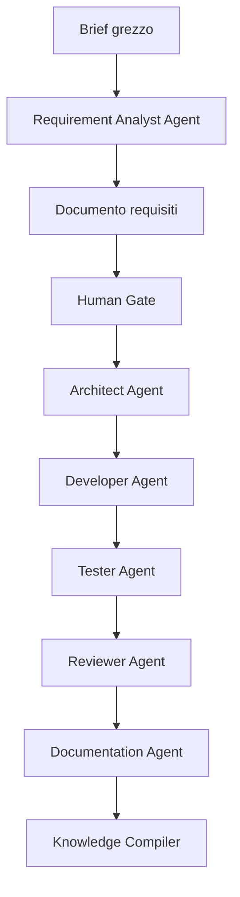
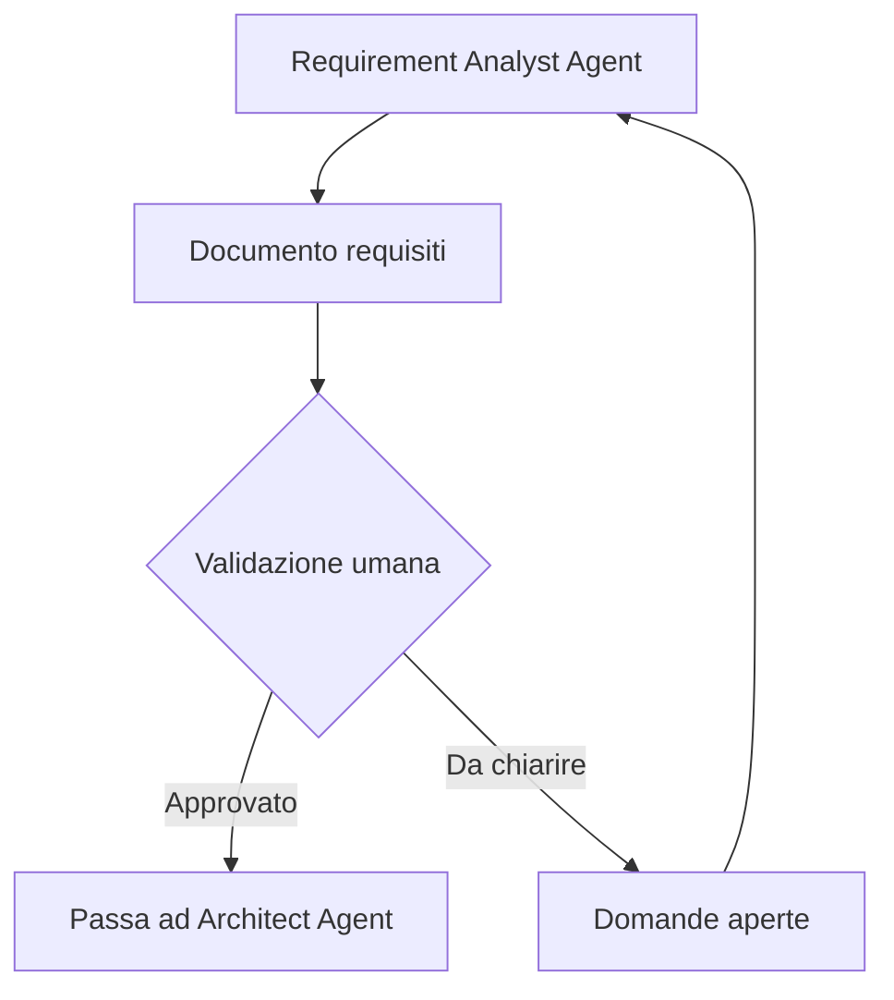
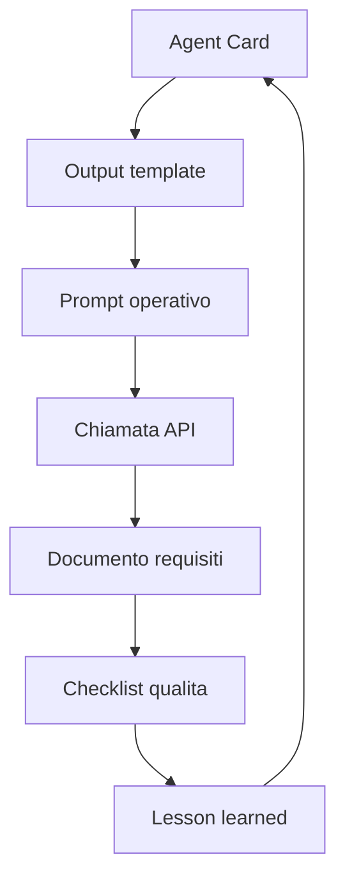

# 05 - Prima Agent Card: Requirement Analyst Agent

## Obiettivo della lezione

Questa lezione serve a creare la prima Agent Card reale del percorso AgentFactory:

```text
Requirement Analyst Agent
```

Finora ho imparato cosa e' un agente, quando usarlo e come progettare una Agent Card. Ora trasformo quei concetti in un artefatto concreto.

Alla fine di questa lezione devo avere:

- capito perche' il primo agente e' un analista requisiti;
- progettato la sua missione;
- definito responsabilita' e confini;
- definito input e output;
- assegnato tool e privilegi iniziali;
- stabilito regole operative;
- chiarito quando deve fermarsi;
- definito criteri di qualita';
- creato il file reale della Agent Card.

L'artefatto prodotto e':

```text
agents/requirement-analyst-agent.md
```

## Perche' questa lezione conta

Questa lezione e' il primo passaggio in cui AgentFactory smette di essere solo manuale e inizia a contenere componenti della factory.

Il manuale spiega.

La Agent Card progetta.

Il futuro codice eseguira'.

Il Requirement Analyst Agent e' il primo agente perche' ogni progetto parte da una domanda fondamentale:

```text
Che cosa bisogna costruire, per chi, con quali vincoli e secondo quali criteri?
```

Se questa domanda resta confusa, tutto cio' che viene dopo diventa fragile.

Un Architect Agent progettarebbe su requisiti non chiari.

Un Developer Agent implementerebbe funzionalita' forse non richieste.

Un Tester Agent non saprebbe cosa verificare.

Un Documentation Agent documenterebbe un sistema nato su basi incerte.

Un Knowledge Compiler rischierebbe di assorbire conoscenza sporca.

Quindi il primo agente della pipeline deve essere quello che trasforma input grezzi in requisiti verificabili.

## Prerequisiti

Prima di questa lezione devo avere chiari:

- che un agente non e' un semplice prompt;
- che un agente deve produrre artefatti verificabili;
- che non tutti i task richiedono agenti;
- che una Agent Card e' il contratto operativo di un agente;
- che responsabilita' e privilegi devono essere separati.

## Perche' partire dai requisiti

Nei progetti reali, raramente il problema arriva gia' pronto.

Spesso arriva cosi':

```text
Ci serve una piattaforma per gestire meglio i ticket interni.
```

Oppure:

```text
Vorremmo automatizzare il processo ferie.
```

Oppure:

```text
Ci serve un'app per migliorare la comunicazione con i clienti.
```

Queste frasi sembrano chiare, ma in realta' nascondono molte domande.

Esempio su "piattaforma ticket":

```text
Chi puo' aprire ticket?
Chi li assegna?
Esistono priorita'?
Esistono SLA?
Serve autenticazione?
Serve storico?
Serve dashboard?
Serve integrazione email?
Chi puo' vedere cosa?
Serve audit?
Ci sono dati personali?
```

Se salto questa fase, la pipeline parte male.

Il Requirement Analyst Agent serve proprio a evitare questo.

## Posizione nella futura pipeline



Il Requirement Analyst Agent non e' tutta la pipeline.

E' il primo filtro di qualita'.

Il suo compito non e' costruire il prodotto.

Il suo compito e' rendere chiaro cosa dovra' essere costruito.

## Missione dell'agente

La missione scelta e':

```text
Trasformare input progettuali grezzi, ambigui o incompleti in un documento requisiti chiaro, verificabile e pronto per gli agenti successivi della pipeline.
```

Questa missione contiene parole importanti.

## "Input progettuali grezzi"

Significa che l'agente non ricevera' sempre documenti perfetti.

Potra' ricevere:

- brief informali;
- email;
- appunti;
- trascrizioni;
- issue;
- richieste vocali trascritte;
- descrizioni confuse;
- documenti parziali.

Questo e' realistico.

Nel lavoro vero, l'input iniziale e' spesso incompleto.

## "Ambigui o incompleti"

L'agente non deve fingere che tutto sia chiaro.

Deve distinguere:

- cosa e' certo;
- cosa e' ipotesi;
- cosa manca;
- cosa va chiesto.

Questa distinzione e' una delle sue responsabilita' principali.

## "Documento requisiti chiaro"

L'output non deve essere una risposta discorsiva generica.

Deve essere un documento strutturato.

Il documento deve poter essere letto da:

- me;
- un futuro Architect Agent;
- un futuro Developer Agent;
- un futuro Tester Agent;
- una persona che deve validare.

## "Verificabile"

Un requisito verificabile e' un requisito che posso controllare.

Debole:

```text
Il sistema deve essere veloce.
```

Migliore:

```text
Il sistema deve caricare la lista dei ticket aperti entro 2 secondi con almeno 10.000 ticket presenti.
```

Non tutti i requisiti avranno subito numeri precisi.

Ma l'agente deve spingere verso chiarezza e verificabilita'.

## "Pronto per gli agenti successivi"

Questo e' essenziale.

Il Requirement Analyst Agent non lavora per se stesso.

Lavora per preparare il terreno agli altri agenti.

Il suo output deve aiutare:

- Architect Agent a progettare;
- Developer Agent a implementare;
- Tester Agent a verificare;
- Knowledge Compiler a capire cosa puo' diventare conoscenza riutilizzabile.

## Responsabilita' principali

La Agent Card definisce queste responsabilita':

```text
- leggere e comprendere il brief iniziale;
- identificare fatti certi;
- identificare ipotesi;
- formulare domande aperte;
- distinguere requisiti funzionali e non funzionali;
- individuare attori e stakeholder;
- chiarire scope e out of scope;
- evidenziare vincoli, rischi e ambiguita';
- proporre criteri di accettazione iniziali;
- preparare handoff per Architect Agent, Developer Agent, Tester Agent e Knowledge Compiler.
```

Queste responsabilita' coprono la parte iniziale del ciclo progetto.

Notare una cosa: non c'e' "scrivere codice".

Questo e' voluto.

L'agente deve avere confini precisi.

## Fatti, ipotesi e domande aperte

Questa e' la sua distinzione piu' importante.

Dato un brief:

```text
Vogliamo una piattaforma per gestire ticket IT interni.
```

Fatto:

```text
Il dominio e' gestione ticket IT interni.
```

Ipotesi:

```text
Probabilmente serviranno utenti autenticati.
```

Domanda aperta:

```text
Quali ruoli utente sono previsti?
```

Se l'agente confonde questi tre livelli, produce cattiva analisi.

## Requisiti funzionali e non funzionali

Il Requirement Analyst Agent deve separare:

```text
Requisiti funzionali = cosa il sistema deve fare.
Requisiti non funzionali = come il sistema deve comportarsi.
```

Esempio funzionale:

```text
RF-001 - Il sistema deve permettere a un utente autorizzato di aprire un ticket.
```

Esempio non funzionale:

```text
RNF-001 - Il sistema deve mantenere uno storico delle modifiche ai ticket.
```

Questa separazione aiutera' molto gli agenti successivi.

## Scope e out of scope

Lo scope definisce cosa entra nel progetto.

L'out of scope definisce cosa non entra per ora.

Esempio:

```text
In scope:
- apertura ticket;
- assegnazione ticket;
- cambio stato;
- storico.

Out of scope:
- app mobile nativa;
- chatbot automatico;
- integrazione HR.
```

Questa distinzione protegge il progetto dall'espansione incontrollata.

## Cosa l'agente non deve fare

La Agent Card dice chiaramente che il Requirement Analyst Agent non deve:

```text
- inventare requisiti non presenti nell'input;
- trasformare ipotesi in fatti;
- scegliere tecnologie se non dichiarate come vincolo;
- progettare architettura;
- scrivere codice;
- creare backlog definitivo senza validazione umana;
- modificare la knowledge base permanente;
- procedere se mancano informazioni critiche.
```

Questa sezione e' importante quanto le responsabilita'.

Un agente ben progettato sa cosa deve fare e cosa deve evitare.

## Tool e privilegi iniziali

Nella versione v0.1 l'agente resta prudente.

Tool consentiti:

```text
- lettura file di progetto;
- ricerca nel repository;
- lettura template;
- scrittura del documento requisiti;
- consultazione della knowledge base validata;
- consultazione di issue o documenti solo se autorizzata.
```

Privilegi:

```text
Lettura: brief, documenti di progetto, template, knowledge base validata.
Scrittura: solo artefatti di analisi requisiti nella posizione autorizzata.
Esecuzione comandi: no nella versione v0.1.
Accesso esterno: no nella versione v0.1, salvo autorizzazione esplicita.
Modifica knowledge base: no; puo' solo proporre note per il Knowledge Compiler.
```

Questa scelta segue il principio del minimo privilegio.

L'agente deve poter fare il suo lavoro, ma non deve avere poteri inutili.

## Human Gate

Il Requirement Analyst Agent deve preparare un documento, ma non deve validarlo da solo.

La validazione dei requisiti resta umana.



Questo e' un punto di governance fondamentale.

L'agente puo' accelerare l'analisi.

La responsabilita' finale sui requisiti deve restare controllata.

## Criteri di qualita'

La Agent Card definisce criteri concreti:

```text
- i fatti sono separati dalle ipotesi;
- le domande aperte sono esplicite e utili;
- i requisiti funzionali sono numerati;
- i requisiti non funzionali sono separati;
- ogni requisito importante e' verificabile;
- scope e out of scope sono dichiarati;
- i rischi principali sono indicati;
- i criteri di accettazione iniziali sono presenti;
- l'handoff per gli agenti successivi e' chiaro;
- l'output puo' essere validato da una persona.
```

Questi criteri saranno utili piu' avanti per creare eval, checklist e test dell'agente.

Per ora servono a una cosa semplice:

```text
capire se l'agente ha lavorato bene.
```

## Rischi principali

Ogni agente puo' sbagliare.

Per questo la Agent Card include rischi.

Rischi principali:

```text
- inventare requisiti;
- trattare ipotesi come fatti;
- produrre un documento lungo ma poco operativo;
- scegliere tecnologie premature;
- omettere domande aperte critiche;
- ignorare vincoli non funzionali;
- non preparare un handoff utile;
- confondere analisi requisiti con progettazione architetturale.
```

Il punto non e' eliminare ogni rischio in anticipo.

Il punto e' renderlo visibile.

Un rischio visibile puo' essere controllato.

Un rischio nascosto diventa pericoloso.

## Come questa Agent Card prepara il primo agente reale

La Agent Card non e' ancora codice.

Ma prepara il codice.

Il percorso sara':



Quando arriveremo alla parte pratica, non dovremo inventare l'agente da zero.

Avremo gia':

- missione;
- input;
- output;
- regole;
- privilegi;
- criteri di qualita';
- rischi.

Il codice dovra' solo rendere eseguibile cio' che abbiamo progettato.

## Anti-pattern ed errori comuni

### Errore 1 - Far scegliere tecnologie all'analista requisiti

Errore:

```text
Il Requirement Analyst Agent decide React, Node.js e PostgreSQL.
```

Perche' e' sbagliato:

```text
La scelta tecnologica appartiene all'architettura, salvo vincoli dichiarati dal brief.
```

Correzione:

```text
L'agente puo' registrare tecnologie solo se sono vincoli espliciti.
```

### Errore 2 - Nascondere le domande aperte

Errore:

```text
L'agente produce un documento apparentemente completo anche quando mancano informazioni.
```

Perche' e' pericoloso:

```text
Trasforma in certezza cio' che non e' stato chiarito.
```

Correzione:

```text
Le domande aperte devono essere una sezione obbligatoria.
```

### Errore 3 - Confondere desideri e requisiti

Errore:

```text
Sarebbe bello avere notifiche diventa automaticamente requisito must-have.
```

Perche' e' sbagliato:

```text
Un desiderio non prioritizzato non e' ancora un requisito validato.
```

Correzione:

```text
Classificare come ipotesi, opportunita' o domanda di priorita'.
```

### Errore 4 - Produrre output non operativo

Errore:

```text
Il documento e' ben scritto, ma non aiuta Architect, Developer o Tester.
```

Perche' e' un problema:

```text
Un agente di pipeline deve produrre output riutilizzabile dagli agenti successivi.
```

Correzione:

```text
Inserire handoff espliciti.
```

## Collegamento con AgentFactory

Questa lezione crea il primo vero agente progettato della AgentFactory.

Non e' ancora un agente eseguibile.

Ma e' gia' un componente architetturale.

Da questo momento il repository contiene:

- manuale;
- template;
- prima Agent Card;
- base per un futuro esperimento reale.

Questo e' importante perche' conferma il senso del progetto:

```text
Il manuale non racconta soltanto la factory.
Il manuale accompagna la costruzione della factory.
```

## Artefatto prodotto

Questa lezione produce:

```text
agents/requirement-analyst-agent.md
```

Questo file e' la prima Agent Card concreta del percorso.

## Verifica personale

Dopo questa lezione devo saper rispondere:

```text
1. Perche' il primo agente e' un Requirement Analyst Agent?
2. Qual e' la sua missione?
3. Cosa deve produrre?
4. Cosa non deve fare?
5. Quali privilegi ha nella versione v0.1?
6. Perche' non puo' modificare la knowledge base?
7. Perche' deve separare fatti, ipotesi e domande aperte?
8. Come il suo output aiuta gli agenti successivi?
```

## Conoscenza da assorbire

- Il primo agente della pipeline deve chiarire il problema prima che altri agenti progettino o implementino.
- Il Requirement Analyst Agent trasforma input grezzi in requisiti verificabili.
- L'agente deve separare fatti, ipotesi e domande aperte.
- L'agente non deve scegliere tecnologie premature.
- L'output deve essere validabile da una persona.
- Il documento requisiti e' un handoff per gli agenti successivi.
- La Agent Card e' il primo passo verso un agente eseguibile.

## Prossimo passo

Creare il template di output del Requirement Analyst Agent:

```text
templates/requirement-analysis-output-template.md
```

Poi useremo quel template per il primo esperimento manuale su un brief semplice.
