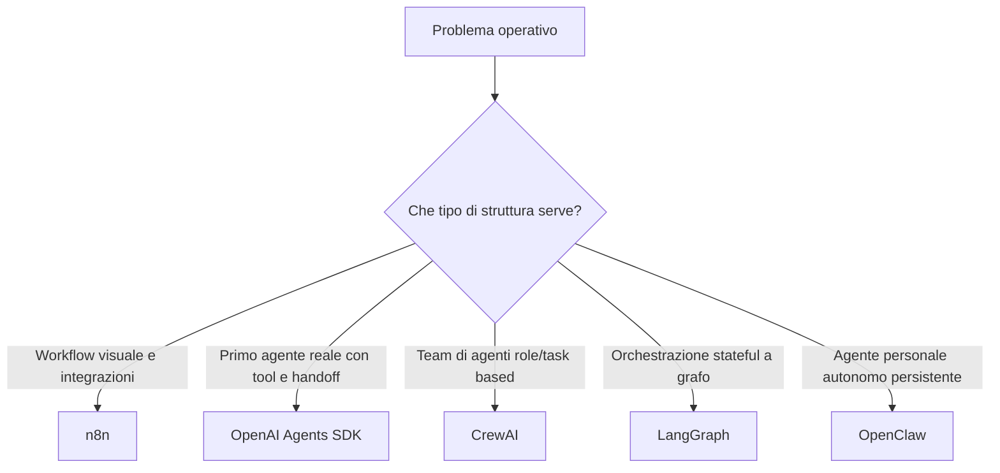
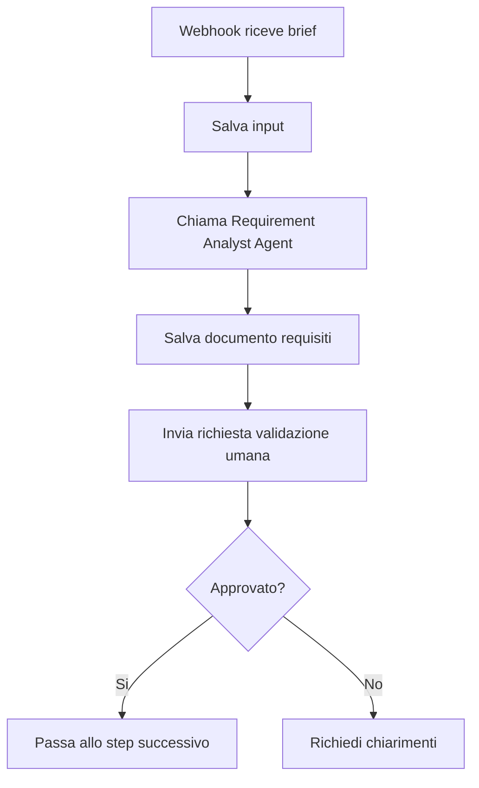
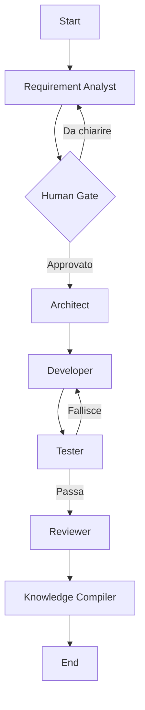
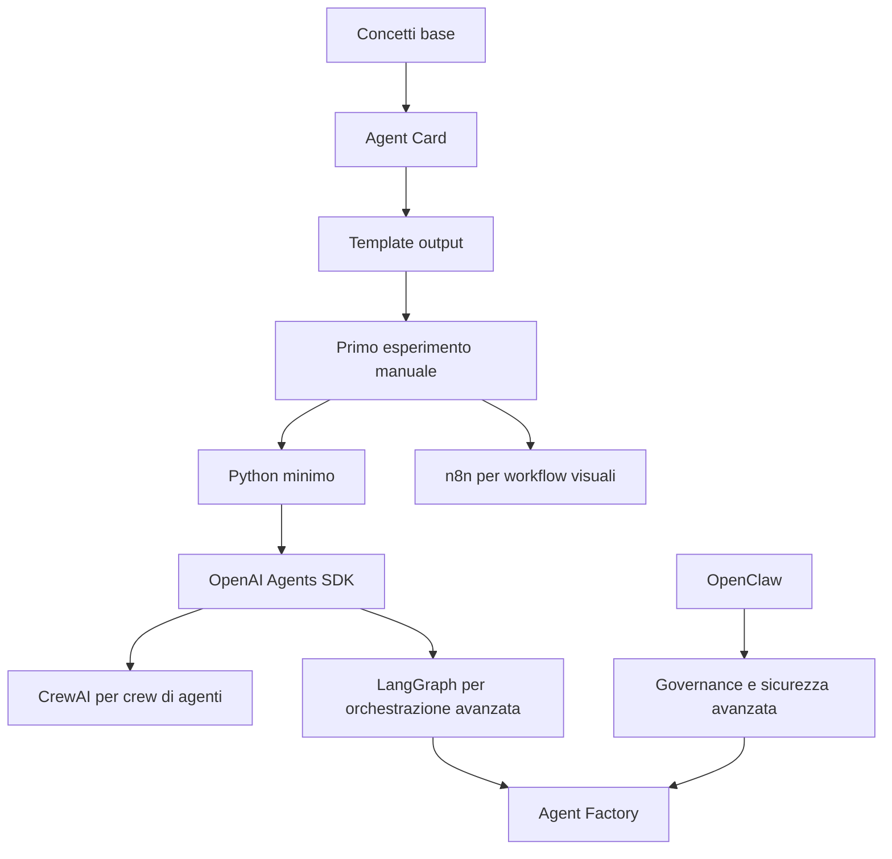

# 06 - Strumenti reali: n8n, OpenAI Agents SDK, CrewAI, LangGraph e OpenClaw

## Obiettivo della lezione

Questa lezione serve a inserire nel percorso gli strumenti reali che incontreremo costruendo AgentFactory.

Non voglio studiarli tutti subito come tutorial.

Voglio prima capire:

- che tipo di strumenti sono;
- che problema risolvono;
- quando sono utili;
- quando sono pericolosi o prematuri;
- dove entrano nella roadmap;
- come possono aiutarmi a costruire una vera Agent Factory.

Gli strumenti che considero necessari per il percorso sono:

- n8n;
- OpenAI Agents SDK;
- CrewAI;
- LangGraph;
- OpenClaw.

Non li considero tutti allo stesso livello.

Non sono alternative identiche.

Sono pezzi diversi dell'ecosistema agentico.

## Perche' questa lezione conta

Finora ho studiato concetti:

- agente;
- workflow;
- pipeline;
- Agent Card;
- privilegi;
- artefatti;
- knowledge absorption.

Ma nel lavoro reale dovro' anche scegliere strumenti.

Il rischio e' correre subito dietro al tool piu' famoso.

Questo sarebbe un errore.

La domanda giusta non e':

```text
Quale tool e' migliore?
```

La domanda giusta e':

```text
Quale ruolo ha questo tool dentro la mia architettura?
```

Un tool puo' essere ottimo per automazioni visuali ma non per orchestrare agenti complessi.

Un altro puo' essere perfetto per agenti a grafo ma troppo avanzato per iniziare.

Un altro puo' essere potentissimo ma rischioso perche' opera 24/7 con molti privilegi.

Questa lezione serve a creare una mappa mentale.

## Prerequisiti

Prima di questa lezione devo avere chiari:

- differenza tra automazione, workflow, agente e Agent Factory;
- differenza tra prompt e agente;
- concetto di Agent Card;
- concetto di privilegio;
- importanza di human gate e governance.

## Mappa generale degli strumenti



Questa mappa e' volutamente semplice.

Serve a evitare confusione iniziale.

## n8n

n8n e' una piattaforma di workflow automation visuale.

Permette di costruire flussi usando nodi collegati tra loro.

Un nodo puo':

- ricevere un trigger;
- leggere dati;
- chiamare una API;
- mandare una email;
- aggiornare un foglio;
- chiamare un modello AI;
- aspettare una condizione;
- gestire errori;
- passare output al nodo successivo.

Nelle docs ufficiali n8n organizza il lavoro intorno a workflow, nodes, connections, executions, credentials, webhooks, schedule trigger, HTTP request, code node, AI e MCP nodes.

Fonte:

```text
https://docs.n8n.io/
```

## Perche' n8n serve ad AgentFactory

n8n e' importante perche' mi insegna la parte visuale e deterministica dei workflow.

Esempio:



In questo schema, n8n non e' l'agente.

n8n e' il controller del workflow.

L'agente ragiona.

n8n orchestra passaggi, trigger, notifiche e integrazioni.

## Quando usare n8n

Usero' n8n quando devo:

- collegare servizi;
- gestire trigger;
- automatizzare passaggi ripetibili;
- visualizzare un workflow;
- gestire notifiche e approvazioni;
- integrare agenti dentro processi aziendali;
- fare prototipi rapidi di workflow.

Esempio concreto:

```text
Quando arriva un brief da form web, salvarlo, chiamare un agente, notificare l'umano e archiviare l'output.
```

## Quando NON usare n8n come soluzione principale

n8n non e' sempre la scelta giusta.

Non lo userei come cuore della logica agentica complessa quando servono:

- stato interno sofisticato;
- ragionamento ciclico;
- molti agenti che si passano stato;
- memory architecture avanzata;
- branching complesso basato su valutazioni;
- controllo fine del runtime agentico.

In quei casi strumenti come LangGraph o un SDK agentico possono essere piu' adatti.

## OpenAI Agents SDK

OpenAI Agents SDK e' uno stack per costruire agenti con Python.

Secondo la documentazione ufficiale, fornisce primitive come:

- agents;
- tools;
- handoffs;
- guardrails;
- sessions;
- human-in-the-loop;
- tracing;
- MCP integration;
- sandbox agents.

Fonte:

```text
https://openai.github.io/openai-agents-python/
```

Per AgentFactory e' importante perche' puo' diventare il primo modo pratico per creare agenti reali.

Esempio:

```text
Requirement Analyst Agent
  -> istruzioni dalla Agent Card
  -> tool autorizzati
  -> output Markdown
  -> tracing
  -> verifica qualita'
```

## Quando usare OpenAI Agents SDK

Lo usero' quando voglio:

- creare un primo agente reale;
- usare tool;
- gestire handoff tra agenti;
- usare guardrail;
- tracciare esecuzioni;
- lavorare in Python;
- costruire qualcosa di vicino alla produzione senza inventare tutto da zero.

Nel percorso, OpenAI Agents SDK entra dopo:

- Agent Card;
- template output;
- primo esperimento manuale;
- Python minimo;
- chiamata API base.

Non deve arrivare prima della progettazione.

## CrewAI

CrewAI e' un framework per costruire agenti, crew e flows.

Dalla documentazione ufficiale, CrewAI parla di:

- agents;
- crews;
- flows;
- tasks;
- processes;
- guardrails;
- memory;
- knowledge;
- observability.

Fonte:

```text
https://docs.crewai.com/
```

CrewAI e' interessante per AgentFactory perche' ragiona in modo vicino ai ruoli.

Esempio:

```text
Requirement Analyst
Architect
Developer
Tester
Reviewer
```

Questa struttura assomiglia a una crew: un gruppo di agenti con compiti diversi.

## Quando usare CrewAI

CrewAI puo' essere utile quando voglio:

- prototipare team di agenti;
- ragionare per ruoli e task;
- costruire workflow multi-agent senza partire da un runtime troppo basso livello;
- sperimentare crew e processi sequenziali o gerarchici.

Lo vedo come uno strumento da studiare quando inizieremo a trasformare Agent Card in agenti coordinati.

## LangGraph

LangGraph e' un framework/runtime per orchestrare agenti e workflow a grafo.

La documentazione ufficiale lo descrive come framework low-level per agenti long-running e stateful, con attenzione a:

- orchestration;
- durable execution;
- streaming;
- human-in-the-loop;
- persistence;
- memory;
- subgraphs;
- fault tolerance;
- state.

Fonte:

```text
https://docs.langchain.com/oss/python/langgraph/overview
```

LangGraph e' importante perche' assomiglia molto alla forma mentale di una pipeline agentica professionale.

Non penso solo a una lista di step.

Penso a un grafo:



Questo tipo di struttura e' molto vicino a cio' che voglio costruire.

## Quando usare LangGraph

LangGraph entra quando devo gestire:

- stato;
- cicli;
- retry;
- branch;
- human gate;
- memoria;
- agenti long-running;
- workflow non lineari;
- orchestrazione fine.

Non lo userei subito come primo strumento.

Prima devo capire bene:

- Agent Card;
- output;
- handoff;
- pipeline manuale;
- Python minimo.

Poi LangGraph diventa molto interessante.

## OpenClaw

OpenClaw e' un assistente/agent runtime open source orientato ad agenti personali autonomi e persistenti.

Dal sito ufficiale si presenta come AI che "actually does things": puo' gestire inbox, email, calendario, check-in voli e altre azioni tramite chat app come WhatsApp o Telegram.

Fonte:

```text
https://openclaw.ai/
```

OpenClaw e' importante non tanto perche' dobbiamo usarlo subito, ma perche' mostra dove puo' arrivare un agente autonomo:

- memoria persistente;
- skills/plugin;
- interazione via chat;
- azioni reali;
- attivita' in background;
- integrazioni con servizi personali;
- alto livello di autonomia.

## Perche' OpenClaw e' anche un caso di rischio

OpenClaw e strumenti simili fanno capire perche' la governance e' fondamentale.

Un agente sempre attivo, con accesso a email, calendario, file, browser, token e servizi esterni, puo' essere utilissimo.

Ma puo' anche essere pericoloso.

I rischi sono:

- privilegi troppo ampi;
- azioni non desiderate;
- esposizione credenziali;
- plugin o skill non affidabili;
- memoria persistente sporca;
- manipolazione da input esterni;
- difficolta' di audit;
- effetti collaterali reali.

Quindi OpenClaw lo inserisco nel percorso come caso studio avanzato su:

- autonomia;
- memoria;
- skill system;
- permessi;
- sicurezza;
- agenti personali;
- agenti sempre attivi.

Non come primo strumento operativo.

## Confronto sintetico

| Strumento | Categoria | Quando serve | Rischio principale |
|---|---|---|---|
| n8n | Workflow automation visuale | Trigger, integrazioni, automazioni, human gate | Credential e workflow esposti male |
| OpenAI Agents SDK | SDK agentico Python | Primo agente reale, tool, handoff, tracing | Progettare agenti prima di capirli |
| CrewAI | Framework multi-agent role/task | Crew di agenti e task coordinati | Astrarre troppo presto |
| LangGraph | Orchestrazione stateful a grafo | Pipeline complesse, cicli, stato, human gate | Complessita' architetturale |
| OpenClaw | Runtime agente autonomo persistente | Caso studio su autonomia e personal agents | Privilegi e sicurezza |

## Come entrano nella roadmap



Il percorso corretto non e':

```text
scelgo un tool e ci costruisco sopra tutto.
```

Il percorso corretto e':

```text
capisco il problema
  -> progetto agenti e workflow
  -> scelgo lo strumento piu' adatto
  -> costruisco
  -> valuto
  -> miglioro
```

## Decisione per AgentFactory

Per ora la decisione e':

```text
Studiare n8n come workflow automation layer.
Studiare OpenAI Agents SDK come primo candidato per agenti reali.
Studiare CrewAI come framework role/task per multi-agent.
Studiare LangGraph come orchestratore avanzato a grafo.
Studiare OpenClaw come caso studio di autonomia, memoria e rischio.
```

Non scegliamo ancora lo stack definitivo.

Scegliamo cosa imparare e quando.

## Anti-pattern ed errori comuni

### Errore 1 - Scegliere il tool prima dell'architettura

Errore:

```text
Usero' LangGraph per tutto.
```

Perche' e' sbagliato:

```text
Prima devo sapere se il problema richiede davvero un grafo stateful.
```

Correzione:

```text
Classificare il problema e poi scegliere il tool.
```

### Errore 2 - Confondere n8n con un agente

Errore:

```text
Ho creato un workflow n8n, quindi ho creato un agente.
```

Perche' e' sbagliato:

```text
n8n orchestra nodi e integrazioni. Puo' chiamare agenti, ma non ogni workflow n8n e' agentico.
```

Correzione:

```text
Distinguere workflow automation e ragionamento agentico.
```

### Errore 3 - Usare OpenClaw senza governance

Errore:

```text
Installare un agente autonomo con accesso a tutto e lasciarlo lavorare.
```

Perche' e' rischioso:

```text
Un agente persistente con privilegi ampi puo' produrre effetti reali difficili da controllare.
```

Correzione:

```text
Studiare isolamento, permessi, credenziali, audit e human gate.
```

### Errore 4 - Saltare Python minimo

Errore:

```text
Voglio usare SDK avanzati senza sapere leggere file, JSON, funzioni e script.
```

Perche' e' fragile:

```text
Gli SDK agentici richiedono comunque basi operative.
```

Correzione:

```text
Prima imparare il minimo Python necessario per AgentFactory.
```

## Collegamento con AgentFactory

Questa lezione inserisce gli strumenti reali nel percorso senza perdere il controllo.

AgentFactory non nasce come clone di n8n, LangGraph, CrewAI, OpenClaw o OpenAI Agents SDK.

AgentFactory e' il metodo con cui imparo a decidere:

```text
quando usare automazione;
quando usare agenti;
quando usare workflow visuali;
quando usare orchestrazione a grafo;
quando serve un runtime agentico;
quando serve governance forte.
```

Il valore non e' conoscere un tool.

Il valore e' sapere scegliere e progettare.

## Artefatto prodotto

Questa lezione produce una mappa degli strumenti reali:

```text
n8n = workflow automation layer
OpenAI Agents SDK = runtime/SDK per agenti reali in Python
CrewAI = framework role/task per crew multi-agent
LangGraph = orchestratore stateful a grafo
OpenClaw = runtime autonomo persistente da studiare come caso avanzato
```

## Verifica personale

Dopo questa lezione devo saper rispondere:

```text
1. Perche' n8n non e' automaticamente un agente?
2. Quando n8n e' utile in AgentFactory?
3. Perche' OpenAI Agents SDK puo' servire per il primo agente reale?
4. Che differenza c'e' tra CrewAI e LangGraph?
5. Perche' OpenClaw e' utile come caso studio ma rischioso come primo strumento?
6. Perche' non devo scegliere il tool prima dell'architettura?
7. Dove entrano questi strumenti nella roadmap?
```

## Conoscenza da assorbire

- n8n serve a visualizzare e automatizzare workflow.
- Un workflow n8n puo' chiamare agenti, ma non e' automaticamente un agente.
- OpenAI Agents SDK e' un buon candidato per costruire i primi agenti reali in Python.
- CrewAI e' utile per ragionare in termini di agenti, task e crew.
- LangGraph e' utile per orchestrazione avanzata, stato, cicli e human-in-the-loop.
- OpenClaw e' un caso studio potente su agenti autonomi persistenti, ma richiede forte governance.
- La scelta del tool deve venire dopo la classificazione del problema e la progettazione dell'architettura.

## Prossimo passo

Creare il template di output del Requirement Analyst Agent.

Solo dopo useremo strumenti reali per eseguire un primo esperimento.
