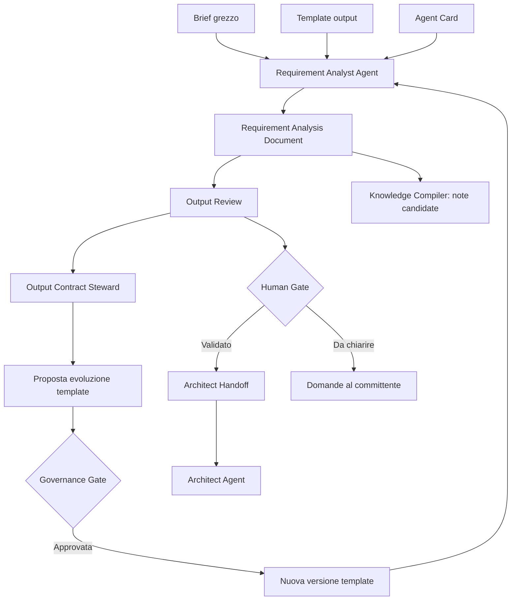
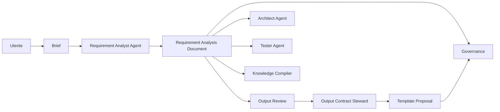

# 07 - Template di output: Requirement Analysis Document

## Obiettivo della lezione

Questa lezione serve a costruire il primo template di output reale del percorso AgentFactory.

Il template si chiama:

```text
Requirement Analysis Document
```

Serve al Requirement Analyst Agent per trasformare un brief grezzo in un documento requisiti ordinato, verificabile e usabile come fonte dagli agenti successivi.

Fino ad ora ho creato:

- una roadmap;
- una definizione di agente;
- una distinzione tra automazione, workflow e agente;
- una Agent Card;
- una mappa degli strumenti reali.

Ora devo fare un passo molto importante:

```text
passare dalla progettazione dell'agente alla progettazione del suo output.
```

Un agente senza output ben strutturato e' difficile da valutare.

Un agente difficile da valutare e' difficile da migliorare.

Un agente difficile da migliorare non puo' diventare parte seria di una Agent Factory.

## Perche' questa lezione conta

Quando si lavora con AI Agent, il rischio non e' solo ottenere una risposta sbagliata.

Il rischio piu' sottile e' ottenere una risposta che sembra buona, ma che non e' controllabile.

Esempio:

```text
Ho capito il progetto. Bisogna creare una piattaforma moderna, scalabile, intuitiva e sicura.
```

Questa frase suona bene.

Ma non basta.

Non dice:

- quali fatti sono certi;
- quali parti sono ipotesi;
- quali informazioni mancano;
- quali requisiti sono funzionali;
- quali requisiti sono non funzionali;
- cosa e' dentro lo scope;
- cosa e' fuori dallo scope;
- quali criteri permettono di dire che il lavoro e' fatto bene;
- cosa deve ricevere l'agente successivo.

Un output professionale deve essere leggibile da una persona, ma anche utilizzabile da una pipeline.

Questa e' una differenza enorme.

Un documento scritto per "fare bella figura" puo' essere discorsivo.

Un artefatto scritto per una Agent Factory deve essere:

- strutturato;
- verificabile;
- versionabile;
- riutilizzabile;
- adatto al passaggio tra agenti.

## Prerequisiti

Prima di questa lezione devo avere chiari:

- che cos'e' un artefatto;
- che cos'e' un template;
- cosa fa il Requirement Analyst Agent;
- differenza tra fatti, ipotesi e domande aperte;
- differenza tra requisiti funzionali e non funzionali;
- concetto di handoff;
- concetto di human gate.

## Il problema: output libero contro output contrattualizzato

Un modello AI e' molto bravo a generare testo libero.

Ma il testo libero e' fragile quando deve entrare in una pipeline.

Perche'?

Perche' ogni volta potrebbe cambiare forma.

Oggi l'agente scrive:

```text
Requisiti principali
```

Domani scrive:

```text
Funzionalita' richieste
```

Un altro giorno scrive:

```text
Cosa deve fare il sistema
```

Per una persona sono tre frasi simili.

Per una pipeline sono tre strutture diverse.

Questo crea problemi.

Un agente successivo, per esempio l'Architect Agent, deve sapere dove trovare:

- obiettivo di business;
- vincoli;
- requisiti;
- rischi;
- domande aperte;
- decisioni in attesa.

Se ogni output cambia forma, ogni agente successivo deve reinterpretare tutto da capo.

Questo aumenta:

- rumore;
- ambiguita';
- errori;
- costo in token;
- rischio di perdere informazioni importanti.

## Che cos'e' un output contract

Un output contract e' un accordo sulla forma dell'output.

Non dice solo:

```text
scrivi un buon documento requisiti.
```

Dice:

```text
il documento deve avere queste sezioni, in questo ordine, con questo tipo di contenuto.
```

Un output contract rende l'agente piu' controllabile.

La parola importante e':

```text
forma.
```

Un output contract non decide tutto il lavoro dell'agente successivo.

Decide soprattutto come deve essere fatto l'artefatto prodotto dall'agente corrente.

Esempio semplice:

```text
Il Requirement Analyst Agent deve produrre un Requirement Analysis Document.
Quel documento deve avere sezioni stabili.
Ogni sezione deve contenere un certo tipo di informazione.
```

Quindi l'output contract risponde a domande come:

```text
Quale artefatto deve uscire?
Quali sezioni deve avere?
In che ordine?
Quali campi sono obbligatori?
Come capisco se il formato e' rispettato?
```

Esempio:

```text
Il Requirement Analyst Agent deve sempre produrre:

1. metadati;
2. sintesi progetto;
3. obiettivo di business;
4. fatti certi;
5. ipotesi;
6. domande aperte;
7. attori e stakeholder;
8. scope;
9. out of scope;
10. requisiti funzionali;
11. requisiti non funzionali;
12. vincoli;
13. rischi;
14. criteri di accettazione;
15. punti di validazione umana;
16. handoff per agenti successivi;
17. note per Knowledge Compiler.
```

Questa lista non e' burocrazia.

E' architettura.

Sto creando una forma stabile che altri agenti potranno leggere.

## Output contract, template e handoff

Qui devo fare una distinzione importante, perche' questi tre concetti sono vicini ma non sono la stessa cosa.

| Concetto | Domanda a cui risponde | Esempio |
|---|---|---|
| Output contract | Che forma deve avere l'artefatto prodotto? | Il documento requisiti deve avere fatti, ipotesi, domande, requisiti, rischi e criteri di accettazione |
| Template | Quale file uso come stampo pratico del contratto? | `templates/requirement-analysis-output-template.md` |
| Handoff | Che cosa deve ricevere il prossimo agente per lavorare bene? | L'Architect deve ricevere obiettivo, vincoli, scope, rischi e output atteso |

Il template e' la materializzazione pratica dell'output contract.

L'handoff invece e' il passaggio operativo verso un altro agente.

Esempio:

```text
Output contract:
"Il Requirement Analysis Document deve avere la sezione Vincoli."

Template:
file Markdown con la sezione ## Vincoli pronta da compilare.

Handoff:
"Architect Agent, considera questi vincoli specifici quando progetti l'architettura."
```

La differenza e' questa:

```text
Output contract = controlla la forma dell'output.
Handoff = controlla il passaggio di responsabilita' e contesto.
```

Un output puo' contenere una sezione di handoff.

Ma la sezione di handoff non coincide con tutto l'output contract.

E un Handoff Contract, quando lo salviamo come file autonomo, puo' avere a sua volta un template e quindi un suo output contract.

Questa frase sembra sottile, ma e' fondamentale:

```text
anche l'handoff e' un artefatto, quindi anche l'handoff puo' avere un contratto di forma.
```

Pero' lo scopo resta diverso.

L'output contract protegge la stabilita' dell'artefatto.

L'handoff protegge la continuita' del lavoro tra agenti.

## Output blindato non significa output immutabile

Qui nasce un dubbio importante:

```text
Se in una pipeline multi-agent possono esistere agenti creati dinamicamente,
ma l'output di un agente deve rispettare un contratto preciso,
chi controlla che quel contratto sia ancora giusto?
```

La risposta e':

```text
serve un ruolo di controllo del contratto di output.
```

In una Agent Factory professionale l'output contract deve essere abbastanza rigido da proteggere la pipeline, ma abbastanza governato da poter evolvere.

Se il contratto e' troppo libero, gli agenti successivi non sanno cosa leggere.

Se il contratto e' troppo rigido, la pipeline non riesce ad adattarsi a progetti nuovi.

Quindi non devo pensare al template come a una pietra immobile.

Devo pensarlo come a un componente versionato.

Esempio:

```text
Requirement Analysis Document v0.1
Requirement Analysis Document v0.2
Requirement Analysis Document v1.0
```

Ogni versione deve essere tracciata, motivata e compatibile con gli agenti che la usano.

## Il ruolo dell'Output Contract Steward

Per ora lo chiamiamo:

```text
Output Contract Steward
```

Non e' ancora un agente che costruiremo subito.

E' un ruolo concettuale che comparira' piu' avanti nella pipeline.

Il suo compito e' controllare se gli output prodotti dagli agenti sono:

- conformi al template;
- completi;
- leggibili dagli agenti successivi;
- troppo verbosi;
- troppo poveri;
- pieni di sezioni inutili;
- mancanti di informazioni ricorrenti;
- adatti ai nuovi tipi di progetto che la factory incontra.

Quando trova un problema, non deve cambiare tutto impulsivamente.

Deve produrre una proposta di evoluzione.

Esempio:

```text
Problema osservato:
In 4 progetti su 5 il Requirement Analysis Document non distingue bene
tra "vincoli tecnici" e "decisioni gia' prese".

Proposta:
Aggiungere una sezione "Decisioni note" dopo "Vincoli".

Impatto:
Architect Agent e Reviewer Agent potranno distinguere meglio cio' che e'
obbligatorio da cio' che e' solo una scelta gia' effettuata.
```

Questa proposta puo' poi passare da:

- human gate;
- review automatica;
- test di compatibilita';
- aggiornamento versionato del template.

## Perche' non basta lasciare che ogni agente si adatti da solo

Un agente dinamico puo' essere creato per un progetto specifico.

Esempio:

```text
Per un progetto sanitario creo un Compliance Analyst Agent temporaneo.
Per un progetto e-commerce creo un Conversion Analyst Agent temporaneo.
Per un progetto enterprise creo un Security Risk Agent temporaneo.
```

Questi agenti possono avere bisogni diversi.

Il Compliance Analyst Agent potrebbe avere bisogno di una sezione su privacy e trattamento dati.

Il Security Risk Agent potrebbe avere bisogno di una sezione su minacce e superfici di attacco.

Il Conversion Analyst Agent potrebbe avere bisogno di funnel, metriche e comportamento utente.

La soluzione sbagliata sarebbe lasciare che ogni agente cambi liberamente il formato.

Perche'?

Perche' dopo poche esecuzioni la factory avrebbe decine di output incompatibili.

La soluzione corretta e':

```text
gli agenti dinamici possono proporre estensioni;
la factory valuta le estensioni;
solo le estensioni utili, ricorrenti e compatibili diventano parte del contratto ufficiale.
```

Questo e' un punto fondamentale:

```text
gli agenti possono imparare dall'esperienza,
ma la conoscenza assorbita deve passare da un processo di validazione.
```

## Evoluzione autonoma, ma governata

Quando diciamo che una Agent Factory deve migliorare nel tempo, non intendiamo:

```text
ogni agente modifica da solo template, prompt e regole quando vuole.
```

Questo sarebbe pericoloso.

Intendiamo invece:

```text
la pipeline raccoglie evidenze;
un agente o ruolo specializzato analizza gli output;
propone miglioramenti;
il sistema valuta impatto e compatibilita';
una persona o una policy approva;
il cambiamento viene versionato.
```

Questa e' evoluzione autonoma governata.

E' diversa dall'autonomia cieca.

In una prima fase il gate sara' umano.

Quando saremo piu' avanti, alcune modifiche piccole e a basso rischio potranno essere approvate automaticamente, per esempio:

- aggiungere un campo facoltativo;
- migliorare una descrizione del template;
- aggiungere un esempio;
- correggere una checklist;
- proporre una nuova sezione senza renderla obbligatoria.

Le modifiche rischiose invece devono restare sotto controllo umano:

- rimuovere sezioni;
- cambiare il significato di un campo;
- cambiare l'ordine richiesto da agenti a valle;
- modificare criteri di accettazione;
- modificare privilegi o tool consentiti.

## Schema drift: quando il contratto scivola senza controllo

Un rischio tipico nelle pipeline multi-agent si puo' chiamare:

```text
schema drift
```

Significa che la forma dell'output cambia lentamente, quasi senza accorgersene.

All'inizio il Requirement Analysis Document ha 17 sezioni.

Poi un agente aggiunge una sezione.

Poi un altro la rinomina.

Poi un terzo ne salta due.

Dopo dieci esecuzioni nessuno sa piu' quale sia la forma corretta.

Questo rompe:

- parsing;
- review;
- test;
- handoff;
- memoria;
- riuso della conoscenza.

L'Output Contract Steward serve proprio a impedire che questo accada.

## Nuova mappa mentale

Prima pensavo:

```text
Agente -> Output -> Agente successivo
```

Ora devo pensare:

```text
Agente -> Output -> Verifica output -> Handoff
                 -> Proposta miglioramento contratto -> Validazione -> Nuova versione template
```

Quindi l'output contract non e' solo un file.

E' un confine operativo tra:

- produzione;
- controllo;
- apprendimento;
- governance.

## Differenza tra template e output finale

Il template e' lo stampo.

L'output finale e' il documento compilato.

Esempio:

```text
Template:
## Obiettivo di business
[Descrivere perche' il progetto esiste]

Output:
## Obiettivo di business
Ridurre il tempo di gestione delle richieste clienti da email non strutturate a ticket ordinati.
```

Il template non deve essere perfetto per sempre.

Deve essere abbastanza buono per iniziare, essere usato, essere valutato e poi migliorato.

Questa e' una regola fondamentale di AgentFactory:

```text
prima creo un artefatto semplice e tracciabile;
poi lo uso;
poi misuro dove fallisce;
poi lo miglioro.
```

## Perche' il Requirement Analyst Agent viene prima degli altri

In una pipeline multi-agent, l'analisi requisiti e' il primo filtro serio.

Se questa fase e' debole, tutto il resto diventa fragile.

Un Developer Agent puo' scrivere codice.

Ma se i requisiti sono ambigui, scrivera' codice coerente con una interpretazione sbagliata.

Un Tester Agent puo' scrivere test.

Ma se non ci sono criteri di accettazione, testera' cio' che immagina, non cio' che e' stato richiesto.

Un Architect Agent puo' proporre architettura.

Ma se i vincoli non sono chiari, rischia di scegliere soluzioni premature.

Quindi il Requirement Analyst Agent serve a proteggere tutta la pipeline.

## Mappa del flusso



In questo schema ci sono tre elementi importanti:

- l'Agent Card dice chi e' l'agente e cosa puo' fare;
- il template dice come deve essere fatto l'output;
- il documento finale diventa fonte autorevole consultabile dagli altri agenti;
- l'handoff seleziona cio' che serve al prossimo agente senza caricare tutto il documento;
- la review controlla se l'output rispetta il contratto;
- l'Output Contract Steward propone evoluzioni del template quando emergono limiti ricorrenti.

## Anatomia del Requirement Analysis Document

Il template creato in questa lezione vive qui:

```text
templates/requirement-analysis-output-template.md
```

Le sezioni principali sono:

| Sezione | A cosa serve | Perche' e' importante |
|---|---|---|
| Metadati | Identificare progetto, versione, autore e stato | Rende il documento tracciabile |
| Sintesi progetto | Spiegare il progetto in poche righe | Aiuta lettura rapida e handoff |
| Obiettivo di business | Chiarire il perche' del progetto | Evita soluzioni tecniche senza scopo |
| Fatti certi | Separare cio' che e' dichiarato | Riduce invenzioni dell'agente |
| Ipotesi | Dichiarare deduzioni non confermate | Evita di trattare ipotesi come verita' |
| Domande aperte | Evidenziare cosa manca | Prepara human gate e chiarimenti |
| Attori e stakeholder | Capire chi usa o influenza il sistema | Migliora requisiti e priorita' |
| Scope | Definire cosa entra nella fase corrente | Riduce espansione incontrollata |
| Out of scope | Definire cosa resta fuori | Protegge tempi, costi e focus |
| Requisiti funzionali | Descrivere cosa deve fare il sistema | Base per sviluppo e test |
| Requisiti non funzionali | Descrivere qualita' e vincoli di comportamento | Base per architettura e governance |
| Vincoli | Esplicitare limiti tecnici, legali o organizzativi | Evita decisioni incompatibili |
| Rischi | Anticipare problemi | Aiuta priorita' e controllo |
| Criteri di accettazione | Dire come verificare il risultato | Collega requisiti e test |
| Human gate | Stabilire cosa deve approvare una persona | Evita automazione cieca |
| Note preliminari di handoff | Preparare indicazioni per agenti successivi | Aiuta a generare Handoff Contract separati quando servono |
| Note Knowledge Compiler | Proporre conoscenza da assorbire | Alimenta miglioramento nel tempo |

## Fatti, ipotesi e domande aperte

Queste tre sezioni sono fondamentali.

Molti errori nei sistemi agentici nascono da qui.

### Fatti certi

Un fatto certo e' qualcosa che compare chiaramente nell'input.

Esempio:

```text
Il cliente vuole un sito statico consultabile.
```

Se questa informazione e' nel brief, posso trattarla come fatto.

### Ipotesi

Un'ipotesi e' una deduzione ragionevole ma non confermata.

Esempio:

```text
Poiche' il sito deve essere proiettabile, si ipotizza che la leggibilita' su schermo grande sia prioritaria.
```

Questa e' utile.

Ma non devo trattarla come certezza.

### Domande aperte

Una domanda aperta e' un punto che blocca o limita la qualita' del lavoro.

Esempio:

```text
Il sito deve essere pubblicato su GitHub Pages, Netlify, Vercel o solo consultato localmente?
```

Le domande aperte non sono un fallimento.

Sono un segnale di professionalita'.

Un agente bravo non finge certezza quando il brief e' incompleto.

## Requisiti verificabili

Un requisito deve poter essere verificato.

Requisito debole:

```text
Il sito deve essere bello.
```

Problema:

```text
"Bello" non e' verificabile.
```

Requisito migliore:

```text
Il sito deve usare una palette dark/cyberpunk, avere navigazione laterale, cards per le lezioni e layout responsive desktop/mobile.
```

Questo e' piu' verificabile.

Non e' ancora perfetto, ma posso controllarlo.

## Criteri di accettazione

I criteri di accettazione rispondono a questa domanda:

```text
come capisco che il requisito e' soddisfatto?
```

Esempio:

```text
Requisito:
La sidebar deve avere sezioni espandibili e richiudibili.

Criterio di accettazione:
L'utente puo' aprire e chiudere le sezioni Fondazione, Lezioni e Agenti senza ricaricare la pagina.
```

Questa struttura aiuta il Tester Agent.

Infatti il Tester Agent non deve indovinare cosa verificare.

Riceve criteri gia' collegati ai requisiti.

## Note preliminari per gli agenti successivi

Il Requirement Analysis Document non e' solo un documento per l'umano.

E' anche una fonte per la pipeline.

Pero' non devo confondere due cose:

```text
Requirement Analysis Document = fonte completa.
Handoff Contract = contesto operativo selezionato per un agente specifico.
```

Nel Requirement Analysis Document posso inserire note preliminari per:

- Architect Agent;
- Developer Agent;
- Tester Agent;
- Reviewer Agent;
- Knowledge Compiler.

Queste note non sono necessariamente l'Handoff Contract finale.

Sono materiale da cui creare un handoff separato quando il progetto cresce o quando il prossimo agente ha bisogno di un ingresso operativo pulito.

Esempio:

```text
Note per Architect Agent:
- valutare se sito statico semplice basta o se serve framework;
- considerare GitHub Pages come target naturale;
- mantenere Markdown come fonte principale.

Note per Tester Agent:
- verificare desktop e mobile;
- verificare link lezioni;
- verificare leggibilita' dei diagrammi.
```

Questo evita che ogni agente riparta da zero.

Quando preparo il passaggio reale verso l'Architect Agent, posso trasformare queste note in:

```text
Architect Handoff Contract
```

Regola pratica:

```text
Se il progetto e' piccolo, il RAD con note interne puo' bastare.
Se il progetto e' medio o complesso, creo un Handoff Contract separato.
Se il prossimo agente ha dubbi, puo' consultare il RAD come fonte.
```

Quindi l'agente successivo non deve sempre ricevere tutto il RAD nel proprio contesto attivo.

Idealmente riceve prima l'handoff.

Il RAD resta disponibile come fonte di approfondimento.

## Human gate

Il Requirement Analyst Agent non deve decidere tutto da solo.

Deve indicare quali punti richiedono validazione umana.

Esempio:

```text
- Confermare target di pubblicazione del sito.
- Confermare se il manuale deve essere pubblico o privato.
- Confermare se gli studenti avranno solo lettura o anche accesso al repo.
```

In AgentFactory, il human gate non e' un ostacolo.

E' un dispositivo di sicurezza e qualita'.

## Esempio semplice

Brief grezzo:

```text
Voglio un sito dark cyberpunk per consultare le lezioni del manuale AgentFactory.
```

Output atteso, in forma sintetica:

```text
Fatto certo:
- Il sito deve consultare le lezioni AgentFactory.
- Il design richiesto e' dark/cyberpunk.

Ipotesi:
- Il sito deve essere statico e semplice da pubblicare.

Domande aperte:
- Dove verra' pubblicato?
- Deve avere ricerca?
- Deve supportare contenuti lunghi e diagrammi?

Requisiti funzionali:
- Mostrare elenco lezioni.
- Aprire ogni lezione in pagina dedicata.
- Avere navigazione laterale.

Requisiti non funzionali:
- Responsive.
- Leggibile in proiezione.
- Design coerente e moderno.
```

Questo non e' ancora un documento completo.

Ma e' gia' molto piu' utile di una risposta libera.

## Esempio professionale

Brief:

```text
Un'azienda vuole automatizzare la ricezione di brief cliente, trasformarli in requisiti e generare una prima proposta tecnica con agenti AI.
```

Un Requirement Analyst Agent professionale deve produrre almeno:

- obiettivo di business;
- attori coinvolti;
- canali di input;
- requisiti funzionali;
- requisiti non funzionali;
- vincoli su privacy e dati;
- domande aperte su autorizzazioni e fonti;
- rischi legati ad automazione e allucinazione;
- criteri di accettazione;
- note preliminari o handoff verso Architect Agent e Governance Agent.

Output debole:

```text
Serve una pipeline AI che riceve brief, capisce requisiti e produce proposta tecnica.
```

Output forte:

```text
Il sistema deve ricevere brief da canali autorizzati, salvarli come artefatti versionati, produrre un documento requisiti con fatti/ipotesi/domande, richiedere validazione umana prima della proposta tecnica e tracciare ogni decisione rilevante.
```

La differenza e' enorme.

Nel secondo caso posso progettare, testare e governare.

## Anti-pattern ed errori comuni

### Errore 1 - Scrivere documenti belli ma inutilizzabili

Errore:

```text
Produrre una lunga analisi discorsiva senza sezioni stabili.
```

Perche' e' un problema:

```text
Gli agenti successivi non sanno dove trovare le informazioni.
```

Correzione:

```text
Usare sempre il template.
```

### Errore 2 - Mescolare fatti e ipotesi

Errore:

```text
Il cliente vuole GitHub Pages.
```

Quando in realta' il brief dice solo:

```text
Voglio un sito statico.
```

Perche' e' un problema:

```text
L'agente trasforma una deduzione in una certezza.
```

Correzione:

```text
Scrivere GitHub Pages tra le ipotesi o tra le opzioni, non tra i fatti.
```

### Errore 3 - Saltare i criteri di accettazione

Errore:

```text
Elencare requisiti senza spiegare come verificarli.
```

Perche' e' un problema:

```text
Il Tester Agent non ha una base chiara.
```

Correzione:

```text
Ogni requisito importante deve avere almeno un criterio di accettazione.
```

### Errore 4 - Non preparare note per il passaggio successivo

Errore:

```text
Concludere il documento senza indicare cosa devono fare gli agenti successivi.
```

Perche' e' un problema:

```text
La pipeline perde continuita'.
```

Correzione:

```text
Aggiungere note specifiche per gli agenti successivi e, se il progetto lo richiede, generare Handoff Contract separati.
```

### Errore 5 - Usare il template come gabbia

Errore:

```text
Compilare tutte le sezioni anche quando non ci sono informazioni utili.
```

Perche' e' un problema:

```text
Il documento si riempie di testo finto.
```

Correzione:

```text
Se una sezione non ha dati, scrivere "Non disponibile nell'input" o "Da chiarire".
```

### Errore 6 - Far evolvere i contratti senza controllo

Errore:

```text
Ogni agente modifica liberamente sezioni, nomi e formato dell'output.
```

Perche' e' un problema:

```text
Gli agenti a valle non sanno piu' quale struttura aspettarsi.
```

Correzione:

```text
Le modifiche ai template devono essere proposte, valutate, versionate e approvate.
```

### Errore 7 - Bloccare per sempre un contratto sbagliato

Errore:

```text
Il template e' ufficiale, quindi non si cambia mai.
```

Perche' e' un problema:

```text
La factory non assorbe conoscenza dai progetti reali.
```

Correzione:

```text
Trattare il template come un artefatto versionato che migliora grazie a evidenze raccolte nelle esecuzioni.
```

## Collegamento con AgentFactory

Questa lezione crea un pezzo reale della futura Agent Factory.

Il template di output e' un contratto tra:

- utente;
- Requirement Analyst Agent;
- agenti successivi;
- sistema di verifica;
- knowledge base.



Questa e' la base per arrivare a pipeline multi-agent reali.

Non sto solo imparando un concetto.

Sto costruendo un componente.

## Artefatto prodotto

Questa lezione produce il template:

```text
templates/requirement-analysis-output-template.md
```

Questo template sara' usato nei prossimi esperimenti per far produrre al Requirement Analyst Agent un documento requisiti coerente.

## Aggiornamento della Agent Card

La Agent Card del Requirement Analyst Agent viene aggiornata concettualmente:

```text
Output principale:
Requirement Analysis Document compilato secondo template ufficiale.
```

Questo significa che l'agente non deve piu' produrre un generico documento requisiti.

Deve produrre quel documento, con quella struttura.

## Verifica personale

Dopo questa lezione devo saper rispondere:

```text
1. Perche' un output libero e' fragile in una pipeline multi-agent?
2. Che differenza c'e' tra template e output finale?
3. Che cos'e' un output contract?
4. Perche' devo separare fatti, ipotesi e domande aperte?
5. Perche' i criteri di accettazione aiutano il Tester Agent?
6. Perche' nel RAD posso avere note preliminari di handoff senza confonderle con un Handoff Contract completo?
7. Quando una sezione vuota deve diventare "Da chiarire" invece di essere inventata?
8. Perche' un output contract deve essere rigido ma versionabile?
9. Che problema crea lo schema drift in una pipeline multi-agent?
10. Che differenza c'e' tra agente che propone un'estensione e agente che modifica autonomamente un contratto ufficiale?
11. Che differenza c'e' tra output contract, template e handoff?
```

## Conoscenza da assorbire

- Un agente professionale non produce solo testo, produce artefatti strutturati.
- Il template di output rende l'agente valutabile.
- L'output contract governa la forma dell'artefatto; il template la rende concreta; l'handoff prepara il passaggio al prossimo agente.
- Il Requirement Analysis Document e' fonte completa; l'Handoff Contract e' contesto selezionato per il prossimo agente.
- Un output stabile riduce perdita di contesto tra agenti.
- Fatti, ipotesi e domande aperte devono rimanere separati.
- Ogni requisito importante deve essere verificabile.
- I criteri di accettazione collegano Requirement Analyst Agent e Tester Agent.
- Le note preliminari nel RAD aiutano a preparare la pipeline multi-agent, ma nei passaggi complessi l'handoff va separato.
- Il template deve evolvere dopo uso reale, non prima in astratto.
- Un output blindato protegge la pipeline, ma deve restare versionabile.
- Gli agenti dinamici possono proporre estensioni, non cambiare da soli i contratti ufficiali.
- Serve un ruolo di Output Contract Steward per controllare conformita', drift ed evoluzione dei template.
- L'evoluzione autonoma deve essere governata da evidenze, review, compatibilita' e gate.

## Prossimo passo

Usare il template con un brief semplice e produrre il primo Requirement Analysis Document manuale.

Solo dopo avra' senso iniziare ad automatizzare questo passaggio con Python o con un SDK agentico.
