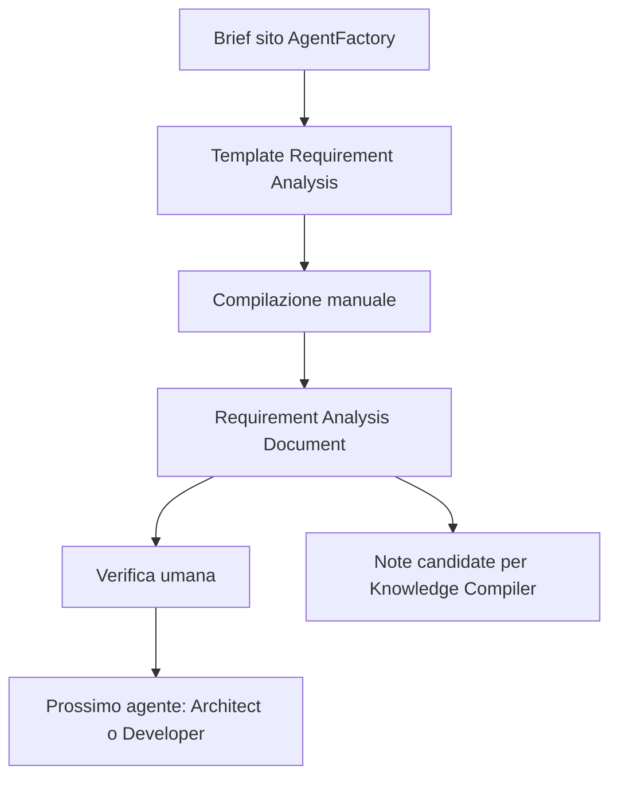
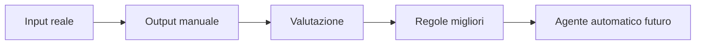

# 08 - Primo Requirement Analysis Document manuale

## Obiettivo della lezione

Questa lezione serve a fare il primo uso reale del template creato nella lezione precedente.

Nella lezione 07 ho creato il template:

```text
templates/requirement-analysis-output-template.md
```

Ora lo uso per produrre un primo artefatto compilato:

```text
experiments/001-agentfactory-static-site-requirements.md
```

Questo passaggio e' molto importante perche' segna una transizione:

```text
da "sto imparando cosa dovrebbe fare un agente"
a "sto simulando manualmente il lavoro dell'agente"
```

Prima di automatizzare un agente, devo saper riconoscere un output buono.

Se non so produrre o valutare manualmente un buon output, non posso sapere se l'agente sta lavorando bene.

## Perche' questa lezione conta

Molti percorsi sugli AI Agent saltano troppo presto al codice.

Questo crea una falsa sensazione di progresso.

Si scrive uno script.

Lo script chiama un modello.

Il modello produce testo.

Sembra di avere un agente.

Ma in realta' manca una domanda fondamentale:

```text
L'output prodotto e' utile, verificabile e pronto per il passaggio successivo?
```

Questa lezione serve a costruire il muscolo piu' importante prima dell'automazione:

```text
saper giudicare la qualita' di un artefatto.
```

Un agente non diventa professionale perche' usa un modello potente.

Diventa professionale quando:

- riceve input chiari;
- produce output strutturati;
- dichiara incertezze;
- prepara note utili per gli handoff successivi;
- rispetta limiti;
- lascia tracce valutabili.

## Prerequisiti

Prima di questa lezione devo avere chiari:

- che cos'e' un Requirement Analyst Agent;
- che cos'e' un template di output;
- che cos'e' un Requirement Analysis Document;
- differenza tra fatto, ipotesi e domanda aperta;
- differenza tra requisito funzionale e requisito non funzionale;
- concetto di criterio di accettazione;
- concetto di handoff.

## Il principio: simulare prima di automatizzare

In AgentFactory seguo questa regola:

```text
prima simulo manualmente il workflow;
poi automatizzo;
poi valuto;
poi miglioro.
```

Perche'?

Perche' la simulazione manuale mi obbliga a capire:

- quale input serve;
- quale output voglio;
- quali sezioni sono utili;
- quali sezioni sono ambigue;
- dove il template e' troppo debole;
- dove l'agente dovra' fermarsi;
- dove serve validazione umana.

Se automatizzo prima, rischio di costruire una pipeline elegante che produce artefatti mediocri.

Se simulo prima, costruisco criterio.

E il criterio e' cio' che mi permette di diventare bravo davvero.

## Input scelto per il primo esperimento

Uso un brief reale emerso durante il percorso:

```text
Creare un sito web statico semplice, consultabile e presentabile per il progetto AgentFactory.
Il sito deve avere un design moderno in dark mode, con palette cyberpunk.
Deve rendere il manuale consultabile e proiettabile.
Deve avere una sidebar ordinata, compatta, responsive, con sezioni espandibili e richiudibili.
```

Questo brief e' adatto per il primo esperimento perche':

- e' concreto;
- riguarda il repository reale;
- ha requisiti visivi e funzionali;
- contiene vincoli impliciti;
- ha gia' prodotto iterazioni;
- e' abbastanza semplice da analizzare senza codice;
- e' abbastanza reale da non essere un esempio finto.

## Mappa del primo esperimento



In questa lezione non chiamo ancora API.

Non uso ancora Python.

Non uso ancora OpenAI Agents SDK.

Sto costruendo l'output ideale che poi vorro' far produrre a un agente reale.

## Perche' usare proprio il sito AgentFactory

Il sito AgentFactory non e' un esercizio casuale.

E' parte del sistema che stiamo costruendo.

Ha tre ruoli:

1. rende il manuale consultabile;
2. rende il progetto presentabile;
3. obbliga a pensare come una factory: contenuto, struttura, navigazione, pubblicazione, manutenzione.

Quindi l'analisi requisiti del sito non e' solo una pratica didattica.

E' il primo caso reale interno.

Questo e' molto buono per imparare, perche' posso confrontare:

- cosa volevo;
- cosa ho costruito;
- cosa manca;
- cosa migliorare;
- quale conoscenza assorbire.

## Come compilare il template

Compilare il template non significa riempire ogni sezione con frasi generiche.

Significa prendere decisioni pulite.

### Se l'input contiene una informazione chiara

La metto nei fatti certi.

Esempio:

```text
Il sito deve essere statico.
```

### Se l'input suggerisce qualcosa ma non lo dichiara

La metto nelle ipotesi.

Esempio:

```text
GitHub Pages e' un target probabile, ma non ancora confermato.
```

### Se manca una decisione importante

La metto nelle domande aperte o nei punti di validazione umana.

Esempio:

```text
Il sito deve essere pubblico o privato?
```

### Se una sezione non ha informazioni

Non invento.

Scrivo:

```text
Non disponibile nell'input.
```

oppure:

```text
Da chiarire.
```

Questa e' una disciplina fondamentale.

## Artefatto prodotto

Il documento compilato vive qui:

```text
experiments/001-agentfactory-static-site-requirements.md
```

E' il primo Requirement Analysis Document del repository.

Non e' ancora prodotto da un agente automatico.

E' una simulazione manuale del comportamento che voglio insegnare al Requirement Analyst Agent.

## Cosa imparare guardando l'artefatto

Quando leggo il documento prodotto devo chiedermi:

- i fatti sono separati dalle ipotesi?
- le domande aperte sono utili?
- i requisiti sono verificabili?
- i criteri di accettazione sono concreti?
- le note per gli agenti successivi aiutano davvero a preparare handoff chiari?
- ci sono rischi reali?
- il documento e' troppo lungo o troppo vago?
- posso usarlo per guidare sviluppo, test e review?

Queste domande sono il primo nucleo di valutazione.

## Differenza tra fare analisi e fare progettazione

Il Requirement Analyst Agent non deve progettare tutto.

In questa fase non deve decidere:

- architettura definitiva;
- framework finale;
- deploy definitivo;
- struttura CSS completa;
- implementazione JavaScript.

Deve invece preparare le condizioni per decidere bene dopo.

Esempio:

```text
Requisito:
Il sito deve essere consultabile come static site senza backend.

Nota preliminare per Architect Agent:
Valutare se HTML/CSS/JS statico e' sufficiente o se conviene introdurre un generatore piu' robusto.
```

Questa e' analisi corretta.

Non sto progettando tutta la soluzione.

Sto preparando il materiale da cui potra' nascere un Handoff Contract separato.

## Prima metrica qualitativa

Da questa lezione introduco una prima metrica semplice:

```text
Un Requirement Analysis Document e' buono se un agente successivo puo' usare l'handoff derivato dal RAD senza dover reinterpretare tutto da zero.
```

Questa metrica e' semplice ma potente.

Se l'Architect Agent, leggendo l'handoff derivato dal RAD, deve chiedersi:

```text
ma cosa voleva davvero l'utente?
```

allora l'analisi requisiti e' debole.

Se invece puo' dire:

```text
ho obiettivo, scope, vincoli, requisiti e criteri di accettazione;
posso progettare il prossimo passo.
```

allora l'artefatto sta funzionando.

Il RAD resta comunque fonte completa.

L'handoff, quando esiste come file separato, diventa il contesto operativo primario del prossimo agente.

## Esempio di trasformazione

Input grezzo:

```text
La sidebar e' troppo schiacciata a sinistra, usiamo meglio gli spazi.
```

Trasformazione debole:

```text
Migliorare la sidebar.
```

Trasformazione forte:

```text
RF-006 - Il layout deve posizionare la sidebar dentro un contenitore centrato, mantenendo proporzioni moderne tra navigazione e contenuto.
Motivazione: evitare che la sidebar appaia schiacciata sul bordo e che il contenuto occupi spazio in modo poco intenzionale.
Criterio di accettazione: a viewport desktop, la shell principale ha una larghezza massima e margini laterali responsive; su mobile la sidebar resta off-canvas.
```

La seconda versione e' piu' lunga.

Ma e' molto piu' utile.

Puo' guidare sviluppo e test.

## Anti-pattern ed errori comuni

### Errore 1 - Saltare il documento manuale

Errore:

```text
Ho gia' il template, ora posso scrivere subito codice.
```

Perche' e' fragile:

```text
Non ho ancora verificato se il template funziona su un caso reale.
```

Correzione:

```text
Compilare almeno un esempio manuale prima di automatizzare.
```

### Errore 2 - Trattare l'artefatto come compito scolastico

Errore:

```text
Riempire le sezioni perche' "vanno riempite".
```

Perche' e' fragile:

```text
L'artefatto diventa lungo ma non operativo.
```

Correzione:

```text
Ogni sezione deve aiutare una decisione, una verifica o un handoff.
```

### Errore 3 - Confondere desideri estetici con requisiti verificabili

Errore:

```text
Il sito deve essere figo.
```

Perche' e' fragile:

```text
Non e' verificabile.
```

Correzione:

```text
Tradurre il desiderio in segnali controllabili: dark mode, palette, sidebar, leggibilita', responsive, gerarchia visiva.
```

### Errore 4 - Dimenticare le iterazioni gia' avvenute

Errore:

```text
Analizzare solo il primo brief e ignorare le correzioni successive.
```

Perche' e' fragile:

```text
Il documento non rappresenta piu' il progetto reale.
```

Correzione:

```text
Includere anche feedback successivi, marcandoli come fatti certi o decisioni emerse.
```

### Errore 5 - Non separare output attuale e desiderato

Errore:

```text
Descrivere quello che esiste gia' come se fosse tutto cio' che serve.
```

Perche' e' fragile:

```text
Si perde la differenza tra stato attuale e miglioramento richiesto.
```

Correzione:

```text
Separare fatti attuali, requisiti desiderati e punti da validare.
```

## Collegamento con AgentFactory

Questa lezione e' un pezzo centrale del metodo AgentFactory.

Per costruire agenti che migliorano nel tempo devo avere:

- input;
- output;
- valutazione;
- correzione;
- conoscenza assorbita.



Il documento manuale non e' una perdita di tempo.

E' il dataset iniziale del mio criterio.

Prima creo esempi buoni.

Poi chiedo agli agenti di imitarli.

Poi misuro dove falliscono.

## Verifica personale

Dopo questa lezione devo saper rispondere:

```text
1. Perche' devo simulare manualmente un agente prima di automatizzarlo?
2. Quale brief ho scelto per il primo Requirement Analysis Document?
3. Dove vive l'artefatto prodotto?
4. Come distinguo fatti, ipotesi e domande aperte?
5. Quando una richiesta estetica diventa un requisito verificabile?
6. Come capisco se l'artefatto aiuta a preparare un handoff utile per l'agente successivo?
7. Perche' questo documento e' gia' parte della futura Agent Factory?
```

## Conoscenza da assorbire

- Prima di automatizzare un agente devo sapere valutare manualmente il suo output.
- Un template va provato su un caso reale, non solo disegnato in astratto.
- Il Requirement Analysis Document e' utile se diventa fonte completa e prepara handoff selezionati per gli agenti successivi.
- Le iterazioni dell'utente sono input importanti e vanno integrate nei requisiti.
- Una richiesta estetica deve essere tradotta in criteri osservabili.
- Un artefatto manuale ben fatto diventa esempio di training mentale per l'agente futuro.

## Prossimo passo

Valutare il Requirement Analysis Document appena prodotto.

La prossima lezione dovra' introdurre una checklist di valutazione per capire se l'output del Requirement Analyst Agent e' buono o debole.
