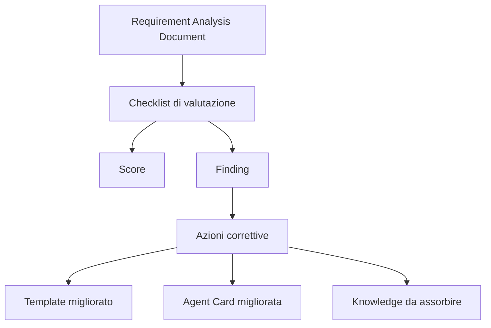
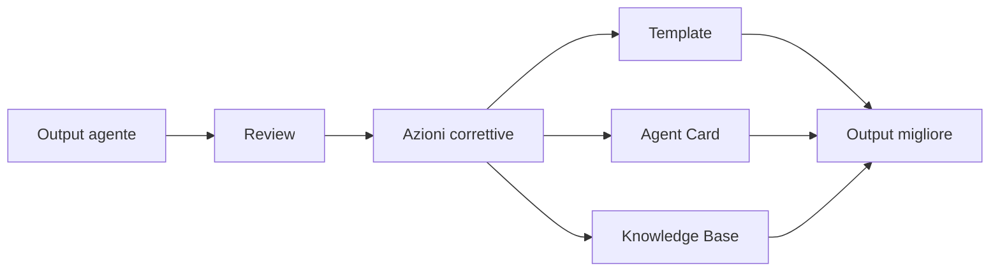

# 09 - Valutare l'output del Requirement Analyst Agent

## Obiettivo della lezione

Questa lezione serve a imparare come valutare un Requirement Analysis Document.

Nella lezione 08 ho prodotto il primo documento requisiti manuale:

```text
experiments/001-agentfactory-static-site-requirements.md
```

Ora devo rispondere a una domanda fondamentale:

```text
come capisco se questo output e' buono?
```

Questa domanda e' centrale per tutta AgentFactory.

Se non so valutare l'output di un agente, non posso:

- migliorare l'agente;
- confrontare due versioni dello stesso agente;
- capire se un template funziona;
- sapere se un modello piu' costoso produce valore reale;
- decidere se l'output puo' passare all'agente successivo;
- assorbire conoscenza utile nella knowledge base.

Quindi questa lezione introduce una checklist di valutazione.

La checklist vive qui:

```text
templates/requirement-analysis-review-checklist.md
```

E la prima review reale vive qui:

```text
experiments/001-agentfactory-static-site-requirements-review.md
```

## Perche' questa lezione conta

Un agente AI puo' produrre un output convincente.

Ma "convincente" non significa "buono".

Un documento puo' sembrare professionale perche':

- e' lungo;
- usa parole tecniche;
- ha tante sezioni;
- suona ordinato;
- sembra sicuro.

Ma puo' comunque essere debole.

Esempio:

```text
Il sistema deve essere scalabile, sicuro, moderno e performante.
```

Questa frase sembra professionale.

Ma non dice:

- scalabile quanto?
- sicuro rispetto a quali rischi?
- moderno secondo quali criteri?
- performante con quali soglie?
- chi verifica queste qualita'?

La valutazione serve a togliere l'illusione.

Serve a trasformare:

```text
mi sembra buono
```

in:

```text
e' buono per questi motivi, debole in questi punti, e migliorabile in queste azioni.
```

## Prerequisiti

Prima di questa lezione devo avere chiari:

- che cos'e' un Requirement Analysis Document;
- che cos'e' un template di output;
- differenza tra fatti, ipotesi e domande aperte;
- requisiti funzionali e non funzionali;
- criteri di accettazione;
- handoff tra agenti;
- human gate;
- concetto di artefatto verificabile.

## La differenza tra leggere e valutare

Leggere un documento significa capirne il contenuto.

Valutare un documento significa giudicare se puo' svolgere bene il suo ruolo.

Un Requirement Analysis Document deve servire a:

- chiarire il brief;
- ridurre ambiguita';
- separare fatti e ipotesi;
- rendere i requisiti verificabili;
- preparare sviluppo, test e review;
- evidenziare rischi;
- indicare cosa richiede validazione umana;
- passare contesto utile agli agenti successivi.

Quindi la domanda non e':

```text
mi piace questo documento?
```

La domanda e':

```text
questo documento permette alla pipeline di lavorare meglio?
```

## Mappa della valutazione



La valutazione non deve finire in un giudizio generico.

Deve produrre:

- score;
- punti forti;
- problemi;
- rischi;
- azioni correttive;
- conoscenza riutilizzabile.

## Che cosa valuta la checklist

La checklist valuta dieci aree.

| Area | Domanda principale | Perche' conta |
|---|---|---|
| Struttura | Il documento segue il template? | Riduce variabilita' |
| Tracciabilita' | Si capisce da dove arriva l'input? | Serve audit e memoria |
| Separazione | Fatti, ipotesi e domande sono distinti? | Riduce allucinazioni |
| Completezza | Le sezioni essenziali sono presenti? | Evita buchi nella pipeline |
| Verificabilita' | I requisiti sono testabili? | Aiuta Tester Agent |
| Handoff | Gli agenti successivi ricevono contesto utile? | Evita re-interpretazione |
| Human gate | Le decisioni umane sono esplicite? | Evita autonomia cieca |
| Rischi | I rischi sono concreti e mitigati? | Aumenta governance |
| Sintesi | Il documento e' leggibile e non ridondante? | Riduce rumore |
| Azionabilita' | Il documento abilita il prossimo passo? | Misura utilita' reale |

## La scala di valutazione

Uso una scala semplice da 0 a 3.

```text
0 = assente o inutilizzabile
1 = presente ma debole
2 = buono ma migliorabile
3 = forte e operativo
```

Questa scala e' volutamente semplice.

Non voglio introdurre metriche finte troppo precise.

In questa fase mi serve una valutazione leggibile, ripetibile e utile.

## Esempio di valutazione

Supponiamo che una sezione "Requisiti funzionali" contenga:

```text
Il sito deve essere bello e facile da usare.
```

Valutazione:

```text
Score verificabilita': 1
Motivo: il requisito esiste ma non e' abbastanza testabile.
Azione correttiva: tradurre "bello" e "facile" in criteri osservabili.
```

Versione migliorata:

```text
RF-001 - Il sito deve mostrare le lezioni come cards con titolo, numero e sintesi.
Criterio di accettazione: la home mostra una card per ogni lezione registrata nel generatore.
```

Qui il requisito diventa verificabile.

## Perche' lo score non basta

Lo score e' utile.

Ma da solo non basta.

Se scrivo:

```text
Verificabilita': 2/3
```

so che c'e' qualcosa da migliorare.

Ma non so cosa.

Quindi ogni valutazione deve includere:

- punteggio;
- motivo;
- evidenza;
- azione correttiva.

Esempio:

```text
Area: Human gate
Score: 2/3
Motivo: sono presenti punti di validazione, ma non sono classificati per priorita'.
Evidenza: pubblicazione, ricerca interna e formato futuro sono tutti allo stesso livello.
Azione: distinguere decisioni bloccanti da decisioni rimandabili.
```

Questo e' utile.

Un agente puo' migliorare da qui.

## Valutare senza distruggere

La review non serve a demolire l'output.

Serve a renderlo migliore.

Un buon Reviewer Agent non deve essere solo critico.

Deve essere:

- preciso;
- giusto;
- utile;
- proporzionato;
- orientato al prossimo passo.

Errore:

```text
Il documento non e' abbastanza dettagliato.
```

Questa critica e' vaga.

Critica migliore:

```text
La sezione rischi indica il rischio di pubblicazione futura, ma non chiarisce quali decisioni bloccano il deploy. Aggiungere una distinzione tra rischi immediati e rischi futuri.
```

Questa critica aiuta.

## Applicazione al primo esperimento

In questa lezione applico la checklist al documento:

```text
experiments/001-agentfactory-static-site-requirements.md
```

Il risultato della review e':

```text
experiments/001-agentfactory-static-site-requirements-review.md
```

Questa review e' il primo esempio concreto di valutazione di un artefatto.

Non e' ancora fatta da un Reviewer Agent automatico.

E' una review manuale.

Ma serve a costruire il criterio che poi vorro' automatizzare.

## Che cosa rende buona una review

Una review e' buona se:

- non si limita a dire "bene" o "male";
- trova problemi reali;
- non inventa problemi inutili;
- distingue errori gravi da miglioramenti futuri;
- propone azioni concrete;
- lascia conoscenza assorbibile;
- aiuta a decidere se procedere o iterare.

La review e' un artefatto, non un commento volante.

Questo significa che deve essere versionata.

## Anti-pattern ed errori comuni

### Errore 1 - Valutare a sensazione

Errore:

```text
Mi sembra fatto bene.
```

Perche' e' fragile:

```text
La sensazione non e' ripetibile e non migliora l'agente.
```

Correzione:

```text
Usare una checklist con aree, punteggi, evidenze e azioni.
```

### Errore 2 - Dare solo un voto

Errore:

```text
8/10.
```

Perche' e' fragile:

```text
Il voto non spiega cosa migliorare.
```

Correzione:

```text
Aggiungere motivazione, evidenza e azione correttiva.
```

### Errore 3 - Cercare perfezione troppo presto

Errore:

```text
Il documento non e' perfetto, quindi non va bene.
```

Perche' e' fragile:

```text
Nelle prime fasi serve capire se l'output abilita il passo successivo, non se e' definitivo.
```

Correzione:

```text
Distinguere blocchi, miglioramenti necessari e miglioramenti futuri.
```

### Errore 4 - Ignorare il ruolo dell'artefatto

Errore:

```text
Valutare il documento come se fosse una presentazione finale.
```

Perche' e' fragile:

```text
Un Requirement Analysis Document deve aiutare la pipeline, non fare marketing.
```

Correzione:

```text
Valutare soprattutto utilita', verificabilita' e handoff.
```

### Errore 5 - Non trasformare la review in conoscenza

Errore:

```text
Correggere il documento e basta.
```

Perche' e' fragile:

```text
La prossima volta l'agente ripetera' lo stesso errore.
```

Correzione:

```text
Estrarre lesson learned, regole e possibili aggiornamenti a template o Agent Card.
```

## Collegamento con AgentFactory

Questa lezione introduce il ciclo minimo di miglioramento:

```text
output -> review -> azioni -> conoscenza -> agente migliore
```



Senza review, AgentFactory resta una catena di generazione testo.

Con review, diventa un sistema che impara.

## Artefatti prodotti

Questa lezione produce:

```text
templates/requirement-analysis-review-checklist.md
experiments/001-agentfactory-static-site-requirements-review.md
```

Il primo file e' un template riutilizzabile.

Il secondo e' la review concreta del primo esperimento.

## Verifica personale

Dopo questa lezione devo saper rispondere:

```text
1. Perche' non basta leggere un output per valutarlo?
2. Quali aree valuta la checklist?
3. Perche' lo score da solo non basta?
4. Che differenza c'e' tra critica vaga e finding utile?
5. Quando un documento e' abbastanza buono per passare all'agente successivo?
6. Perche' la review deve produrre azioni correttive?
7. Come una review alimenta il miglioramento di AgentFactory?
```

## Conoscenza da assorbire

- La qualita' di un agente si misura dagli artefatti che produce.
- Un output convincente non e' automaticamente un output buono.
- Ogni review deve contenere score, motivazione, evidenza e azione.
- La review deve essere proporzionata al ruolo dell'artefatto.
- Lo scopo non e' perfezione immediata, ma miglioramento tracciabile.
- Le review sono uno dei meccanismi principali con cui una Agent Factory impara.

## Prossimo passo

Usare la review per capire se aggiornare:

- il template di Requirement Analysis Document;
- la Agent Card del Requirement Analyst Agent;
- la roadmap;
- la knowledge base.

La prossima lezione dovra' introdurre il concetto di knowledge absorption: come trasformare una review in conoscenza permanente.
