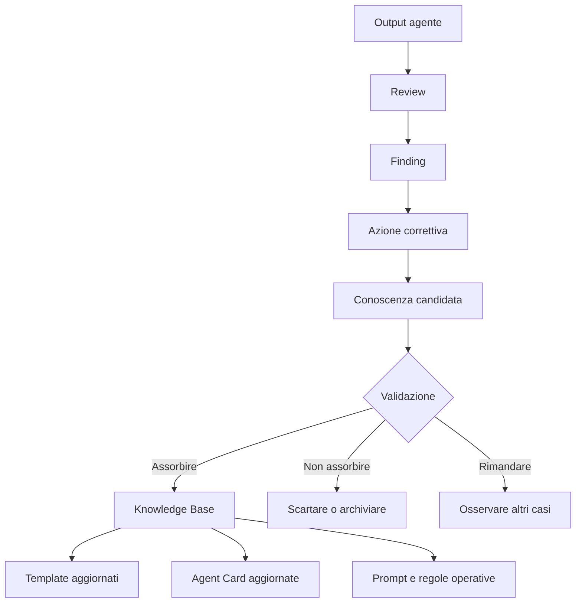
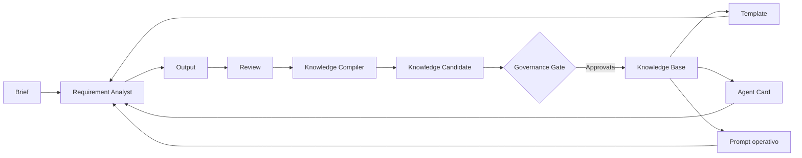

# 10 - Knowledge absorption: trasformare esperienza in conoscenza permanente

## Obiettivo della lezione

Questa lezione serve a capire come una Agent Factory impara davvero nel tempo.

Nella lezione 09 ho imparato a valutare l'output del Requirement Analyst Agent.

Ora devo fare il passo successivo:

```text
trasformare review, errori, decisioni e pattern ricorrenti in conoscenza permanente.
```

Questo processo si chiama:

```text
knowledge absorption
```

Non significa salvare tutto.

Non significa buttare ogni output dentro una cartella.

Non significa fare una memoria infinita piena di rumore.

Significa decidere, con criterio, cosa merita di diventare parte stabile della factory.

## Perche' questa lezione conta

Una pipeline multi-agent puo' produrre molti artefatti:

- analisi requisiti;
- review;
- proposte architetturali;
- test plan;
- codice;
- report di errore;
- note di deploy;
- decisioni umane;
- failure analysis.

Se salvo tutto senza filtro, ottengo confusione.

Se non salvo nulla, la factory non impara.

Il punto professionale e' trovare una via controllata:

```text
esperienza grezza -> valutazione -> conoscenza candidata -> validazione -> memoria permanente
```

Questa e' una delle differenze principali tra:

```text
un agente che esegue compiti
```

e:

```text
una Agent Factory che migliora dopo ogni progetto.
```

## Prerequisiti

Prima di questa lezione devo avere chiari:

- che cos'e' un artefatto;
- che cos'e' un output contract;
- come si valuta un Requirement Analysis Document;
- che cos'e' una review;
- perche' una review deve produrre finding e azioni correttive;
- differenza tra storage e memoria permanente;
- ruolo della Knowledge Base;
- ruolo del Knowledge Compiler.

## Il problema: esperienza non e' automaticamente conoscenza

Un errore molto comune e' pensare:

```text
se salvo tutto quello che succede, allora il sistema impara.
```

Non e' vero.

Salvare tutto produce storage.

La conoscenza richiede selezione.

Esempio:

```text
Durante un progetto il Developer Agent ha sbagliato un path perche' il file era stato rinominato.
```

Questo evento puo' essere:

- rumore occasionale;
- errore ricorrente;
- segnale di naming poco chiaro;
- mancanza di una regola di handoff;
- mancanza di un controllo automatico.

La knowledge absorption serve a capire quale di queste cose e' vera.

Se l'errore e' occasionale, non va trasformato in regola permanente.

Se l'errore si ripete, allora puo' diventare conoscenza.

## Differenza tra storage, memoria e knowledge absorption

Questi tre concetti vanno separati.

| Concetto | Che cos'e' | Rischio se confuso |
|---|---|---|
| Storage | Archivio di file, log, output e tracce | Credere che salvare equivalga a imparare |
| Memoria permanente | Conoscenza validata e riutilizzabile | Salvare regole false o troppo specifiche |
| Knowledge absorption | Processo che decide cosa entra in memoria | Far evolvere la factory senza controllo |

Lo storage conserva.

La memoria orienta.

La knowledge absorption filtra.

## Il ciclo minimo di apprendimento

Il ciclo minimo e':



Questo ciclo e' fondamentale.

Una review non deve morire come file isolato.

Deve generare domande:

- cosa abbiamo imparato?
- e' una lezione riutilizzabile?
- vale per un solo progetto o per molti?
- deve aggiornare un template?
- deve aggiornare una Agent Card?
- deve aggiornare una checklist?
- deve entrare nella Knowledge Base?

## Che cosa puo' diventare conoscenza permanente

Non tutto merita di essere assorbito.

In AgentFactory possono diventare conoscenza permanente:

- principi generali;
- regole operative;
- pattern ricorrenti;
- anti-pattern;
- criteri di qualita';
- checklist;
- decisioni architetturali riutilizzabili;
- prompt migliori;
- sezioni nuove di un template;
- limiti noti di un agente;
- condizioni in cui serve un human gate;
- segnali di rischio ricorrenti.

Esempio:

```text
Finding:
Il Requirement Analysis Document non distingue decisioni bloccanti e decisioni rimandabili.

Conoscenza candidata:
Nei punti di validazione umana distinguere sempre:
- decisioni bloccanti;
- decisioni importanti ma rimandabili;
- decisioni informative.
```

Questa e' conoscenza utile.

Puo' aggiornare:

- template di Requirement Analysis Document;
- checklist di review;
- Agent Card del Requirement Analyst Agent.

## Che cosa non deve diventare conoscenza permanente

La factory non deve assorbire:

- dettagli temporanei;
- preferenze non validate;
- errori isolati;
- workaround usati una sola volta;
- conclusioni senza evidenza;
- output sbagliati;
- ipotesi trattate come fatti;
- decisioni valide solo per un cliente specifico;
- correzioni nate da un bug non piu' presente.

Esempio sbagliato:

```text
In questo progetto abbiamo usato GitHub Pages.
Regola permanente: usare sempre GitHub Pages.
```

Questa non e' una buona regola.

Versione migliore:

```text
Per siti statici semplici, pubblici, senza backend e legati a un repository GitHub,
GitHub Pages e' una opzione naturale da valutare.
```

La seconda formulazione e' piu' forte perche':

- non e' assoluta;
- specifica il contesto;
- non impedisce alternative future;
- puo' essere riutilizzata.

## Knowledge candidate

Una knowledge candidate e' una conoscenza non ancora approvata.

E' una proposta.

Non deve entrare direttamente nella memoria permanente.

Deve prima essere valutata.

Una buona knowledge candidate contiene:

- fonte;
- evidenza;
- lezione appresa;
- ambito di validita';
- rischio se applicata male;
- file da aggiornare;
- decisione: assorbire, non assorbire o rimandare.

Il template vive qui:

```text
templates/knowledge-absorption-template.md
```

## Il ruolo del Knowledge Compiler

Il Knowledge Compiler e' il ruolo che trasforma esperienza grezza in conoscenza pulita.

Non deve essere un archivista passivo.

Deve comportarsi come un editor tecnico.

Il suo lavoro e':

- leggere review, output e failure analysis;
- estrarre pattern;
- eliminare rumore;
- separare fatti, ipotesi e decisioni;
- proporre aggiornamenti a template, Agent Card e checklist;
- indicare cosa non va salvato;
- preparare conoscenza riutilizzabile.

In futuro potra' diventare un agente reale.

Per ora lo studiamo come ruolo.

## Human gate nella knowledge absorption

La knowledge absorption e' delicata perche' modifica il comportamento futuro della factory.

Se assorbo conoscenza sbagliata, peggioro il sistema.

Per questo nelle prime fasi serve un human gate.

Esempio:

```text
Knowledge Compiler:
Propongo di aggiungere al template una sezione "Decisioni note".

Human gate:
Approvato, ma come sezione facoltativa nella versione v0.2 del template.
```

Questo evita due estremi:

- autonomia cieca;
- manualita' totale.

La direzione corretta e':

```text
gli agenti propongono;
la governance valida;
la factory assorbe.
```

## Livelli di assorbimento

Non tutta la conoscenza ha lo stesso peso.

Posso distinguere tre livelli.

### Livello 1 - Nota

Conoscenza utile ma non ancora operativa.

Esempio:

```text
Nei progetti statici la pubblicazione va chiarita presto.
```

### Livello 2 - Regola operativa

Conoscenza che cambia come lavoro.

Esempio:

```text
Ogni Requirement Analysis Document deve distinguere decisioni bloccanti e decisioni rimandabili.
```

### Livello 3 - Aggiornamento di contratto

Conoscenza che cambia template, Agent Card o checklist.

Esempio:

```text
Aggiungere al template una sezione "Decisioni note" o aggiornare i punti di validazione umana.
```

Piu' il livello e' alto, piu' serve controllo.

## Esempio semplice

Esperienza:

```text
Durante la pubblicazione GitHub Pages il sito sembrava rotto per cache del browser.
```

Review:

```text
Il problema non era il layout in se', ma cache mista tra HTML nuovo e CSS vecchio.
```

Knowledge candidate:

```text
Quando si aggiornano asset critici del sito statico, usare cache-busting su CSS, JS e immagini.
```

Decisione:

```text
Assorbire come regola tecnica del sito statico.
```

File da aggiornare:

```text
tools/build-site.js
CHANGELOG.md
eventuale documentazione di deploy
```

Questa e' knowledge absorption concreta.

Non sto solo correggendo un bug.

Sto imparando una regola riutilizzabile.

## Esempio professionale

Scenario:

```text
Una Agent Factory lavora su dieci progetti diversi.
In sei progetti il Reviewer Agent segnala che i requisiti non funzionali sono troppo vaghi.
```

Finding ricorrente:

```text
RNF come "sicuro", "veloce", "scalabile" compaiono senza soglie o criteri di verifica.
```

Knowledge candidate:

```text
Ogni requisito non funzionale deve includere almeno:
- categoria;
- motivazione;
- criterio osservabile;
- soglia, se disponibile;
- rischio se non soddisfatto.
```

Assorbimento:

- aggiornare template requisiti;
- aggiornare checklist di review;
- aggiornare Agent Card del Requirement Analyst Agent;
- aggiungere esempio nella Knowledge Base.

Risultato:

```text
Il prossimo Requirement Analyst Agent produrra' output migliori perche' la factory ha assorbito una debolezza ricorrente.
```

## Anti-pattern ed errori comuni

### Errore 1 - Salvare tutto

Errore:

```text
Ogni output viene copiato nella knowledge base.
```

Perche' e' un problema:

```text
La knowledge base diventa rumorosa e difficile da usare.
```

Correzione:

```text
Salvare solo conoscenza validata, sintetica e riutilizzabile.
```

### Errore 2 - Non salvare nulla

Errore:

```text
Finito il task, si passa al task successivo.
```

Perche' e' un problema:

```text
La factory ripete gli stessi errori.
```

Correzione:

```text
Dopo review o progetto, compilare una knowledge absorption candidate.
```

### Errore 3 - Trasformare un caso singolo in regola assoluta

Errore:

```text
Ha funzionato una volta, quindi sara' sempre la scelta giusta.
```

Perche' e' un problema:

```text
La factory diventa rigida e sbaglia su contesti diversi.
```

Correzione:

```text
Scrivere sempre ambito di validita' e condizioni di applicazione.
```

### Errore 4 - Assorbire conoscenza senza evidenza

Errore:

```text
Mi sembra una buona idea, quindi la metto nelle regole.
```

Perche' e' un problema:

```text
La memoria permanente si riempie di preferenze non testate.
```

Correzione:

```text
Ogni conoscenza candidata deve indicare fonte ed evidenza.
```

### Errore 5 - Lasciare che un agente modifichi la memoria senza gate

Errore:

```text
Il Knowledge Compiler aggiorna direttamente template e Agent Card.
```

Perche' e' un problema:

```text
Un errore di interpretazione puo' cambiare il comportamento futuro della factory.
```

Correzione:

```text
Il Knowledge Compiler propone, la governance approva, poi si versiona.
```

## Collegamento con AgentFactory

Questa lezione aggiunge un nuovo circuito alla factory.

Prima avevo:

```text
brief -> agente -> output -> review
```

Ora aggiungo:

```text
review -> knowledge candidate -> validazione -> memoria permanente -> agenti migliori
```



Questo e' il primo schema serio di miglioramento nel tempo.

## Artefatto prodotto

Questa lezione usa e rafforza il template:

```text
templates/knowledge-absorption-template.md
```

Il template serve a trasformare una lezione, una review, un esperimento o un errore in una proposta di conoscenza permanente.

## Aggiornamento del template

Il template di knowledge absorption deve includere:

- fonte;
- evidenza;
- lesson learned;
- ambito di validita';
- rischio di applicazione sbagliata;
- cosa diventa permanente;
- cosa non va salvato;
- file da aggiornare;
- decisione.

Questo rende il processo piu' controllabile.

## Verifica personale

Dopo questa lezione devo saper rispondere:

```text
1. Perche' salvare tutto non equivale a imparare?
2. Che differenza c'e' tra storage e memoria permanente?
3. Che cos'e' una knowledge candidate?
4. Qual e' il ruolo del Knowledge Compiler?
5. Perche' serve un human gate nella knowledge absorption?
6. Quando una lezione appresa deve aggiornare un template?
7. Quando una lezione appresa deve restare solo nota?
8. Perche' ogni conoscenza assorbita deve avere ambito di validita'?
```

## Conoscenza da assorbire

- Una Agent Factory impara solo se trasforma esperienze valutate in conoscenza validata.
- Storage e memoria permanente non sono la stessa cosa.
- La knowledge absorption deve filtrare rumore, casi singoli e ipotesi non confermate.
- Il Knowledge Compiler propone conoscenza, ma non dovrebbe modificare memoria permanente senza gate.
- Ogni conoscenza assorbita deve avere fonte, evidenza e ambito di validita'.
- Il miglioramento degli agenti passa da template, Agent Card, checklist, prompt e regole operative aggiornate.

## Prossimo passo

Applicare il template di knowledge absorption alla prima review reale:

```text
experiments/001-agentfactory-static-site-requirements-review.md
```

La prossima lezione dovra' produrre la prima knowledge absorption candidate concreta e decidere cosa entra davvero nella Knowledge Base.
