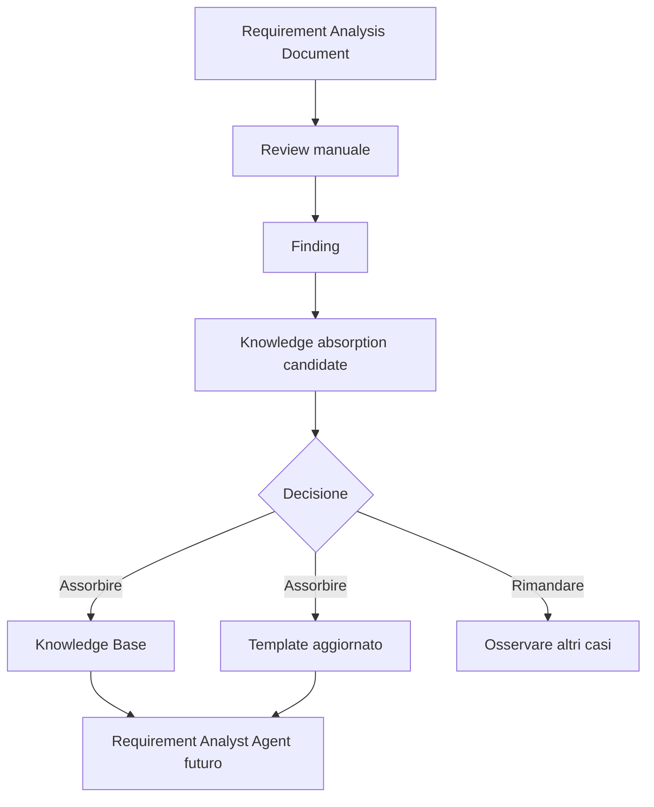

# 11 - Prima knowledge absorption candidate reale

## Obiettivo della lezione

Questa lezione serve a fare per la prima volta il processo di knowledge absorption su un artefatto reale.

Nella lezione 10 ho studiato il concetto:

```text
esperienza grezza -> review -> conoscenza candidata -> validazione -> memoria permanente
```

Ora lo applico alla prima review concreta:

```text
experiments/001-agentfactory-static-site-requirements-review.md
```

L'obiettivo non e' solo leggere la review.

L'obiettivo e':

- estrarre conoscenza candidata;
- distinguere cosa assorbire e cosa no;
- capire quali file devono cambiare;
- aggiornare un template quando la conoscenza e' abbastanza solida;
- salvare una traccia della decisione.

Questa e' una lezione importante perche' inizia a rendere AgentFactory una factory che impara davvero.

## Perche' questa lezione conta

Finora ho fatto tre passaggi:

1. ho creato un template di output;
2. ho prodotto un Requirement Analysis Document manuale;
3. ho valutato quel documento con una review.

Ma una review, da sola, non migliora il sistema.

Una review migliora il sistema solo se produce cambiamenti controllati.

Esempio:

```text
Finding:
I requisiti non hanno priorita'.
```

Questo finding puo' restare una nota.

Oppure puo' diventare:

```text
Regola:
Ogni requisito importante deve indicare priorita' e fase.
```

La differenza e' enorme.

Nel primo caso ho corretto un documento.

Nel secondo caso ho migliorato il modo in cui la factory produrra' documenti futuri.

## Prerequisiti

Prima di questa lezione devo avere chiari:

- che cos'e' una review;
- che cos'e' un finding;
- che cos'e' una knowledge candidate;
- differenza tra storage e memoria permanente;
- ruolo del Knowledge Compiler;
- ruolo del human gate;
- perche' non tutto deve essere assorbito.

## Fonte da analizzare

La fonte e':

```text
experiments/001-agentfactory-static-site-requirements-review.md
```

Questa review valuta:

```text
experiments/001-agentfactory-static-site-requirements.md
```

L'esito e':

```text
Passa con riserve
```

Score:

```text
25/30
83%
```

Quindi il documento e' buono, ma contiene alcune debolezze utili per imparare.

## Finding emersi dalla review

I finding principali sono:

```text
P1 - Mancano priorita' o fase dei requisiti.
P2 - Alcuni criteri qualitativi possono diventare piu' misurabili.
P2 - Human gate presenti ma non classificati.
P3 - Sintesi finale utile.
```

Questi finding non hanno tutti lo stesso peso.

Devo capire quali sono:

- problemi del singolo documento;
- segnali di miglioramento del template;
- regole generali da usare in futuro;
- suggerimenti utili ma non ancora abbastanza solidi.

## Prima selezione

Uso una tabella per ragionare.

| Finding | Tipo | Decisione iniziale | Motivo |
|---|---|---|---|
| Mancano priorita' o fase | Pattern strutturale | Assorbire | Aiuta handoff, sviluppo e test |
| Criteri qualitativi poco misurabili | Regola di qualita' | Assorbire | Rende output piu' verificabili |
| Human gate non classificati | Regola di governance | Assorbire | Riduce blocchi e autonomia cieca |
| Sintesi finale utile | Miglioramento di leggibilita' | Rimandare | Utile, ma non ancora necessaria come obbligo |

Questa e' una distinzione importante.

Non sto assorbendo tutto.

Sto scegliendo.

## Knowledge candidate prodotte

Dalla review estraggo quattro candidate.

### Candidate 1 - Priorita' e fase dei requisiti

```text
Ogni requisito rilevante dovrebbe indicare priorita' e fase.
```

Esempio:

```text
Priorita': Must
Fase: v0.1
```

Perche' e' utile:

- il Developer Agent capisce cosa implementare prima;
- il Tester Agent capisce cosa coprire subito;
- il Reviewer Agent puo' valutare scope e completezza;
- il Supervisor Agent puo' pianificare meglio.

Decisione:

```text
Assorbire.
```

### Candidate 2 - Criteri qualitativi osservabili

```text
Le richieste qualitative devono essere trasformate in segnali verificabili.
```

Esempio debole:

```text
Il sito deve essere bello e leggibile.
```

Esempio migliore:

```text
Il sito deve essere leggibile su desktop e mobile.
Criterio: verificare screenshot a 1440px e 390px senza sovrapposizioni o testo tagliato.
```

Perche' e' utile:

- riduce interpretazioni soggettive;
- aiuta il Tester Agent;
- aiuta il Reviewer Agent;
- evita che il design resti solo gusto.

Decisione:

```text
Assorbire.
```

### Candidate 3 - Human gate classificati

```text
Ogni punto di validazione umana dovrebbe indicare se e' bloccante, rimandabile o informativo.
```

Esempio:

```text
Decisione: confermare pubblicazione su GitHub Pages
Tipo: Bloccante
Motivo: influenza struttura di deploy e path asset
```

Perche' e' utile:

- evita blocchi inutili;
- chiarisce quando fermare la pipeline;
- separa governance vera da promemoria;
- aiuta il Supervisor Agent.

Decisione:

```text
Assorbire.
```

### Candidate 4 - Sintesi decisionale finale

```text
Ogni Requirement Analysis Document dovrebbe chiudere con una sintesi decisionale finale.
```

Perche' e' utile:

- aiuta lettura rapida;
- aiuta handoff umano;
- riduce tempo di orientamento.

Perche' non la assorbo subito come obbligo:

- il template e' gia' abbastanza lungo;
- non e' ancora chiaro se serve in ogni progetto;
- potrebbe diventare rumore nei progetti piccoli;
- va osservata in altri casi.

Decisione:

```text
Rimandare.
```

## Artefatto prodotto

Questa lezione produce il primo record di knowledge absorption:

```text
experiments/001-agentfactory-static-site-knowledge-absorption.md
```

Questo file non e' ancora una regola permanente da solo.

E' il documento che spiega:

- fonte;
- cosa e' successo;
- cosa abbiamo imparato;
- evidenza;
- ambito di validita';
- rischio di applicazione sbagliata;
- cosa diventa permanente;
- cosa non va salvato;
- file da aggiornare;
- decisione.

## Cosa entra nella Knowledge Base

Da questa lezione entrano nella Knowledge Base tre regole operative:

```text
1. I requisiti rilevanti devono indicare priorita' e fase.
2. I criteri qualitativi devono essere tradotti in segnali osservabili.
3. I punti di validazione umana devono indicare se sono bloccanti, rimandabili o informativi.
```

Queste regole vengono salvate in:

```text
knowledge-base/requirement-analysis-rules.md
```

Non salvo invece:

```text
usare sempre GitHub Pages
```

Perche' e' una scelta valida per questo progetto, ma non una regola universale.

Non salvo nemmeno:

```text
aggiungere sempre sintesi decisionale finale
```

Per ora resta una candidate rimandata.

## Quanto puo' crescere la memoria

Questa lezione introduce anche una domanda fondamentale:

```text
se ogni progetto produce nuova conoscenza,
Agent Card, template, prompt e knowledge base non rischiano di diventare enormi?
```

La risposta e':

```text
si', se la factory assorbe conoscenza senza curatela.
```

La knowledge absorption non deve diventare:

```text
aggiungo tutto in fondo a un file.
```

Deve diventare:

```text
seleziono, comprimo, sostituisco, archivio, versiono e recupero solo cio' che serve.
```

Un agente puo' peggiorare anche prima di superare il limite tecnico di contesto del modello.

Perche'?

Perche' se il contesto contiene troppe regole, esempi, eccezioni, note storiche e istruzioni vecchie, il modello riceve piu' rumore.

Il problema quindi non e' solo:

```text
quanti token entrano?
```

Il problema e':

```text
quanto segnale utile c'e' rispetto al rumore?
```

Una Agent Card non deve diventare una memoria storica completa.

Deve restare il documento identitario dell'agente:

- missione;
- responsabilita';
- input;
- output;
- tool;
- privilegi;
- condizioni di stop;
- criteri di qualita'.

La conoscenza appresa dai progetti deve vivere soprattutto in:

- knowledge base;
- regole validate;
- esempi selezionati;
- run record;
- review;
- decisioni versionate;
- memoria recuperabile dal Context Builder.

## Chi pulisce la conoscenza vecchia

Quando nuova conoscenza sostituisce conoscenza vecchia, non dovrebbe farlo l'agente operativo da solo.

Il Requirement Analyst Agent non deve decidere liberamente:

```text
questa vecchia regola non serve piu', la cancello.
```

Il Developer Agent non deve decidere liberamente:

```text
questo template e' lungo, lo riscrivo.
```

Serve un ruolo dedicato.

Nel percorso lo trattero' piu' avanti con nomi come:

```text
Knowledge Curator
Agent Maintainer
Prompt Librarian
Memory Steward
```

Questi ruoli non producono direttamente il progetto.

Mantengono sana la factory.

Il loro compito sara':

- trovare regole duplicate;
- trovare istruzioni in conflitto;
- proporre compressioni;
- proporre archiviazioni;
- distinguere conoscenza attiva e storica;
- mantenere Agent Card brevi e leggibili;
- mantenere prompt operativi focalizzati;
- mantenere template usabili;
- controllare che i file non diventino discariche di memoria;
- proporre versioni nuove senza perdere audit trail.

## Stato degli agenti

Un'altra distinzione fondamentale:

```text
lo stato di un agente non deve stare tutto nella Agent Card.
```

La Agent Card e':

```text
identita' stabile dell'agente.
```

Lo stato operativo vive altrove:

```text
run record
trace
versione della Agent Card
versione del prompt
versione del template
knowledge usata in quel run
output prodotto
review ricevuta
decisioni prese
metriche di qualita'
```

Quindi la mappa corretta diventa:

```text
Agent Card = identita' stabile
Prompt operativo = istruzioni di esecuzione
Template = forma dell'output
Knowledge Base = memoria validata
Run Record = storia di un'esecuzione
State Store = stato operativo della pipeline
Context Builder = selezione del contesto utile
Knowledge Curator = pulizia e manutenzione della memoria
Agent Maintainer = pulizia e manutenzione degli agenti
```

Questo punto e' centrale per il futuro.

La factory non deve solo imparare.

Deve anche dimenticare bene, comprimere bene e recuperare bene.

## Regola provvisoria di crescita sana

Da ora in poi tratto ogni nuova conoscenza con questa domanda:

```text
dove deve vivere?
```

Possibili risposte:

| Tipo conoscenza | Dove vive | Note |
|---|---|---|
| Identita' dell'agente | Agent Card | Deve restare breve e stabile |
| Regola operativa riutilizzabile | Knowledge Base | Deve avere ambito di validita' |
| Forma dell'output | Template | Non deve diventare troppo burocratico |
| Istruzione di esecuzione | Prompt operativo | Deve essere focalizzata sul run |
| Evidenza storica | Run record / experiments | Non va caricata sempre nel contesto |
| Regola vecchia sostituita | Archivio/versione precedente | Non va lasciata attiva se crea conflitto |
| Conoscenza utile solo in certi casi | Retrieval / Context Builder | Va recuperata solo quando serve |

Questa tabella non chiude il tema.

Lo apre.

Piu' avanti diventera' una parte fondamentale della progettazione della memoria.

## Aggiornamento del template requisiti

La knowledge absorption produce anche un aggiornamento concreto al template:

```text
templates/requirement-analysis-output-template.md
```

Il template viene migliorato con:

- campo `Priorita`;
- campo `Fase`;
- human gate classificato per tipo;
- criteri di accettazione piu' osservabili.

Questo e' il punto in cui la factory impara:

```text
review -> knowledge absorption -> template migliore
```

La prossima volta il Requirement Analyst Agent non dovra' ricordarsi a mano questa regola.

La trovera' gia' nel template.

## Mappa del flusso concreto



Questo e' il primo ciclo di miglioramento reale.

Non e' ancora automatico.

Ma e' gia' il modello che poi potro' automatizzare.

## Perche' non aggiorno subito tutto

Potrei essere tentato di aggiornare:

- Agent Card;
- checklist;
- template;
- roadmap;
- knowledge base;
- sito;
- manuale.

Ma bisogna evitare l'effetto valanga.

In questa fase aggiorno solo cio' che ha impatto diretto:

- template requisiti;
- knowledge base;
- manuale/roadmap per tracciare il percorso;
- sito generato.

La Agent Card del Requirement Analyst Agent potra' essere aggiornata quando inizieremo a progettare il primo agente reale.

La checklist potra' essere aggiornata quando faremo la prossima review.

## Esempio semplice

Situazione:

```text
Il requisito dice: il sito deve essere bello.
```

Review:

```text
Criterio troppo qualitativo.
```

Knowledge absorption:

```text
Le richieste qualitative devono diventare segnali osservabili.
```

Template aggiornato:

```text
Criterio di accettazione: [Come verificare che sia soddisfatto, usando comportamento, output, viewport, screenshot, soglia o controllo esplicito quando possibile]
```

Risultato:

```text
Il prossimo documento requisiti sara' piu' testabile.
```

## Esempio professionale

Scenario:

```text
Pipeline multi-agent per creare una piattaforma SaaS.
```

Il Requirement Analyst Agent produce 40 requisiti senza priorita'.

Il Developer Agent non sa da dove iniziare.

Il Tester Agent non sa cosa coprire nella prima suite.

Il Supervisor Agent non sa stimare fasi.

La review segnala:

```text
Manca distinzione tra Must, Should, Could e tra v0.1, v0.2, futuro.
```

Knowledge absorption:

```text
I requisiti rilevanti devono indicare priorita' e fase.
```

Template aggiornato.

Risultato:

```text
La prossima pipeline riceve output piu' orchestrabile.
```

## Anti-pattern ed errori comuni

### Errore 1 - Assorbire tutto dalla review

Errore:

```text
Ogni suggerimento della review diventa regola permanente.
```

Perche' e' un problema:

```text
La factory diventa pesante e burocratica.
```

Correzione:

```text
Distinguere assorbire, rimandare e non assorbire.
```

### Errore 2 - Assorbire solo concetti astratti

Errore:

```text
Scrivere "fare requisiti migliori" nella knowledge base.
```

Perche' e' inutile:

```text
Non cambia il comportamento di nessun agente.
```

Correzione:

```text
Tradurre la conoscenza in campi, checklist, esempi o regole operative.
```

### Errore 3 - Aggiornare il template senza spiegare perche'

Errore:

```text
Aggiungo Priorita' al template, ma non traccio la motivazione.
```

Perche' e' fragile:

```text
Tra un mese non sapro' se quella sezione serve davvero.
```

Correzione:

```text
Creare una knowledge absorption candidate con evidenza e decisione.
```

### Errore 4 - Trattare una preferenza come regola

Errore:

```text
Mi piace la sintesi finale, quindi diventa obbligatoria.
```

Perche' e' fragile:

```text
Potrebbe allungare inutilmente documenti piccoli.
```

Correzione:

```text
Rimandare finche' non emerge come bisogno ricorrente.
```

### Errore 5 - Dimenticare l'agente a valle

Errore:

```text
Assorbire conoscenza pensando solo al documento, non alla pipeline.
```

Perche' e' un problema:

```text
Una Agent Factory migliora quando gli agenti successivi lavorano meglio.
```

Correzione:

```text
Ogni regola assorbita deve spiegare quale agente o passaggio aiuta.
```

## Collegamento con AgentFactory

Questa lezione crea il primo piccolo ciclo reale:

```text
Requirement Analyst output
  -> Review
  -> Knowledge absorption
  -> Knowledge Base
  -> Template migliorato
  -> Output futuri migliori
```

Questo e' esattamente il principio che voglio padroneggiare:

```text
un sistema multi-agent professionale non deve solo produrre output;
deve imparare in modo controllato dai propri output.
```

## Artefatti prodotti

Questa lezione produce:

```text
experiments/001-agentfactory-static-site-knowledge-absorption.md
knowledge-base/requirement-analysis-rules.md
```

E aggiorna:

```text
templates/requirement-analysis-output-template.md
```

## Verifica personale

Dopo questa lezione devo saper rispondere:

```text
1. Quali finding della review meritano assorbimento?
2. Perche' priorita' e fase aiutano la pipeline?
3. Perche' i criteri qualitativi devono diventare osservabili?
4. Perche' i human gate devono essere classificati?
5. Perche' non assorbo subito la sintesi decisionale finale?
6. Che differenza c'e' tra aggiornare un template e aggiornare una knowledge base?
7. Come questa lezione migliora gli output futuri del Requirement Analyst Agent?
```

## Conoscenza da assorbire

- La review deve produrre decisioni di assorbimento, non solo giudizi.
- Priorita' e fase rendono i requisiti piu' orchestrabili.
- I criteri qualitativi devono diventare osservabili per essere testabili.
- I punti di validazione umana devono indicare se bloccano il workflow o possono essere rimandati.
- Non ogni miglioramento utile deve diventare obbligatorio subito.
- La knowledge absorption deve lasciare traccia del perche' un template cambia.

## Prossimo passo

Dopo questa lezione posso iniziare a progettare il passaggio successivo:

```text
dal Requirement Analysis Document al primo handoff verso Architect Agent.
```

La prossima lezione dovra' spiegare come un agente riceve un artefatto da un altro agente e come evitare perdita di contesto nel passaggio.
