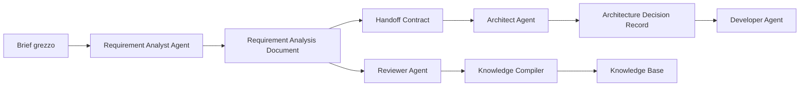

# 12 - Handoff e contratti tra agenti

## Obiettivo della lezione

Questa lezione serve a capire come un agente passa il lavoro a un altro agente senza perdere contesto, responsabilita' e vincoli.

Finora ho costruito questo primo ciclo:

```text
brief
  -> Requirement Analyst Agent
  -> Requirement Analysis Document
  -> Reviewer Agent
  -> Knowledge Compiler
  -> Knowledge Base
  -> template migliorato
```

Adesso devo imparare il passaggio successivo:

```text
Requirement Analysis Document
  -> Handoff Contract
  -> Architect Agent
```

Questa freccia non significa che il Requirement Analysis Document sparisce.

Significa:

```text
Il Requirement Analysis Document resta la fonte completa.
L'Handoff Contract diventa il contesto operativo primario per l'Architect Agent.
```

Il punto non e' "mandare un file a un altro agente".

Il punto e' costruire un passaggio controllato, dove l'agente successivo riceve:

- cosa deve fare;
- cosa non deve fare;
- quali informazioni sono certe;
- quali informazioni sono ipotesi;
- quali vincoli deve rispettare;
- quali decisioni umane bloccano il lavoro;
- quale output deve produrre;
- quali rischi deve tenere presenti.

Un sistema multi-agent professionale vive o muore sulla qualita' degli handoff.

## Perche' questa lezione conta

Quando una persona lavora da sola, puo' tenere molte cose in testa.

In una pipeline multi-agent questo non basta.

Ogni agente vede solo una parte del lavoro. Anche quando il sistema ha accesso a molti file, l'agente deve comunque capire quali informazioni sono davvero rilevanti per il suo compito.

Se il passaggio e' debole, succedono problemi tipici:

```text
Requirement Analyst:
"Ho scritto i requisiti."

Architect:
"Ok, allora scelgo tecnologie e architettura."

Problema:
l'Architect non sa quali parti sono certe, quali sono ipotesi,
quali decisioni umane sono bloccanti e quali vincoli non puo' violare.
```

Il risultato e' un'architettura apparentemente sensata, ma costruita su informazioni non governate.

Questo e' pericoloso perche':

- l'Architect puo' trasformare ipotesi in decisioni;
- puo' ignorare una domanda aperta critica;
- puo' scegliere una tecnologia prima del tempo;
- puo' progettare oltre lo scope;
- puo' passare al Developer un lavoro non validabile;
- puo' generare ulteriore complessita' invece di ridurla.

Un handoff non e' burocrazia.

E' il sistema nervoso della pipeline.

## Prerequisiti

Prima di questa lezione devo avere chiari:

- che cos'e' un artefatto;
- che cos'e' un output contract;
- che cos'e' un Requirement Analysis Document;
- differenza tra fatti, ipotesi e domande aperte;
- ruolo del Reviewer Agent;
- ruolo del Knowledge Compiler;
- perche' un agente non deve avere tutto il potere;
- perche' il contesto non coincide con la sola Agent Card.

## Definizione semplice

Un handoff e' il passaggio strutturato da un agente a un altro.

Esempio umano:

```text
Analista:
"Ho raccolto i requisiti. Questi sono i vincoli, queste sono le domande aperte,
queste sono le parti gia' validate. Ora puoi progettare l'architettura,
ma non scegliere ancora provider a pagamento finche' il cliente non conferma il budget."
```

Esempio agentico:

```text
Requirement Analyst Agent
  produce:
    - documento requisiti;
    - rischi;
    - validazioni umane;
    - handoff per Architect.

Architect Agent
  riceve:
    - obiettivo;
    - scope;
    - vincoli;
    - requisiti prioritizzati;
    - decisioni aperte;
    - output atteso.
```

Il passaggio deve essere abbastanza ricco da evitare perdita di contesto, ma abbastanza selettivo da non sommergere l'agente successivo.

## Handoff non significa copiare tutto

Il primo errore e' pensare:

```text
Per evitare perdita di contesto, passo tutto.
```

Sembra prudente, ma non lo e'.

Se passo tutto senza struttura, l'agente successivo deve rifare il lavoro di selezione.

Questo produce:

- piu' token;
- piu' rumore;
- piu' possibilita' di confondere informazione importante e informazione secondaria;
- piu' rischio di ignorare una decisione bloccante;
- meno controllo sulla responsabilita' dell'agente.

Un buon handoff non e' un dump.

Un buon handoff e' una compressione intenzionale.

```text
Artefatto completo
  -> estrazione delle parti rilevanti
  -> contratto di passaggio
  -> input pulito per l'agente successivo
```

Qui entra il tema del context budget.

Ogni agente ha un contesto limitato, non solo in senso tecnico di token, ma anche in senso qualitativo.

Se gli passo tutto, aumento il rischio che:

- legga informazioni irrilevanti;
- dia troppo peso a dettagli secondari;
- perda il vincolo importante dentro il rumore;
- ripeta analisi gia' fatte;
- costi di piu' senza ragione.

Quindi la regola non e':

```text
l'agente successivo deve sempre leggere tutto il RAD.
```

La regola e':

```text
l'agente successivo riceve l'handoff come contesto primario;
puo' consultare il RAD come fonte quando deve verificare, approfondire o risolvere un dubbio.
```

## Cosa deve sopravvivere nel passaggio

Quando un agente passa il lavoro a un altro, alcune informazioni devono sopravvivere sempre.

### 1. Obiettivo

L'agente successivo deve sapere perche' esiste il lavoro.

Esempio:

```text
Rendere il manuale AgentFactory consultabile come sito statico presentabile.
```

Senza obiettivo, l'Architect puo' ottimizzare la cosa sbagliata.

Potrebbe progettare un sistema tecnicamente elegante, ma inadatto allo scopo reale.

### 2. Scope

L'agente successivo deve sapere cosa rientra nella fase corrente.

Esempio:

```text
Fase corrente:
- sito statico;
- generazione da Markdown;
- GitHub Pages;
- nessun backend;
- nessuna autenticazione.
```

Senza scope, l'agente puo' espandere il progetto.

Questa e' una forma comune di deriva agentica:

```text
serve un sito statico
  -> l'agente propone CMS
  -> poi database
  -> poi autenticazione
  -> poi dashboard admin
```

Magari tutte idee interessanti, ma fuori fase.

### 3. Out of scope

Dire cosa non fare e' importante quanto dire cosa fare.

Esempio:

```text
Out of scope:
- backend;
- database;
- editing dal sito;
- login studenti;
- deploy automatico complesso.
```

Un out of scope chiaro protegge il progetto.

### 4. Fatti certi

L'agente successivo deve distinguere quello che e' dichiarato da quello che e' dedotto.

Esempio:

```text
Fatto:
Il sito deve essere statico.

Ipotesi:
In futuro potrebbe servire una ricerca interna.
```

Se un agente confonde queste due cose, prende decisioni fragili.

### 5. Ipotesi

Le ipotesi sono utili, ma devono restare ipotesi.

Esempio:

```text
Ipotesi:
Il manuale crescera' abbastanza da richiedere ricerca o indice interno.
```

L'Architect puo' tenerne conto progettando estendibilita', ma non deve trattarla come requisito obbligatorio.

### 6. Domande aperte

Le domande aperte indicano incertezza.

Non sono decorazione.

Possono bloccare o meno il prossimo step.

Esempio:

```text
Domanda:
Serve ricerca interna gia' nella prima versione?

Tipo:
Rimandabile.
```

Se la domanda non e' bloccante, la pipeline puo' andare avanti.

Se e' bloccante, l'agente deve fermarsi.

### 7. Vincoli

I vincoli sono muri.

L'agente puo' progettare dentro quei muri, non fingere che non esistano.

Esempio:

```text
Vincolo:
Il sito deve restare statico e compatibile con GitHub Pages.
```

### 8. Rischi

I rischi aiutano l'agente successivo a non ottimizzare solo per il caso felice.

Esempio:

```text
Rischio:
La sidebar cresce troppo e diventa difficile da consultare.
```

L'Architect deve progettare una struttura che possa crescere.

### 9. Decisioni umane

Ogni human gate deve essere classificato.

Esempio:

```text
Decisione:
Passare in futuro ad Astro/MkDocs/Vite?

Tipo:
Rimandabile.
```

Se la decisione e' rimandabile, l'agente puo' progettare una soluzione semplice ora e lasciare spazio a evoluzione futura.

### 10. Output atteso

L'agente successivo deve sapere cosa deve produrre.

Esempio:

```text
Architect Agent deve produrre:
- Architecture Decision Record;
- proposta struttura sito;
- scelte tecniche motivate;
- rischi architetturali;
- handoff per Developer Agent.
```

Senza output atteso, non posso valutare se l'agente ha lavorato bene.

## Cos'e' un Handoff Contract

Un Handoff Contract e' un artefatto di passaggio tra agenti.

Serve a trasferire contesto, responsabilita', vincoli e output atteso da un agente mittente a un agente ricevente.

Qui devo evitare una confusione importante:

```text
Handoff Contract non significa semplicemente "un altro nome per output contract".
```

Un output contract controlla la forma di un artefatto.

Un handoff controlla il passaggio operativo tra due agenti.

Poiche' anche l'handoff viene salvato come artefatto Markdown, anche l'handoff puo' avere un suo template e quindi un suo output contract.

Ma lo scopo principale e' diverso.

| Concetto | Cosa governa | Domanda principale | Esempio |
|---|---|---|---|
| Output contract | Forma dell'artefatto | Com'e' fatto l'output? | Il Requirement Analysis Document deve avere sezioni obbligatorie |
| Handoff Contract | Passaggio tra agenti | Cosa deve sapere e fare il prossimo agente? | L'Architect deve rispettare scope, vincoli e domande aperte |

Quindi la relazione corretta e':

```text
un Handoff Contract e' un artefatto di passaggio;
se voglio renderlo stabile e verificabile,
gli assegno un template;
quel template diventa l'output contract dell'handoff.
```

Questo chiarisce perche' nel repo abbiamo:

```text
templates/agent-handoff-contract-template.md
```

Quel file non dice solo "passa qualcosa al prossimo agente".

Dice quale forma deve avere un handoff fatto bene.

Serve a rispondere a tre domande:

```text
1. Da chi arriva questo lavoro?
2. Chi deve riceverlo?
3. Cosa deve fare il ricevente, con quali limiti?
```

Nel nostro percorso lo salviamo come file Markdown.

Questo per ora e' perfetto per imparare, perche':

- e' leggibile;
- e' versionabile;
- e' modificabile senza strumenti complessi;
- puo' essere mostrato agli studenti;
- puo' diventare in futuro input per un agente reale via API.

## Differenza tra artefatto sorgente e handoff

Il Requirement Analysis Document e' l'artefatto sorgente.

L'Handoff Contract e' la versione orientata al prossimo agente.

Non sono la stessa cosa.

```text
Requirement Analysis Document:
contiene analisi completa del progetto.

Architect Handoff:
contiene cio' che serve all'Architect per progettare senza perdere vincoli e contesto.
```

Questa distinzione e' fondamentale.

Se passo solo il documento sorgente, l'Architect deve capire da solo cosa usare.

Se passo anche un handoff, gli sto dando un ingresso operativo.

## Postilla: Architect Handoff e ADR non sono la stessa cosa

Qui puo' nascere una confusione naturale.

Nel nostro esempio compaiono due file vicini:

```text
experiments/001-agentfactory-static-site-architect-handoff.md
experiments/001-agentfactory-static-site-architecture.md
```

Sembrano entrambi "documenti per l'Architect", ma hanno scopi opposti.

```text
Architect Handoff = input operativo per l'Architect Agent.
Architecture Decision Record = output decisionale prodotto dall'Architect Agent.
```

L'Architect Handoff viene prima.

Serve a dire:

- da dove arriva il lavoro;
- quale agente deve riceverlo;
- quali requisiti, vincoli e rischi deve considerare;
- cosa e' dentro o fuori scope;
- quali privilegi ha;
- quando deve fermarsi;
- quale artefatto deve produrre.

L'ADR viene dopo.

Serve a registrare:

- quale problema architetturale e' stato deciso;
- quale decisione e' stata presa;
- perche' quella decisione e' adatta;
- quali alternative sono state considerate;
- quali trade-off e rischi vengono accettati;
- quando la decisione andra' rivalutata;
- cosa deve sapere il Developer Agent.

Tabella mentale:

| Documento | Momento | Chi lo usa | Domanda principale |
|---|---|---|---|
| Architect Handoff | Prima dell'Architect | Architect Agent | "Che lavoro devo fare, con quali limiti?" |
| Architecture Decision Record | Dopo l'Architect | Developer, Tester, Reviewer, futuro Architect | "Che decisione architetturale abbiamo preso e perche'?" |

Quindi:

```text
L'handoff non decide l'architettura.
L'handoff prepara l'Architect a decidere bene.

L'ADR non passa semplicemente il lavoro.
L'ADR conserva e motiva la decisione architetturale presa.
```

Se confondo i due documenti, rischio due errori.

Errore 1:

```text
Uso l'Architect Handoff come se fosse gia' una decisione.
```

Problema:

```text
L'Architect non sta piu' decidendo: sta solo eseguendo una scelta nascosta nel passaggio.
```

Errore 2:

```text
Uso l'ADR come se fosse solo un handoff per Developer.
```

Problema:

```text
Perdo la memoria del perche' architetturale e riduco l'ADR a una lista di istruzioni.
```

La sequenza corretta e':

```text
RAD
  -> Architect Handoff
  -> Architect Agent
  -> Architecture Decision Record
  -> ADR Review
  -> Developer Handoff
```

## Il RAD va dato all'agente successivo?

Risposta corretta:

```text
si', ma non sempre come contesto principale.
```

Il RAD deve essere disponibile all'agente successivo come fonte.

Ma se l'handoff e' fatto bene, l'agente successivo dovrebbe partire dall'handoff, non dal RAD completo.

Perche'?

Perche' l'handoff contiene gia':

- obiettivo del passaggio;
- scope rilevante per il ricevente;
- out of scope;
- vincoli da rispettare;
- decisioni aperte;
- rischi principali;
- output atteso;
- condizioni di stop;
- privilegi consentiti.

Il RAD serve quando:

- l'handoff non basta;
- l'agente deve verificare la fonte di una informazione;
- c'e' un dubbio su fatti, ipotesi o requisiti;
- il Reviewer chiede auditabilita';
- il ricevente deve citare o motivare una decisione.

Questa distinzione evita due errori opposti.

Errore 1:

```text
Non passo il RAD a nessuno.
```

Problema:

```text
Il prossimo agente non puo' verificare la fonte completa.
```

Errore 2:

```text
Passo sempre tutto il RAD nel contesto attivo.
```

Problema:

```text
Il contesto diventa piu' grande e rumoroso del necessario.
```

Regola professionale:

```text
Handoff come contesto primario.
RAD come fonte consultabile.
```

## Quando basta un solo documento

Non voglio creare burocrazia inutile.

Per un progetto piccolo, un unico Requirement Analysis Document con note preliminari per gli agenti successivi puo' bastare.

Esempio:

```text
Brief piccolo
un solo agente successivo
pochi vincoli
nessun rischio alto
nessun agente dinamico
```

In quel caso il RAD puo' contenere una sezione interna:

```text
Note per Architect Agent
```

e l'Architect puo' usare direttamente quel documento.

Quando invece il progetto cresce, separare RAD e Handoff Contract diventa utile.

Creo un Handoff Contract separato quando:

- il RAD e' lungo;
- il prossimo agente ha responsabilita' specifiche;
- ci sono privilegi o limiti da dichiarare;
- ci sono domande aperte bloccanti;
- ci sono piu' agenti destinatari;
- voglio ridurre il contesto attivo;
- voglio tracciare esattamente cosa e' stato passato a chi.

Regola:

```text
Un solo documento quando il costo della separazione supera il beneficio.
Due documenti quando la separazione riduce rumore, rischio e ambiguita'.
```

## Esempio completo: output contract contro handoff

Prendo il nostro caso reale.

Il Requirement Analyst Agent produce:

```text
Requirement Analysis Document
```

Il suo output contract dice:

```text
Questo documento deve contenere metadati, sintesi, obiettivo,
fatti, ipotesi, domande aperte, scope, requisiti, vincoli,
rischi, criteri di accettazione, human gate e handoff.
```

Questo serve a controllare la forma del documento.

Poi da quel documento posso preparare:

```text
Architect Handoff Contract
```

Questo handoff dice:

```text
Architect Agent, per il tuo lavoro considera questi vincoli,
queste decisioni aperte, questo scope, questi rischi
e produci un Architecture Decision Record.
```

Questo serve a controllare il passaggio tra Requirement Analyst e Architect.

Regola mentale:

```text
Output contract = rende l'output leggibile e verificabile.
Handoff = rende il prossimo passo eseguibile e governato.
```

## Diagramma del passaggio



Osservazione importante:

```text
Il Reviewer e il Knowledge Compiler non spariscono.
Continuano a controllare e migliorare la pipeline.
```

## Perdita di contesto

La perdita di contesto accade quando l'agente successivo non riceve o non comprende informazioni necessarie.

Esempio:

```text
Il Requirement Analyst sa che il sito deve restare statico.
L'Architect non riceve questo vincolo.
L'Architect propone un backend.
```

Questo non e' solo un errore tecnico.

E' un errore di handoff.

### Tipi di perdita di contesto

#### Perdita di obiettivo

L'agente sa cosa fare tecnicamente, ma non perche'.

Esempio:

```text
Costruire un sito bello
```

senza ricordare:

```text
rendere il manuale consultabile, proiettabile e didatticamente usabile.
```

#### Perdita di vincoli

L'agente ignora limiti economici, tecnici, temporali o organizzativi.

Esempio:

```text
Propone un SaaS a pagamento quando il vincolo e' sito statico semplice.
```

#### Perdita di incertezza

L'agente trasforma ipotesi in fatti.

Esempio:

```text
Ipotesi:
potrebbe servire ricerca.

Errore:
progettare gia' un motore di ricerca complesso come requisito obbligatorio.
```

#### Perdita di responsabilita'

L'agente fa lavoro che non gli compete.

Esempio:

```text
Architect Agent scrive codice invece di produrre architettura.
```

#### Perdita di priorita'

L'agente tratta tutto come ugualmente importante.

Esempio:

```text
Logo, ricerca, responsive, CMS e deploy automatico hanno tutti stesso peso.
```

Questo produce caos.

## Responsabilita' del mittente

L'agente che invia il lavoro deve:

- produrre un output conforme al proprio template;
- evidenziare incertezze;
- separare fatti e ipotesi;
- dichiarare vincoli;
- indicare cosa e' pronto e cosa no;
- non scaricare sull'agente successivo problemi che richiedono validazione umana;
- indicare output atteso dal ricevente.
- preparare un handoff abbastanza completo da non costringere il ricevente a rileggere tutto il RAD per iniziare.

Nel nostro caso il mittente e':

```text
Requirement Analyst Agent
```

## Responsabilita' del ricevente

L'agente che riceve il lavoro deve:

- leggere prima l'Handoff Contract;
- rispettare scope e out of scope;
- non trasformare ipotesi in decisioni;
- fermarsi davanti a gate bloccanti;
- produrre solo l'output previsto;
- indicare eventuali problemi di input;
- consultare il RAD quando l'handoff non basta o quando deve verificare una fonte;
- preparare il prossimo handoff.

Nel nostro caso il ricevente e':

```text
Architect Agent
```

## Privilegi nel passaggio

Un handoff non trasferisce automaticamente tutti i privilegi.

Questa e' una regola importantissima.

Esempio:

```text
Requirement Analyst Agent:
puo' scrivere un documento requisiti.

Architect Agent:
puo' scrivere una proposta architetturale.

Developer Agent:
potra' modificare codice.
```

Il fatto che un agente riceva un file non significa che possa modificare tutto.

In una factory professionale, ogni agente riceve:

- input;
- missione;
- output atteso;
- tool consentiti;
- limiti;
- criteri di stop.

Questa separazione protegge il sistema.

## Esempio semplice

Immagino una pipeline per costruire una pagina web.

### Handoff debole

```text
Ecco i requisiti. Fai l'architettura.
```

Problemi:

- non dice quali requisiti sono essenziali;
- non dice cosa e' fuori scope;
- non dice se ci sono decisioni bloccanti;
- non dice cosa deve produrre l'Architect;
- non dice quali vincoli tecnici deve rispettare.

### Handoff migliore

```text
Mittente: Requirement Analyst Agent
Ricevente: Architect Agent
Progetto: AgentFactory Static Site

Obiettivo:
Progettare una struttura statica, semplice e mantenibile per pubblicare il manuale AgentFactory.

Vincoli:
- usare Markdown come fonte;
- mantenere sito statico;
- compatibile con GitHub Pages;
- niente backend nella fase corrente.

Priorita':
- navigazione lezioni;
- leggibilita';
- rigenerazione da Markdown;
- responsive.

Output atteso:
Architecture Decision Record con scelte tecniche, alternative scartate, rischi e handoff per Developer Agent.
```

Questo secondo handoff e' molto piu' utile.

## Esempio professionale

In un progetto vero, potrei avere:

```text
Requirement Analyst Agent
  -> produce Requirement Analysis Document

Architect Agent
  -> produce Architecture Decision Record

Security Reviewer Agent
  -> valuta rischi di sicurezza

Developer Agent
  -> implementa

Tester Agent
  -> crea test plan

Reviewer Agent
  -> controlla output

Knowledge Compiler
  -> assorbe lezioni apprese
```

Se ogni passaggio e' una chat libera, il sistema diventa fragile.

Se ogni passaggio ha un contratto, posso:

- capire dove nasce un errore;
- migliorare un singolo agente senza riscrivere tutto;
- valutare output in modo piu' oggettivo;
- versionare template e regole;
- assegnare privilegi diversi;
- inserire human gate;
- creare agenti dinamici in modo piu' sicuro.

## Handoff e agenti dinamici

Questa lezione prepara anche un concetto avanzato.

In futuro la Agent Factory potra' creare agenti dinamicamente.

Esempio:

```text
Progetto: sito statico didattico
Agenti necessari:
- Requirement Analyst
- Architect
- Developer
- Visual QA Reviewer
- Knowledge Compiler
```

Oppure:

```text
Progetto: automazione n8n per lead management
Agenti necessari:
- Requirement Analyst
- Integration Architect
- n8n Workflow Designer
- Security Reviewer
- Tester
- Knowledge Compiler
```

Ma se gli agenti sono creati dinamicamente, il bisogno di contratti aumenta.

Perche'?

Perche' un agente temporaneo deve sapere subito:

- perche' esiste;
- cosa deve leggere;
- cosa puo' ignorare;
- cosa puo' modificare;
- cosa deve produrre;
- quando deve fermarsi;
- a chi deve passare il lavoro.

Senza handoff, gli agenti dinamici diventano improvvisazione.

Con handoff, diventano componenti governabili.

## Handoff e memoria

Un handoff non e' memoria permanente.

E' contesto operativo per un passaggio specifico.

Differenza:

```text
Handoff:
serve a far lavorare bene il prossimo agente in questo progetto.

Knowledge Base:
serve a migliorare la factory in tutti i progetti futuri.
```

Pero' gli handoff sono fonti preziose per la memoria.

Dopo un progetto posso chiedere:

```text
Quali handoff hanno funzionato?
Quali handoff hanno causato errore?
Quali campi mancavano?
Quali regole vanno assorbite?
```

In questo modo la factory impara anche dai passaggi, non solo dagli output finali.

## Template prodotto

Da questa lezione nasce un template:

```text
templates/agent-handoff-contract-template.md
```

Il template serve a creare handoff leggibili, versionabili e confrontabili.

Le sezioni minime sono:

- metadati;
- mittente;
- ricevente;
- artefatti sorgente;
- obiettivo del passaggio;
- contesto essenziale;
- scope;
- out of scope;
- vincoli;
- decisioni aperte;
- rischi;
- input consentiti;
- output atteso;
- criteri di accettazione;
- privilegi consentiti;
- condizioni di stop;
- prossimo handoff.

## Primo handoff reale prodotto

Applico subito il concetto al progetto gia' in corso:

```text
experiments/001-agentfactory-static-site-architect-handoff.md
```

Questo file rappresenta il primo passaggio operativo dal Requirement Analyst Agent verso l'Architect Agent per il sito statico AgentFactory.

Non e' ancora un agente reale via API.

Ma e' gia' una pipeline reale a livello di artefatti:

```text
requirements
  -> review
  -> absorption
  -> handoff
```

Questo e' il modo giusto di imparare:

prima costruisco il comportamento corretto a mano;
poi lo automatizzo.

## Anti-pattern ed errori comuni

### Errore 1 - Handoff troppo generico

Errore:

```text
Fai l'architettura del progetto.
```

Perche' e' fragile:

```text
L'Architect deve ricostruire obiettivo, vincoli, priorita' e output atteso.
```

Correzione:

```text
Usare un Handoff Contract.
```

### Errore 2 - Handoff troppo lungo

Errore:

```text
Incollare tutto il documento requisiti, tutta la chat e tutti i file.
```

Perche' e' fragile:

```text
Il contesto diventa rumoroso e l'agente puo' ignorare informazioni critiche.
```

Correzione:

```text
Passare il documento completo come fonte consultabile, ma usare una sintesi operativa strutturata come contesto primario.
```

### Errore 3 - Nascondere le incertezze

Errore:

```text
Togliere domande aperte per far sembrare il progetto piu' maturo.
```

Perche' e' pericoloso:

```text
L'agente successivo prendera' decisioni su basi false.
```

Correzione:

```text
Le incertezze devono essere visibili e classificate.
```

### Errore 4 - Non definire output atteso

Errore:

```text
L'Architect lavora, ma non e' chiaro cosa deve consegnare.
```

Perche' e' fragile:

```text
Non posso valutare l'output e non posso passarlo bene al Developer.
```

Correzione:

```text
Ogni handoff deve indicare output atteso e criteri di accettazione.
```

### Errore 5 - Trasferire privilegi senza controllo

Errore:

```text
L'agente riceve un progetto e puo' modificare qualsiasi file.
```

Perche' e' rischioso:

```text
Responsabilita' e permessi si mescolano.
```

Correzione:

```text
Ogni handoff deve dichiarare privilegi consentiti e vietati.
```

## Collegamento con AgentFactory

Questa lezione sposta AgentFactory da una sequenza di documenti a una vera pipeline.

Prima:

```text
Ho un documento requisiti.
```

Ora:

```text
Ho un documento requisiti che puo' essere passato a un agente successivo
tramite un contratto esplicito.
```

Questo e' un salto importante.

Una Agent Factory deve saper:

- creare agenti;
- assegnare responsabilita';
- assegnare privilegi;
- passare contesto;
- controllare output;
- migliorare nel tempo.

L'handoff e' il punto in cui responsabilita' e contesto si incontrano.

## Artefatti prodotti

Questa lezione produce:

```text
templates/agent-handoff-contract-template.md
experiments/001-agentfactory-static-site-architect-handoff.md
```

Aggiorna anche:

```text
GLOSSARY.md
ROADMAP.md
MANUAL.md
tools/build-site.js
docs/
```

## Verifica personale

Dopo questa lezione devo saper rispondere:

```text
1. Che differenza c'e' tra passare un file e fare un handoff?
2. Che differenza c'e' tra output contract e Handoff Contract?
3. Perche' un handoff non deve contenere tutto?
4. Perche' il RAD deve restare fonte consultabile ma non sempre contesto primario?
5. Quando basta un RAD con note interne e quando serve un Handoff Contract separato?
6. Quali informazioni devono sopravvivere tra Requirement Analyst e Architect?
7. Perche' fatti, ipotesi e domande aperte devono restare separati?
8. Perche' l'out of scope protegge la pipeline?
9. Che cosa deve produrre un Architect Agent dopo un handoff?
10. Perche' un handoff non trasferisce automaticamente privilegi?
11. Come un handoff puo' diventare fonte per knowledge absorption futura?
```

## Conoscenza da assorbire

- Un handoff e' una compressione intenzionale del contesto, non un dump.
- Un output contract governa la forma dell'artefatto; un handoff governa il passaggio tra agenti.
- Il RAD e' fonte completa; l'handoff e' contesto operativo primario per il prossimo agente.
- Se l'handoff e' fatto bene, il ricevente consulta il RAD solo per verificare o approfondire.
- Ogni passaggio tra agenti deve dichiarare mittente, ricevente, obiettivo, vincoli e output atteso.
- Le incertezze devono essere visibili e classificate.
- I privilegi non si trasferiscono automaticamente con il contesto.
- Gli handoff sono fonti importanti per migliorare la factory nel tempo.
- Prima di automatizzare una pipeline multi-agent conviene simulare a mano i contratti tra agenti.

## Prossimo passo

Dopo questa lezione posso progettare il primo vero ricevente:

```text
Architect Agent
```

La prossima lezione dovra' spiegare:

- che cosa fa un Architect Agent;
- cosa non deve fare;
- quale output deve produrre;
- come trasforma requisiti e handoff in una proposta architetturale;
- come prepara il lavoro per Developer Agent e Tester Agent.
