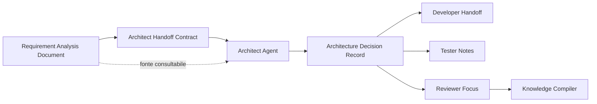

# 13 - Architect Agent e Architecture Decision Record

## Obiettivo della lezione

Questa lezione serve a capire che cosa fa un Architect Agent dentro una pipeline multi-agent e quale artefatto deve produrre.

Nella lezione 12 ho creato il primo handoff:

```text
Requirement Analyst Agent
  -> Handoff Contract
  -> Architect Agent
```

Adesso devo progettare il ricevente.

L'obiettivo non e' imparare "architettura software" in modo generico.

L'obiettivo e' imparare come un agente architetto deve ragionare dentro una Agent Factory:

- riceve requisiti e handoff;
- rispetta vincoli e scope;
- non inventa feature;
- non scrive codice;
- valuta alternative;
- sceglie una direzione tecnica;
- motiva i trade-off;
- produce un artefatto verificabile;
- prepara il lavoro per Developer Agent, Tester Agent e Reviewer Agent.

L'artefatto centrale di questa lezione e':

```text
Architecture Decision Record
```

abbreviato spesso in:

```text
ADR
```

## Perche' questa lezione conta

In una pipeline multi-agent il passaggio da requisiti ad architettura e' delicato.

Il Requirement Analyst Agent dice:

```text
cosa serve
```

L'Architect Agent deve decidere:

```text
come strutturare la soluzione
```

Ma non deve saltare direttamente a:

```text
implemento codice
```

Questa differenza sembra semplice, ma e' uno dei punti in cui gli agenti sbagliano piu' spesso.

Un agente, se non governato, tende a:

- proporre tecnologie premature;
- progettare sistemi troppo grandi;
- ignorare vincoli;
- scegliere soluzioni eleganti ma non necessarie;
- mescolare architettura, sviluppo e design;
- produrre risposte convincenti ma non verificabili.

Un Architect Agent professionale deve invece lavorare con disciplina.

Deve trasformare i requisiti in decisioni motivate, non in entusiasmo tecnico.

## Prerequisiti

Prima di questa lezione devo avere chiari:

- cosa fa il Requirement Analyst Agent;
- cosa contiene un Requirement Analysis Document;
- cosa contiene un Handoff Contract;
- differenza tra scope e out of scope;
- differenza tra vincolo e preferenza;
- concetto di output contract;
- perche' un agente deve avere responsabilita' e privilegi limitati.

Mini richiamo:

```text
Output contract = forma dell'artefatto.
Handoff Contract = passaggio operativo verso il prossimo agente.
```

In questa lezione l'Architect Agent riceve un Handoff Contract, ma deve produrre un altro artefatto con il proprio output contract:

```text
Architecture Decision Record
```

Regola di contesto:

```text
L'Architect parte dall'Handoff Contract.
Consulta il Requirement Analysis Document se deve verificare una fonte,
risolvere un dubbio o recuperare un dettaglio non incluso nell'handoff.
```

## Definizione semplice

Un Architect Agent e' un agente specializzato che prende requisiti e vincoli e propone una struttura tecnica coerente.

Non e' il Developer Agent.

Non e' il Tester Agent.

Non e' il Product Owner.

Non e' il Knowledge Compiler.

Il suo lavoro e':

```text
capire quale struttura tecnica rende il progetto realizzabile,
mantenibile, verificabile e coerente con i vincoli.
```

## Cosa fa un Architect Agent

Un Architect Agent deve:

- leggere l'Handoff Contract come ingresso operativo principale;
- consultare il Requirement Analysis Document come fonte completa quando serve;
- identificare vincoli tecnici e organizzativi;
- distinguere scelte immediate e opzioni future;
- proporre una struttura del sistema;
- scegliere pattern o strumenti quando servono;
- spiegare alternative scartate;
- dichiarare trade-off;
- indicare rischi architetturali;
- preparare handoff per Developer Agent;
- preparare note utili per Tester Agent;
- proporre candidate per Knowledge Compiler se emergono regole riutilizzabili.

## Cosa non deve fare

Un Architect Agent non deve:

- inventare requisiti;
- cambiare scope;
- decidere feature non richieste;
- scrivere codice di produzione;
- modificare file del sito senza autorizzazione;
- installare framework;
- scegliere servizi a pagamento senza human gate;
- aggiornare direttamente la knowledge base;
- ignorare domande aperte bloccanti;
- trasformare ipotesi future in obblighi immediati.

Questa separazione e' essenziale.

Un agente potente non e' un agente che fa tutto.

Un agente potente e' un agente che fa bene il proprio pezzo, dentro confini chiari.

## Differenza tra Requirement Analyst e Architect

Il Requirement Analyst Agent risponde soprattutto a:

```text
Che cosa serve?
Perche' serve?
Quali sono fatti, ipotesi, domande, rischi e requisiti?
```

L'Architect Agent risponde soprattutto a:

```text
Come organizzo tecnicamente la soluzione?
Quali scelte faccio ora?
Quali scelte rimando?
Quali trade-off accetto?
Quali rischi devo mitigare?
Che cosa deve sapere il Developer Agent?
```

Esempio:

```text
Requirement:
Il sito deve essere statico, consultabile e generato da Markdown.

Decisione architetturale:
Mantenere un generatore statico custom in Node.js nella fase corrente,
senza introdurre framework, per ridurre complessita' e mantenere pieno controllo.
```

Questa e' architettura perche' non descrive solo una feature.

Descrive una scelta strutturale, il motivo, il limite e l'impatto.

## Cos'e' un Architecture Decision Record

Un Architecture Decision Record e' un documento che registra una decisione architetturale importante.

Un ADR risponde a domande come:

```text
Qual e' il contesto?
Quale problema devo decidere?
Quale decisione prendo?
Quali alternative ho considerato?
Perche' le scarto?
Quali conseguenze ha la scelta?
Quali rischi accetto?
Quando dovro' rivedere la decisione?
```

Un ADR e' utile perche':

- rende le scelte tracciabili;
- evita di dimenticare perche' una scelta e' stata fatta;
- aiuta gli agenti successivi;
- riduce discussioni ripetute;
- permette review e knowledge absorption;
- separa decisione tecnica da implementazione.

## Differenza tra Architect Handoff e ADR

Per capire davvero il ruolo dell'Architect Agent devo separare bene due artefatti:

```text
Architect Handoff
Architecture Decision Record
```

L'Architect Handoff e' il documento che arriva all'Architect.

L'ADR e' il documento che esce dall'Architect.

Questa frase sembra banale, ma cambia tutto.

### Architect Handoff

L'Architect Handoff e' un mandato operativo.

Dice all'Architect Agent:

```text
Questo e' il progetto.
Queste sono le fonti.
Questi sono i vincoli.
Questo e' lo scope.
Queste sono le domande aperte.
Questi sono i privilegi.
Questo e' l'output che devi produrre.
```

Quindi l'handoff non deve risolvere l'architettura al posto dell'Architect.

Deve preparare un contesto pulito per permettere all'Architect di decidere.

### ADR

L'ADR e' una memoria decisionale.

Dice alla pipeline:

```text
Dato questo contesto e questi vincoli,
abbiamo scelto questa direzione architetturale,
per questi motivi,
scartando o rimandando queste alternative,
accettando questi trade-off,
e la rivaluteremo in queste condizioni.
```

Quindi l'ADR non e' solo "istruzioni per il Developer".

Contiene anche istruzioni per il Developer, ma il suo scopo principale e' conservare la decisione.

### Regola pratica

```text
Se il documento serve a far partire l'Architect, e' un handoff.
Se il documento serve a ricordare e valutare cosa ha deciso l'Architect, e' un ADR.
```

Esempio nel nostro progetto:

```text
Architect Handoff:
"Progetta l'evoluzione del sito statico, resta compatibile con GitHub Pages,
non introdurre backend, considera la crescita del manuale."

ADR:
"Manteniamo per ora il generatore statico custom in Node.js,
perche' e' sufficiente, formativo, controllabile e meno complesso di una migrazione a framework."
```

L'handoff contiene il mandato.

L'ADR contiene la decisione.

## Perche' non basta dire "usiamo X"

Una decisione architetturale debole e':

```text
Usiamo Astro.
```

Oppure:

```text
Usiamo Node.js.
```

Questa non e' ancora architettura.

Manca:

- contesto;
- motivazione;
- alternative;
- vincoli;
- conseguenze;
- rischio;
- criterio di revisione.

Una decisione migliore e':

```text
Decisione:
Nella fase corrente manteniamo il generatore statico custom in Node.js.

Motivo:
Il sito e' ancora piccolo, il contenuto nasce in Markdown, GitHub Pages e' sufficiente,
e introdurre un framework ora aumenterebbe complessita' senza beneficio immediato.

Alternative scartate:
- Astro: potente ma prematuro.
- MkDocs: adatto alla documentazione, ma richiede migrazione e tema.
- Vite app custom: troppo applicativo per un sito documentale statico.

Conseguenza:
Continuiamo a gestire navigazione e rendering nel generatore.
Rivalutiamo se aumentano ricerca, versioni, tassonomie o componenti interattivi.
```

Questa e' una decisione architetturale utile.

## Diagramma della responsabilita'



Il punto chiave:

```text
L'Architect Agent non chiude la pipeline.
Prepara un output che altri agenti possono usare e valutare.
```

## Architettura come gestione dei trade-off

Una cosa fondamentale: architettura non significa scegliere "la tecnologia migliore" in assoluto.

Architettura significa scegliere un compromesso adatto al contesto.

Ogni scelta ha vantaggi e costi.

Esempio:

```text
Generatore custom semplice
```

Vantaggi:

- leggero;
- controllabile;
- nessuna dipendenza complessa;
- facile da versionare;
- adatto alla fase didattica.

Costi:

- se il sito cresce molto, manutenzione manuale del generatore;
- poche funzioni pronte rispetto a framework documentali;
- ricerca interna da implementare a mano o aggiungere dopo.

Esempio opposto:

```text
Framework statico completo
```

Vantaggi:

- routing, componenti e plugin;
- migliore scalabilita' del sito;
- ricerca o indice piu' facili in futuro.

Costi:

- migrazione;
- dipendenze;
- curva di apprendimento;
- rischio di spostare attenzione dal manuale alla tecnologia.

L'Architect Agent deve rendere visibili questi trade-off.

## Decisioni immediate e opzioni future

Un buon Architect Agent distingue:

```text
Decisioni immediate
```

da:

```text
Opzioni future
```

Questo e' importantissimo per AgentFactory.

Errore comune:

```text
In futuro potrebbe servire ricerca.
Quindi ora progettiamo un motore di ricerca completo.
```

Correzione:

```text
In futuro potrebbe servire ricerca.
Ora manteniamo markup e struttura coerenti, cosi' sara' possibile aggiungerla.
```

Questa e' una mentalita' architetturale sana.

Non ignorare il futuro.

Ma non pagare oggi un costo che non serve ancora.

## Architettura e privilegi

L'Architect Agent deve avere privilegi diversi dal Developer Agent.

Nella fase attuale:

```text
Architect Agent:
- legge requisiti, handoff, template, struttura repo;
- scrive proposta architetturale;
- non modifica codice;
- non installa dipendenze;
- non fa deploy.
```

Developer Agent:

```text
- legge ADR e handoff;
- modifica codice autorizzato;
- esegue build/test autorizzati;
- non cambia requisiti;
- non modifica knowledge base permanente.
```

Questa separazione e' una base della governance multi-agent.

Se l'Architect scrive anche codice, testa, deploya e aggiorna memoria, diventa troppo potente e difficile da controllare.

## Agent Card dell'Architect Agent

Da questa lezione nasce una nuova Agent Card:

```text
agents/architect-agent.md
```

L'Agent Card definisce:

- missione;
- responsabilita';
- input;
- output;
- tool consentiti;
- privilegi;
- regole operative;
- condizioni di stop;
- criteri di qualita';
- rischi.

Questa Agent Card e' ancora manuale, ma e' gia' un contratto operativo.

In futuro potra' diventare parte di un sistema reale via API.

## Template ADR

Da questa lezione nasce anche:

```text
templates/architecture-decision-record-template.md
```

Il template ADR serve a produrre decisioni architetturali confrontabili e valutabili.

Se ogni ADR ha una struttura diversa, il Reviewer Agent fara' fatica a valutarlo.

Se ogni ADR ha struttura coerente, posso costruire:

- checklist;
- score;
- review;
- knowledge absorption;
- versioning delle decisioni.

## Primo ADR reale prodotto

Applico subito il concetto al progetto attuale:

```text
experiments/001-agentfactory-static-site-architecture.md
```

Questo e' il primo output simulato dell'Architect Agent.

La decisione principale e':

```text
Mantenere per ora un sito statico generato da Markdown con script Node.js custom,
pubblicato via GitHub Pages, rimandando framework piu' strutturati finche' la complessita'
del sito non lo richiedera'.
```

Questa e' una decisione conservativa, ma forte.

Perche'?

Perche' rispetta il momento del progetto.

AgentFactory ora deve farti imparare pipeline, contratti, agenti e memoria.

Non deve trasformarsi prematuramente in un progetto frontend complesso.

## Esempio semplice

Immagino di dover creare una piccola documentazione personale.

Requisito:

```text
Voglio leggere appunti su web.
```

Architettura debole:

```text
Facciamo una web app con login, database, editor e dashboard.
```

Problema:

```text
Troppo per il bisogno reale.
```

Architettura migliore:

```text
Per ora uso Markdown e sito statico.
Quando avro' molti documenti e bisogno di ricerca, rivaluto un generatore documentale.
```

Questa seconda scelta e' piu' matura perche' protegge focus e manutenzione.

## Esempio professionale

In un contesto aziendale, un Architect Agent potrebbe ricevere:

```text
Requisiti:
- CRM interno;
- utenti autenticati;
- dati sensibili;
- integrazione con sistemi esistenti;
- audit log;
- budget limitato;
- scadenza in 8 settimane.
```

L'Architect Agent non dovrebbe rispondere:

```text
Usiamo microservizi, Kafka e Kubernetes.
```

Risposta migliore:

```text
Dato il team, la scadenza e i dati sensibili,
proporre una web app modulare monolitica, con database relazionale,
audit log centralizzato, ruoli chiari e integrazioni isolate.
Rimandare microservizi finche' non emergono bisogni reali di scalabilita' organizzativa.
```

Questa e' architettura professionale:

- parte dai vincoli;
- evita moda tecnologica;
- considera team e rischio;
- motiva le scelte;
- prepara evoluzione futura.

## Anti-pattern ed errori comuni

### Errore 1 - Technology-first architecture

Errore:

```text
Partire da una tecnologia amata o di moda.
```

Perche' e' fragile:

```text
La tecnologia guida il progetto invece dei requisiti.
```

Correzione:

```text
Partire da obiettivo, vincoli, scope, rischi e solo dopo scegliere tecnologia.
```

### Errore 2 - Architettura troppo grande

Errore:

```text
Progettare subito una soluzione enterprise per un progetto piccolo.
```

Perche' e' un problema:

```text
Aumenta costi, manutenzione e difficolta' di apprendimento.
```

Correzione:

```text
Scegliere la soluzione piu' semplice che rispetta requisiti e crescita prevedibile.
```

### Errore 3 - Confondere Architect e Developer

Errore:

```text
L'Architect Agent produce direttamente codice.
```

Perche' e' fragile:

```text
Salta una fase di decisione verificabile e rende difficile la review.
```

Correzione:

```text
L'Architect produce ADR e handoff. Il Developer implementa dopo.
```

### Errore 4 - Ignorare alternative scartate

Errore:

```text
Scrivere solo la decisione finale.
```

Perche' e' fragile:

```text
In futuro non sapro' perche' non ho scelto altre strade.
```

Correzione:

```text
Ogni ADR deve includere alternative considerate e motivo dello scarto.
```

### Errore 5 - Non indicare quando rivalutare la scelta

Errore:

```text
Una decisione temporanea diventa permanente per inerzia.
```

Perche' e' pericoloso:

```text
La factory non evolve quando cambiano dimensione, rischio o requisiti.
```

Correzione:

```text
Ogni ADR deve indicare condizioni di revisione.
```

## Collegamento con AgentFactory

Questa lezione aggiunge il secondo agente strutturato del percorso:

```text
Requirement Analyst Agent
Architect Agent
```

E aggiunge un nuovo artefatto:

```text
Architecture Decision Record
```

Ora la pipeline manuale diventa:

```text
Brief
  -> Requirement Analysis Document
  -> Review
  -> Knowledge absorption
  -> Architect Handoff
  -> Architecture Decision Record
```

Questo e' un salto importante.

Non sto solo imparando definizioni.

Sto costruendo una catena di artefatti che un domani potra' essere eseguita da agenti reali.

## Artefatti prodotti

Questa lezione produce:

```text
agents/architect-agent.md
templates/architecture-decision-record-template.md
experiments/001-agentfactory-static-site-architecture.md
```

Aggiorna anche:

```text
GLOSSARY.md
ROADMAP.md
MANUAL.md
tools/build-site.js
docs/
```

## Verifica personale

Dopo questa lezione devo saper rispondere:

```text
1. Che cosa fa un Architect Agent?
2. Che cosa non deve fare?
3. Perche' non deve scrivere codice nella fase corrente?
4. Che cos'e' un Architecture Decision Record?
5. Perche' un ADR deve includere alternative scartate?
6. Che differenza c'e' tra decisione immediata e opzione futura?
7. Perche' architettura significa gestire trade-off?
8. Perche' nel sito AgentFactory conviene mantenere per ora un generatore custom?
9. Quando avrebbe senso rivalutare questa scelta?
```

## Conoscenza da assorbire

- L'Architect Agent trasforma requisiti e handoff in decisioni architetturali motivate.
- Un ADR serve a rendere tracciabili contesto, decisione, alternative, trade-off e conseguenze.
- L'Architect non deve implementare codice nella fase corrente.
- Una scelta architetturale deve distinguere decisioni immediate e opzioni future.
- La tecnologia deve seguire requisiti, vincoli e fase del progetto.
- Ogni decisione temporanea deve indicare quando essere rivalutata.

## Prossimo passo

Dopo questa lezione posso introdurre una review dell'output architetturale.

La prossima lezione dovra' spiegare:

- come valutare un ADR;
- quali errori cercare in una proposta architetturale;
- come capire se l'Architect Agent ha rispettato l'handoff;
- come preparare il passaggio verso Developer Agent e Tester Agent.
