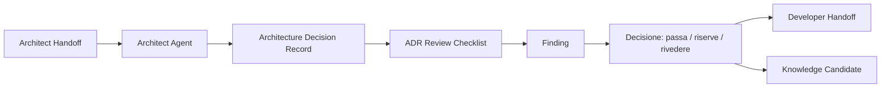

# 14 - Valutare un ADR e l'output dell'Architect Agent

## Obiettivo della lezione

Questa lezione serve a imparare come valutare l'output di un Architect Agent.

Nella lezione 13 ho creato:

```text
agents/architect-agent.md
templates/architecture-decision-record-template.md
experiments/001-agentfactory-static-site-architecture.md
```

Ora devo controllare se l'ADR prodotto e' davvero utilizzabile.

La domanda non e':

```text
Mi piace questa architettura?
```

La domanda corretta e':

```text
Questo ADR rispetta requisiti, handoff, vincoli e responsabilita'
in modo abbastanza chiaro da abilitare il prossimo agente?
```

Questa e' una differenza enorme.

Una pipeline multi-agent non puo' basarsi sul gusto.

Deve basarsi su artefatti valutabili.

## Risposta alla domanda: quando implementiamo davvero il primo agente?

Il primo agente reale lo implementerei molto presto, ma non prima di avere un minimo di protezione.

La sequenza corretta e':

```text
1. Progettare Agent Card.
2. Definire template di output.
3. Produrre un esempio manuale buono.
4. Creare checklist di review.
5. Valutare l'esempio manuale.
6. Automatizzare l'agente reale via API.
7. Confrontare output reale e output manuale.
```

Per questo il primo agente reale dovrebbe essere:

```text
Requirement Analyst Agent
```

Perche' proprio lui?

Perche' e' il piu' pronto.

Abbiamo gia':

- Agent Card;
- template di output;
- primo Requirement Analysis Document manuale;
- checklist di review;
- review reale;
- knowledge absorption;
- regole assorbite nella knowledge base.

Questo significa che quando lo implementeremo davvero potremo dire:

```text
L'agente ha lavorato bene?
```

e non solo:

```text
Ha generato un testo convincente?
```

La mia proposta e':

```text
Lezione 14: review ADR e chiusura ciclo Architect.
Lezione 15: Developer Agent e Implementation Plan.
Lezione 16: prompt operativo e preparazione primo agente reale.
Lezione 17: primo Requirement Analyst Agent via API.
```

Se voglio accelerare, posso comprimere 15 e 16, ma non salterei la review.

Saltare la review ora significherebbe costruire il primo agente reale senza avere ancora un modo buono per capire se la pipeline sta migliorando o peggiorando.

## Perche' questa lezione conta

Un Architect Agent puo' produrre output molto convincenti.

Puo' scrivere frasi come:

```text
La soluzione proposta garantisce scalabilita', manutenibilita' e flessibilita'.
```

Ma queste parole, da sole, non significano niente.

Devo chiedere:

- scalabilita' rispetto a cosa?
- manutenibilita' per chi?
- flessibilita' a quale costo?
- quali alternative sono state scartate?
- quali vincoli sono stati rispettati?
- quali rischi restano aperti?
- il Developer Agent puo' usare questo output?
- il Tester Agent sa cosa verificare?
- il Reviewer Agent sa cosa controllare?

La review dell'ADR serve a distinguere architettura utile da architettura decorativa.

## Prerequisiti

Prima di questa lezione devo avere chiari:

- cos'e' un Architect Agent;
- cos'e' un Architecture Decision Record;
- cos'e' un Handoff Contract;
- differenza tra requisito e decisione architetturale;
- differenza tra decisione immediata e opzione futura;
- concetto di trade-off;
- ruolo del Reviewer Agent;
- perche' ogni output agentico deve essere valutabile.

## Che cosa deve valutare una review architetturale

Una review ADR deve controllare almeno dieci aree.

### 1. Struttura

L'ADR segue il template previsto?

Se mancano sezioni fondamentali, il problema non e' solo estetico.

E' un problema di contratto.

Esempio:

```text
Manca "Alternative considerate".
```

Conseguenza:

```text
Non so se la decisione e' stata presa dopo un confronto o per preferenza.
```

### 2. Tracciabilita'

Si capisce da quali artefatti nasce la decisione?

Un ADR deve collegarsi a:

- requisiti;
- handoff;
- review precedenti;
- vincoli;
- knowledge base, se rilevante.

Senza tracciabilita', la decisione sembra isolata.

### 3. Aderenza all'handoff

L'Architect Agent ha rispettato il mandato ricevuto?

Esempio:

```text
Handoff:
non introdurre framework nella fase corrente senza motivazione forte.

ADR:
propone Docusaurus senza spiegare perche'.
```

Questo e' un errore.

Non perche' Docusaurus sia sbagliato in assoluto, ma perche' viola il contratto.

### 4. Decisione chiara

La decisione e' esplicita?

Un ADR debole gira intorno al tema:

```text
Potremmo valutare varie possibilita' in futuro.
```

Un ADR forte dice:

```text
Per ora manteniamo il generatore statico custom in Node.js.
```

Poi spiega limiti e condizioni di revisione.

### 5. Motivazione

La decisione e' motivata da requisiti e vincoli?

Una motivazione debole:

```text
Node.js e' semplice.
```

Una motivazione migliore:

```text
Node.js e' gia' sufficiente per generare pagine da Markdown,
non introduce un framework, mantiene compatibilita' GitHub Pages
e lascia il percorso concentrato sugli agenti invece che sul tooling frontend.
```

### 6. Alternative considerate

Un ADR deve mostrare cosa e' stato confrontato.

Alternative tipiche:

- mantenere soluzione attuale;
- usare framework statico;
- usare document generator;
- usare web app custom;
- introdurre backend.

Non serve valutare tutto il mondo.

Serve valutare alternative plausibili.

### 7. Trade-off

Ogni scelta ha costi.

Una review deve controllare se l'ADR li dichiara.

Esempio:

```text
Scelta:
mantenere generatore custom.

Costo:
ricerca interna e indice automatico non arrivano gratis.
```

Se l'ADR non dichiara il costo, sembra troppo ottimista.

### 8. Rischi

I rischi sono concreti?

Esempio debole:

```text
Rischio: il sito potrebbe avere problemi.
```

Esempio migliore:

```text
Rischio: `tools/build-site.js` cresce troppo e diventa difficile da mantenere.
```

Il secondo e' valutabile.

### 9. Condizioni di revisione

Una decisione temporanea deve dire quando rivederla.

Esempio:

```text
Rivalutare se serve ricerca full-text o versioning del manuale.
```

Questo evita che una scelta temporanea diventi una prigione.

### 10. Azionabilita'

L'output abilita il prossimo agente?

Nel nostro caso:

```text
Developer Agent
Tester Agent
Reviewer Agent
```

Se l'ADR e' bello ma non aiuta questi agenti, non basta.

## Diagramma della review ADR



La review non e' un passaggio finale.

E' un nodo della pipeline.

Se l'ADR passa, abilita il prossimo agente.

Se passa con riserve, abilita il prossimo agente ma lascia note correttive.

Se non passa, blocca il workflow.

## Scala di valutazione

Uso la stessa scala gia' introdotta:

```text
0 = assente o inutilizzabile
1 = presente ma debole
2 = buono ma migliorabile
3 = forte e operativo
```

Questa scala e' semplice, ma utile.

Non serve fingere una precisione matematica.

Serve rendere la valutazione confrontabile.

## Esiti possibili

### Passa

L'ADR e' pronto per l'agente successivo.

```text
Developer Agent puo' usarlo senza correzioni rilevanti.
```

### Passa con riserve

L'ADR e' usabile, ma ci sono miglioramenti da tracciare.

```text
Developer Agent puo' procedere,
ma Reviewer o Knowledge Compiler devono conservare alcune note.
```

### Da rivedere

L'ADR contiene problemi che rendono rischioso procedere.

```text
La decisione e' incompleta, poco motivata o non aderente all'handoff.
```

### Bloccato

Manca una decisione umana o un vincolo essenziale.

```text
La pipeline deve fermarsi.
```

## Primo template prodotto

Questa lezione produce:

```text
templates/architecture-decision-review-checklist.md
```

La checklist serve a valutare un ADR in modo ripetibile.

Non voglio che ogni review sia una conversazione diversa.

Voglio un processo.

## Prima review reale prodotta

Applico subito la checklist a:

```text
experiments/001-agentfactory-static-site-architecture.md
```

Il risultato e':

```text
experiments/001-agentfactory-static-site-architecture-review.md
```

Questa review valuta il primo ADR dell'Architect Agent simulato manualmente.

## Valutazione sintetica del nostro ADR

Il nostro ADR e' forte perche':

- segue una struttura chiara;
- cita gli artefatti sorgente;
- rispetta l'handoff;
- prende una decisione esplicita;
- motiva la scelta;
- valuta alternative;
- dichiara trade-off;
- indica rischi;
- indica condizioni di revisione;
- produce note utili per Developer, Tester e Reviewer.

Non e' perfetto.

I miglioramenti principali sono:

- alcune soglie di revisione potrebbero essere piu' misurabili;
- l'handoff per Developer e' utile ma ancora generale;
- manca una vera validazione umana formale della decisione.

Quindi l'esito corretto e':

```text
Passa con riserve
```

Questo e' un punto molto importante.

La review non cerca perfezione.

Cerca una decisione:

```text
possiamo procedere?
```

In questo caso:

```text
si', possiamo procedere verso Developer Agent,
ma portando avanti alcune note correttive.
```

## Esempio semplice

ADR:

```text
Per ora uso un file HTML statico.
```

Review debole:

```text
Mi sembra ok.
```

Review migliore:

```text
La decisione e' chiara, ma mancano alternative considerate,
condizioni di revisione e rischi.
Esito: da rivedere.
```

Questa seconda review aiuta il sistema a migliorare.

## Esempio professionale

ADR:

```text
Scegliere architettura monolitica modulare per una piattaforma interna.
```

Review professionale:

```text
- La scelta rispetta team piccolo e deadline.
- Le alternative microservizi e serverless sono considerate.
- I trade-off sono espliciti.
- I rischi su crescita futura sono dichiarati.
- Mancano criteri di revisione misurabili.
- Handoff Developer buono ma deve indicare boundary dei moduli.

Esito: passa con riserve.
```

Questo e' il tipo di review che voglio imparare a produrre.

## Anti-pattern ed errori comuni

### Errore 1 - Valutare il gusto invece della funzione

Errore:

```text
Mi piace questa architettura.
```

Perche' e' debole:

```text
Non dice se rispetta requisiti, vincoli e handoff.
```

Correzione:

```text
Usare checklist ed evidenze.
```

### Errore 2 - Confondere severita' con qualita'

Errore:

```text
Trovare problemi a tutti i costi.
```

Perche' e' sbagliato:

```text
Una review deve aiutare la pipeline, non dimostrare superiorita'.
```

Correzione:

```text
Separare blocchi reali da miglioramenti utili.
```

### Errore 3 - Non controllare l'handoff

Errore:

```text
Valutare l'ADR senza guardare cosa era stato chiesto all'Architect Agent.
```

Perche' e' fragile:

```text
Non posso sapere se l'agente ha rispettato il mandato.
```

Correzione:

```text
Ogni review ADR deve leggere anche l'handoff sorgente.
```

### Errore 4 - Dare solo uno score

Errore:

```text
Score: 25/30.
```

Perche' non basta:

```text
Lo score senza finding non dice cosa migliorare.
```

Correzione:

```text
Ogni score deve avere evidenza e azione correttiva.
```

### Errore 5 - Non produrre knowledge candidate

Errore:

```text
La review finisce con il giudizio.
```

Perche' e' una perdita:

```text
La factory non impara dal controllo.
```

Correzione:

```text
Ogni review deve proporre eventuali note per Knowledge Compiler.
```

## Collegamento con AgentFactory

Con questa lezione la pipeline manuale diventa:

```text
Brief
  -> Requirement Analysis Document
  -> Requirement Review
  -> Knowledge absorption
  -> Architect Handoff
  -> Architecture Decision Record
  -> ADR Review
```

Ora non ho solo prodotto architettura.

Ho anche valutato l'architettura.

Questo e' essenziale per arrivare a implementare agenti veri.

Un agente reale senza review produce output.

Un agente reale con review produce output governabili.

## Artefatti prodotti

Questa lezione produce:

```text
templates/architecture-decision-review-checklist.md
experiments/001-agentfactory-static-site-architecture-review.md
```

Aggiorna anche:

```text
GLOSSARY.md
ROADMAP.md
MANUAL.md
tools/build-site.js
docs/
```

## Verifica personale

Dopo questa lezione devo saper rispondere:

```text
1. Perche' un ADR va valutato?
2. Che differenza c'e' tra valutare gusto e valutare funzione?
3. Quali aree minime deve coprire una review ADR?
4. Perche' devo controllare l'handoff sorgente?
5. Perche' uno score senza finding non basta?
6. Quando un ADR passa con riserve?
7. Perche' la review ADR ci avvicina al primo agente reale?
8. Perche' il primo agente reale dovrebbe essere Requirement Analyst Agent?
```

## Conoscenza da assorbire

- Un ADR deve essere valutato rispetto a template, handoff, vincoli e utilita' per gli agenti successivi.
- La review architetturale deve produrre evidenze, score, finding e decisione.
- Un output architetturale puo' passare anche se non e' perfetto, se abilita il prossimo step in modo controllato.
- La review non e' un giudizio estetico: e' un controllo di pipeline.
- Il primo agente reale va implementato quando esistono output contract, esempi manuali e checklist di validazione.

## Prossimo passo

Dopo questa lezione posso preparare il passaggio verso:

```text
Developer Agent
```

La prossima lezione dovra' spiegare:

- che cosa fa un Developer Agent;
- cosa non deve fare;
- come riceve ADR e handoff;
- come produce un Implementation Plan;
- quali privilegi servono per leggere, scrivere, eseguire comandi e modificare file;
- come evitare che l'agente sviluppatore diventi troppo potente.
