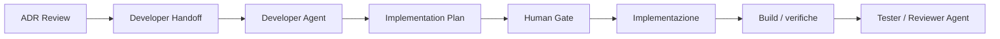

# 15 - Developer Agent e Implementation Plan

## Obiettivo della lezione

Questa lezione serve a capire come progettare un Developer Agent senza trasformarlo in un agente onnipotente.

Finora la pipeline manuale ha prodotto:

```text
Requirement Analysis Document
Requirement Review
Knowledge absorption
Architect Handoff
Architecture Decision Record
ADR Review
```

Adesso posso preparare il passaggio verso chi implementa.

Ma attenzione:

```text
Developer Agent
```

non significa:

```text
agente libero di cambiare tutto il repository.
```

Significa:

```text
agente autorizzato a modificare solo cio' che serve,
seguendo un piano, dentro privilegi espliciti,
con test/verifiche e possibilita' di stop.
```

L'obiettivo della lezione e' imparare:

- che cosa fa un Developer Agent;
- che cosa non deve fare;
- quali input deve ricevere;
- quali privilegi gli servono;
- quali privilegi non deve avere;
- come si passa da ADR a Implementation Plan;
- come evitare modifiche incontrollate;
- come preparare la futura automazione reale.

## Perche' questa lezione conta

Il Developer Agent e' uno degli agenti piu' rischiosi della factory.

Perche'?

Perche' e' il primo agente che, in una pipeline reale, potrebbe:

- leggere codice;
- modificare file;
- eseguire comandi;
- installare dipendenze;
- lanciare test;
- creare commit;
- modificare asset;
- toccare configurazioni;
- rompere qualcosa che prima funzionava.

Quindi e' anche l'agente in cui il tema dei privilegi diventa concreto.

Fino a ora molti agenti producevano documenti.

Il Developer Agent produce cambiamento operativo.

Questo cambia il rischio.

Un Requirement Analyst che sbaglia puo' produrre requisiti deboli.

Un Architect che sbaglia puo' produrre una decisione debole.

Un Developer che sbaglia puo' modificare file reali.

Per questo non basta dire:

```text
Implementa la soluzione.
```

Serve dire:

```text
Implementa questo task,
su questi file,
con questi limiti,
usando questi comandi,
senza toccare queste aree,
e fermati se succede questo.
```

## Prerequisiti

Prima di questa lezione devo avere chiari:

- che cos'e' un Agent Card;
- che cos'e' un Handoff Contract;
- che cos'e' un ADR;
- che cos'e' una review;
- differenza tra requisito, architettura e implementazione;
- concetto di privilegio;
- concetto di minimo privilegio necessario;
- perche' un agente deve avere condizioni di stop.

## Definizione semplice

Un Developer Agent e' un agente specializzato che trasforma un piano approvato in modifiche tecniche concrete.

Lavora su:

- file;
- codice;
- configurazioni;
- script;
- asset;
- documentazione tecnica;
- test o verifiche.

Ma deve farlo dentro un perimetro.

Non decide lo scope.

Non decide l'architettura.

Non decide se una feature e' necessaria.

Non aggiorna la knowledge base permanente.

Non fa deploy senza autorizzazione.

## Cosa fa un Developer Agent

Un Developer Agent deve:

- leggere il Developer Handoff;
- leggere l'ADR approvato o accettato con riserve;
- leggere il template di Implementation Plan;
- ispezionare i file autorizzati;
- proporre un piano di implementazione;
- dichiarare file da modificare;
- dichiarare comandi da eseguire;
- identificare rischi di modifica;
- implementare solo task autorizzati;
- eseguire verifiche consentite;
- riportare risultati;
- preparare handoff per Tester Agent o Reviewer Agent;
- proporre note candidate per Knowledge Compiler.

## Cosa non deve fare

Un Developer Agent non deve:

- inventare requisiti;
- cambiare architettura;
- modificare file fuori perimetro;
- installare dipendenze non autorizzate;
- fare deploy non autorizzato;
- cancellare file non richiesti;
- riscrivere parti ampie senza motivo;
- aggiornare knowledge base permanente;
- cambiare roadmap o manuale se il task e' solo codice;
- ignorare test falliti;
- nascondere errori;
- procedere se incontra conflitti o ambiguita' bloccanti.

## Perche' serve un Implementation Plan

Un Implementation Plan e' il ponte tra decisione architetturale e modifica reale.

L'ADR dice:

```text
Manteniamo un generatore statico custom in Node.js.
```

Il Developer Agent deve tradurlo in:

```text
Quali file devo toccare?
Quali modifiche devo fare?
Quali comandi devo eseguire?
Come verifico che non ho rotto il sito?
Quali rischi devo monitorare?
```

Senza Implementation Plan, il Developer Agent tende a partire subito con le modifiche.

Questo e' pericoloso.

Il piano serve a rallentare quel tanto che basta per proteggere il sistema.

## Differenza tra ADR e Implementation Plan

L'ADR risponde a:

```text
Quale direzione tecnica scegliamo e perche'?
```

L'Implementation Plan risponde a:

```text
Come realizzo operativamente il prossimo passo?
```

Esempio:

```text
ADR:
Mantenere generatore statico custom.

Implementation Plan:
Aggiornare `tools/build-site.js` aggiungendo nuova fonte,
rigenerare `docs/`,
verificare home, sidebar e pagine generate,
non introdurre framework.
```

Sono collegati, ma non sono la stessa cosa.

## Diagramma del passaggio



Nota importante:

```text
Nella fase corrente il Developer Agent produce prima un piano.
Solo dopo autorizzazione puo' modificare file.
```

Questo e' un pattern sano.

## Privilegi del Developer Agent

Il Developer Agent e' il primo agente in cui separo davvero livelli di permesso.

### Lettura

Può leggere:

- file sorgente autorizzati;
- template;
- handoff;
- ADR;
- review;
- knowledge base validata se utile.

### Scrittura

Può scrivere:

- file esplicitamente autorizzati;
- output del proprio piano;
- eventuali file generati se il comando e' previsto;
- report di verifica.

### Esecuzione comandi

Può eseguire solo comandi autorizzati.

Esempio:

```text
node tools/build-site.js
git diff --check
```

Non può eseguire:

```text
deploy
installazioni
cancellazioni ricorsive
reset git
```

senza human gate.

### Accesso esterno

Nella fase corrente:

```text
no
```

Il Developer Agent non deve scaricare pacchetti, leggere internet o chiamare servizi esterni se non necessario e autorizzato.

### Deploy

Nella fase corrente:

```text
no
```

Il deploy e il push restano governati da una decisione esplicita.

## Human gate

Il Developer Agent richiede human gate quando:

- vuole modificare file fuori scope;
- vuole installare dipendenze;
- vuole cancellare file;
- vuole cambiare architettura;
- vuole fare deploy;
- incontra test falliti non banali;
- trova conflitti con modifiche non sue;
- deve usare credenziali o API key;
- deve cambiare dati permanenti.

Questo non rende il sistema lento.

Lo rende controllabile.

## Esempio semplice

Task:

```text
Aggiungere una nuova pagina al sito statico.
```

Developer Agent debole:

```text
Modifico il sito.
```

Developer Agent migliore:

```text
Piano:
1. Aggiungo il file Markdown sorgente.
2. Registro la pagina in `tools/build-site.js`.
3. Eseguo `node tools/build-site.js`.
4. Verifico che `docs/pages/...html` esista.
5. Controllo che la home e la sidebar includano la pagina.
6. Non modifico CSS se non richiesto.
7. Non installo dipendenze.
```

La differenza e' enorme.

Il secondo piano e' verificabile.

## Esempio professionale

Task:

```text
Aggiungere login a un'applicazione web.
```

Developer Agent non governato:

```text
Installa una libreria, modifica backend, frontend, database e deploy.
```

Problema:

```text
Troppe aree, troppi privilegi, troppi rischi.
```

Developer Agent governato:

```text
1. Legge ADR su autenticazione.
2. Legge handoff Security Reviewer.
3. Propone piano.
4. Dichiara file da modificare.
5. Richiede human gate per nuova dipendenza.
6. Implementa solo dopo approvazione.
7. Esegue test autorizzati.
8. Produce handoff per Tester e Reviewer.
```

Questo e' il tipo di disciplina che voglio portare in AgentFactory.

## Agent Card del Developer Agent

Da questa lezione nasce:

```text
agents/developer-agent.md
```

Questa Agent Card definisce:

- missione;
- responsabilita';
- input;
- output;
- tool consentiti;
- privilegi;
- regole operative;
- condizioni di stop;
- criteri di qualita';
- rischi.

## Template Implementation Plan

Da questa lezione nasce:

```text
templates/implementation-plan-template.md
```

Il template serve a impedire che il Developer Agent parta subito con modifiche non governate.

Le sezioni chiave sono:

- metadati;
- input;
- obiettivo;
- file autorizzati;
- file vietati;
- piano step-by-step;
- comandi consentiti;
- verifiche;
- rischi;
- condizioni di stop;
- handoff successivo.

## Primo Developer Handoff

Creo anche:

```text
experiments/001-agentfactory-static-site-developer-handoff.md
```

Questo handoff prende come input:

- ADR;
- review ADR;
- vincoli del sito;
- decisione di mantenere generatore custom.

E prepara il Developer Agent a lavorare sul sito senza cambiare architettura.

## Primo Implementation Plan

Creo infine:

```text
experiments/001-agentfactory-static-site-implementation-plan.md
```

Questo piano non implementa ancora una feature nuova.

Serve a definire come il Developer Agent dovra' operare quando aggiungera' contenuti o piccole evoluzioni al sito statico.

Per ora e' giusto cosi'.

Prima governo il comportamento.

Poi automatizzo.

## Anti-pattern ed errori comuni

### Errore 1 - Dare al Developer tutto il repository

Errore:

```text
Puoi modificare qualsiasi file.
```

Perche' e' rischioso:

```text
L'agente puo' toccare aree non rilevanti e creare danni difficili da isolare.
```

Correzione:

```text
Autorizzare file e cartelle esplicite.
```

### Errore 2 - Saltare il piano

Errore:

```text
Implementa subito.
```

Perche' e' fragile:

```text
Non posso controllare intenzione, scope e rischi prima delle modifiche.
```

Correzione:

```text
Prima Implementation Plan, poi implementazione.
```

### Errore 3 - Installare dipendenze per comodita'

Errore:

```text
Installo una libreria per fare prima.
```

Perche' e' rischioso:

```text
Aumenta superficie di manutenzione e puo' violare l'ADR.
```

Correzione:

```text
Nuove dipendenze richiedono human gate e, se rilevanti, nuovo ADR.
```

### Errore 4 - Confondere fallimento test con fastidio

Errore:

```text
Il test fallisce ma continuo.
```

Perche' e' grave:

```text
La pipeline perde fiducia nelle verifiche.
```

Correzione:

```text
Un test o build fallita deve essere riportata e classificata.
```

### Errore 5 - Nascondere modifiche collaterali

Errore:

```text
Ho cambiato anche altre cose per sistemare.
```

Perche' e' pericoloso:

```text
Aumenta il rischio e rende difficile la review.
```

Correzione:

```text
Ogni modifica fuori piano richiede stop o aggiornamento del piano.
```

## Collegamento con AgentFactory

Con questa lezione la pipeline diventa:

```text
Brief
  -> Requirement Analysis
  -> Requirement Review
  -> Knowledge absorption
  -> Architect Handoff
  -> ADR
  -> ADR Review
  -> Developer Handoff
  -> Implementation Plan
```

Questo e' il punto in cui AgentFactory comincia a somigliare a una pipeline professionale.

Non sto ancora chiedendo all'agente di scrivere codice.

Sto costruendo il recinto in cui potra' farlo.

## Artefatti prodotti

Questa lezione produce:

```text
agents/developer-agent.md
templates/implementation-plan-template.md
experiments/001-agentfactory-static-site-developer-handoff.md
experiments/001-agentfactory-static-site-implementation-plan.md
```

Aggiorna anche:

```text
GLOSSARY.md
ROADMAP.md
MANUAL.md
tools/build-site.js
docs/
```

## Verifica personale

Dopo questa lezione devo saper rispondere:

```text
1. Che cosa fa un Developer Agent?
2. Che cosa non deve fare?
3. Perche' il Developer Agent e' piu' rischioso degli agenti documentali?
4. Che differenza c'e' tra ADR e Implementation Plan?
5. Quali privilegi servono per leggere, scrivere ed eseguire comandi?
6. Quando il Developer Agent deve fermarsi?
7. Perche' nuove dipendenze richiedono human gate?
8. Perche' il piano deve venire prima della modifica?
```

## Conoscenza da assorbire

- Il Developer Agent deve essere governato da piano, privilegi e condizioni di stop.
- Scrivere codice e modificare file aumenta il rischio operativo della pipeline.
- L'Implementation Plan traduce decisioni architetturali in passi tecnici verificabili.
- Nuove dipendenze, deploy e modifiche fuori scope richiedono human gate.
- Un Developer Agent professionale non deve essere veloce prima di essere controllabile.

## Prossimo passo

Dopo questa lezione posso preparare la strada verso il primo agente reale.

Il prossimo passaggio dovrebbe essere:

```text
prompt operativo + runtime minimo per il Requirement Analyst Agent reale
```

Prima di chiamare l'API, pero', devo definire:

- quale modello usare;
- dove mettere la chiave API;
- quale input passare;
- quale template forzare;
- dove salvare l'output;
- come confrontarlo con l'esempio manuale;
- quali costi e limiti accettare.
