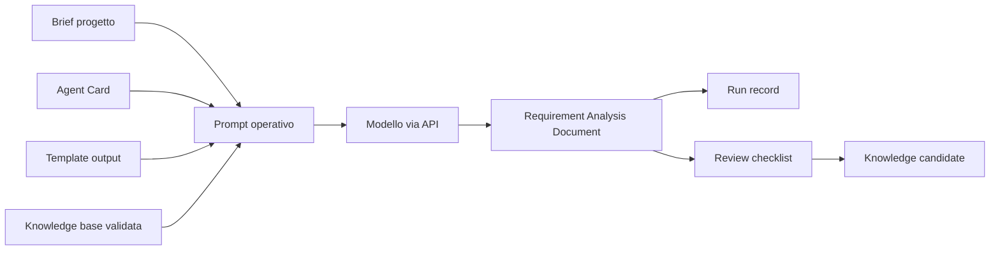

# 16 - Prompt operativo e runtime minimo per il primo agente reale

## Obiettivo della lezione

Questa lezione prepara il passaggio dal manuale alla prima esecuzione reale di un agente.

Finora ho costruito:

```text
Agent Card
Output template
Review checklist
Knowledge absorption
Handoff contract
ADR
Implementation Plan
```

Adesso devo trasformare il Requirement Analyst Agent da agente progettato su carta a agente eseguibile.

Ma non devo ancora correre verso una pipeline multi-agent completa.

Il prossimo passo sano e':

```text
un agente reale,
un input reale,
un prompt operativo,
un template obbligatorio,
un output salvato,
una review tracciata,
un costo controllato.
```

L'obiettivo della lezione e' imparare:

- che cos'e' un prompt operativo;
- perche' un prompt operativo non e' solo una richiesta lunga;
- che cos'e' un runtime minimo;
- quali variabili servono prima di chiamare un'API;
- come proteggere API key e budget;
- dove salvare input, output e run record;
- come confrontare l'output reale con l'output manuale;
- perche' OpenAI Agents SDK entrera' dopo, non prima.

## Perche' questa lezione conta

Il primo agente reale e' un momento delicato.

Se lo costruisco male, rischio di imparare la cosa sbagliata:

```text
"Ho chiamato un modello e mi ha risposto."
```

Questa non e' ancora AgentFactory.

AgentFactory inizia quando posso dire:

```text
"Ho eseguito un agente con ruolo, input, output contract, vincoli,
tracciamento, review e conoscenza assorbibile."
```

La differenza e' enorme.

Un modello puo' rispondere bene una volta.

Un agente deve essere ripetibile.

Un modello puo' improvvisare.

Un agente deve rispettare un contratto.

Un modello puo' produrre testo utile.

Un agente deve produrre un artefatto che entra in una pipeline.

Per questo prima della prima chiamata API creo:

- prompt operativo;
- regole di esecuzione;
- template di run record;
- piano del primo run.

## Prerequisiti

Prima di questa lezione devo avere chiari:

- che cos'e' un Requirement Analyst Agent;
- che cos'e' una Agent Card;
- che cos'e' un Output Contract;
- che cos'e' un Requirement Analysis Document;
- che cos'e' una review;
- che cos'e' un Human Gate;
- perche' non devo mettere credenziali nel repository;
- perche' un output agentico deve essere salvato e valutato.

Non serve ancora conoscere bene Python.

Serve solo capire il flusso.

Il codice arrivera' dopo.

## Il problema: prompt generico contro prompt operativo

Un prompt generico e':

```text
Analizza questo progetto e scrivi i requisiti.
```

Puo' anche produrre qualcosa di utile.

Ma non e' abbastanza.

Perche'?

Perche' lascia troppe decisioni libere:

- quali sezioni usare;
- quali informazioni inventare;
- quanto essere sintetico;
- quali ipotesi dichiarare;
- quali domande aperte inserire;
- come separare requisiti funzionali e non funzionali;
- come preparare handoff per gli agenti successivi;
- quando fermarsi;
- cosa fare se il brief e' ambiguo.

Un prompt operativo invece e':

```text
un contratto di comportamento eseguibile.
```

Non dice solo cosa produrre.

Dice:

- chi sei;
- qual e' la tua missione;
- quale input ricevi;
- quali fonti puoi usare;
- quale template devi rispettare;
- quali errori devi evitare;
- quali informazioni non puoi inventare;
- quali sezioni sono obbligatorie;
- quando devi dichiarare incertezza;
- quando devi chiedere validazione umana;
- quale formato finale devi restituire.

## Definizione semplice

Un prompt operativo e' il documento che permette a un modello di comportarsi come un agente specializzato dentro una pipeline.

Non coincide con la Agent Card.

La Agent Card descrive l'agente.

Il prompt operativo mette l'agente in esecuzione.

Esempio:

```text
Agent Card:
Il Requirement Analyst Agent trasforma brief grezzi in requisiti verificabili.

Prompt operativo:
Prendi questo brief, usa questa Agent Card, rispetta questo template,
non inventare informazioni, separa fatti/ipotesi/domande,
produci solo Markdown nel formato richiesto.
```

## Diagramma del primo agente reale



Questo diagramma e' importante perche' mostra che il modello non lavora da solo.

Il modello e' solo il motore linguistico.

L'agente nasce dalla combinazione di:

- modello;
- ruolo;
- contesto;
- regole;
- template;
- memoria validata;
- valutazione.

## Che cos'e' un runtime minimo

Un runtime minimo e' il pezzo piu' piccolo di sistema capace di eseguire un agente in modo tracciabile.

Nel nostro caso non serve ancora una piattaforma completa.

Serve un piccolo flusso:

```text
1. Leggi il brief.
2. Leggi Agent Card.
3. Leggi template output.
4. Leggi knowledge base utile.
5. Costruisci il prompt operativo.
6. Chiama il modello.
7. Salva l'output Markdown.
8. Salva il run record.
9. Esegui review umana o agentica.
10. Decidi se assorbire conoscenza.
```

Questo runtime potra' essere uno script Python.

Per ora lo progetto.

Nella prossima lezione potro' implementarlo.

## Perche' non parto subito da OpenAI Agents SDK

OpenAI Agents SDK e' uno strumento reale e importante.

Permette di definire agenti con:

- istruzioni;
- tool;
- handoff;
- guardrail;
- sessioni;
- tracing;
- esecuzione tramite runner.

E' perfetto quando voglio orchestrare agenti veri, usare strumenti e osservare trace.

Pero' per il primo passo devo imparare la meccanica base:

```text
input
  -> prompt
  -> modello
  -> output
  -> salvataggio
  -> review
```

Se salto subito a un framework, rischio di non capire cosa sta succedendo sotto.

Quindi la scelta didattica e':

```text
prima runtime minimo,
poi Agents SDK,
poi orchestrazione multi-agent.
```

Questo non significa ignorare lo SDK.

Significa usarlo al momento giusto.

## Che cosa deve sapere il primo runtime

Il primo runtime non deve essere intelligente.

Deve essere affidabile.

Deve sapere:

- quale agente eseguire;
- quale modello usare;
- dove leggere l'input;
- dove leggere il prompt;
- dove leggere il template;
- dove salvare l'output;
- dove salvare il run record;
- quale budget massimo rispettare;
- quali errori bloccano l'esecuzione.

Una configurazione minima potrebbe essere:

```text
AGENT_NAME=Requirement Analyst Agent
OPENAI_API_KEY=[variabile ambiente, mai nel repo]
OPENAI_MODEL=[modello scelto prima del run]
INPUT_FILE=experiments/001-agentfactory-static-site-requirements-input.md
PROMPT_FILE=prompts/requirement-analyst-agent-prompt.md
OUTPUT_FILE=experiments/002-agentfactory-static-site-requirements-ai.md
RUN_RECORD_FILE=experiments/002-agentfactory-static-site-run-record.md
```

La chiave API non deve mai essere scritta in un file del repository.

Deve vivere fuori dal repo, come variabile ambiente.

## API key e sicurezza minima

Una API key e' una credenziale.

Chi la possiede puo' usare il servizio associato e generare costi.

Quindi la regola e':

```text
mai committare API key.
mai incollare API key in un file Markdown.
mai salvarla in un template.
mai mostrarla in un run record.
```

Nel run record posso scrivere:

```text
OPENAI_API_KEY presente: si
```

Non posso scrivere:

```text
OPENAI_API_KEY=[valore segreto reale]
```

Questo e' un primo pezzo di governance reale.

## Costo e budget

Un agente reale costa perche' usa token.

In una Agent Factory professionale devo sempre sapere:

- quanto posso spendere;
- quale modello uso;
- quanti run autorizzo;
- quando fermarmi;
- quale output giustifica il costo.

Per il primo run la regola deve essere semplice:

```text
1 run autorizzato.
1 agente.
1 input.
1 output.
nessun loop automatico.
nessun retry automatico illimitato.
nessuna creazione dinamica di agenti.
```

Questo e' fondamentale.

Gli agenti che migliorano nel tempo non devono diventare agenti che spendono nel tempo senza controllo.

## Input del primo agente

Il primo input deve essere un brief gia' conosciuto.

Perche'?

Perche' ho gia' un confronto manuale.

Usero' il caso:

```text
AgentFactory Static Site
```

Ho gia' prodotto manualmente:

```text
experiments/001-agentfactory-static-site-requirements.md
experiments/001-agentfactory-static-site-requirements-review.md
```

Quando il Requirement Analyst Agent reale produrra' il suo output, potro' confrontarlo con il documento manuale.

Questo rende il primo run formativo.

Non sto solo testando se il modello scrive.

Sto testando se il sistema produce un artefatto utile nella nostra pipeline.

## Output del primo agente

L'output deve essere un file Markdown.

Non una risposta persa in chat.

Non un testo copiato a mano senza traccia.

Il file previsto sara':

```text
experiments/002-agentfactory-static-site-requirements-ai.md
```

Lo stato iniziale sara':

```text
Da validare
```

Solo dopo review potra' diventare:

```text
Validato
```

oppure:

```text
Da rivedere
```

## Run record

Il run record e' il documento che risponde alla domanda:

```text
Che cosa e' successo durante questa esecuzione?
```

Deve tracciare:

- data;
- agente;
- modello;
- prompt usato;
- input usato;
- output generato;
- stato;
- eventuali errori;
- budget previsto;
- costo effettivo se disponibile;
- review successiva;
- conoscenza candidata.

Senza run record, il lavoro dell'agente diventa difficile da studiare.

Con il run record posso migliorare il sistema.

## Prompt operativo creato in questa lezione

Da questa lezione nasce:

```text
prompts/requirement-analyst-agent-prompt.md
```

Questo prompt obbliga il Requirement Analyst Agent a:

- usare il template ufficiale;
- non inventare informazioni;
- distinguere fatti, ipotesi e domande aperte;
- produrre requisiti verificabili;
- preparare handoff per Architect, Developer, Tester e Reviewer;
- dichiarare punti di validazione umana;
- restituire solo Markdown.

## Template creato in questa lezione

Da questa lezione nasce:

```text
templates/real-agent-run-record-template.md
```

Questo template e' il registro standard per le esecuzioni reali.

Non riguarda solo il Requirement Analyst Agent.

Piu' avanti sara' usato anche da:

- Architect Agent reale;
- Developer Agent reale;
- Tester Agent reale;
- pipeline multi-agent completa.

## Piano creato in questa lezione

Creo anche:

```text
experiments/001-requirement-analyst-real-agent-run-plan.md
```

Questo non e' ancora l'output del modello.

E' il piano del primo run.

Serve a dire:

- quale agente eseguire;
- quale input usare;
- quale output aspettarmi;
- quali file salvare;
- quali stop condition rispettare;
- quale review fare dopo.

## Anti-pattern ed errori comuni

### Errore 1 - Confondere chat e agente

Errore:

```text
Scrivo a un modello e tengo la risposta se mi piace.
```

Perche' e' fragile:

```text
Non ho template, run record, confronto, review o memoria.
```

Correzione:

```text
Ogni run reale produce file versionabili e valutabili.
```

### Errore 2 - Mettere la API key nel repository

Errore:

```text
OPENAI_API_KEY=[valore segreto reale]
```

Perche' e' grave:

```text
Espone credenziali e costi.
```

Correzione:

```text
Usare variabile ambiente e non salvare mai il valore nei file.
```

### Errore 3 - Lasciare il modello libero di scegliere il formato

Errore:

```text
Scrivi i requisiti come preferisci.
```

Perche' e' fragile:

```text
Gli agenti successivi non possono affidarsi a una struttura stabile.
```

Correzione:

```text
Forzare il template ufficiale e validare lo schema.
```

### Errore 4 - Fare subito loop automatici

Errore:

```text
Se l'output non va bene, riprova finche' migliora.
```

Perche' e' rischioso:

```text
Aumenta costi e puo' nascondere errori di progettazione del prompt.
```

Correzione:

```text
Per il primo run: un solo tentativo, review, poi miglioramento consapevole.
```

### Errore 5 - Saltare il confronto con il manuale

Errore:

```text
Il modello ha prodotto un testo bello, quindi va bene.
```

Perche' e' insufficiente:

```text
La bellezza del testo non misura utilita' nella pipeline.
```

Correzione:

```text
Confrontare output AI e output manuale usando la checklist.
```

## Collegamento con AgentFactory

Questa lezione crea il ponte tra:

```text
manuale
```

e:

```text
factory reale.
```

La pipeline diventa:

```text
Brief noto
  -> Prompt operativo
  -> Requirement Analyst Agent reale
  -> Requirement Analysis Document AI
  -> Run record
  -> Review
  -> Knowledge absorption
```

Questo e' il primo passo verso agenti che migliorano nel tempo.

Non migliorano per magia.

Migliorano perche':

- ogni run e' tracciato;
- ogni output e' valutato;
- ogni errore puo' diventare conoscenza candidata;
- ogni prompt puo' essere versionato;
- ogni template puo' evolvere con governance.

## Artefatti prodotti

Questa lezione produce:

```text
lessons/16-prompt-operativo-runtime-primo-agente-reale.md
prompts/requirement-analyst-agent-prompt.md
templates/real-agent-run-record-template.md
experiments/001-requirement-analyst-real-agent-run-plan.md
governance/real-agent-execution-rules.md
```

Aggiorna anche:

```text
GLOSSARY.md
ROADMAP.md
MANUAL.md
tools/build-site.js
docs/
```

## Verifica personale

Dopo questa lezione devo saper rispondere:

```text
1. Che differenza c'e' tra prompt generico e prompt operativo?
2. Perche' la Agent Card non basta per eseguire un agente?
3. Che cos'e' un runtime minimo?
4. Perche' il primo agente reale deve produrre un file Markdown?
5. Perche' serve un run record?
6. Dove va messa una API key?
7. Perche' non devo fare loop automatici al primo run?
8. Come confronto output AI e output manuale?
9. Perche' Agents SDK arriva dopo il runtime minimo?
10. Quale conoscenza posso assorbire dopo un run reale?
```

## Conoscenza da assorbire

- Un agente reale non e' solo un modello chiamato via API: e' modello piu' ruolo, contesto, regole, template, output salvato e review.
- Il primo runtime deve essere semplice e tracciabile prima di essere sofisticato.
- API key, modello, budget, input, output e stop condition devono essere definiti prima del run.
- Il primo run deve essere confrontabile con un artefatto manuale gia' noto.
- OpenAI Agents SDK e' importante, ma va introdotto quando servono tool, handoff, guardrail, sessioni e tracing.

## Prossimo passo

Dopo questa lezione posso implementare il primo runtime minimo.

Il prossimo passaggio sara':

```text
creare uno script Python controllato
che legge prompt, template e brief,
chiama il modello solo se la API key e' presente,
salva output e run record,
e non fa nessun loop automatico.
```

Solo dopo potro' eseguire il primo Requirement Analyst Agent reale.
