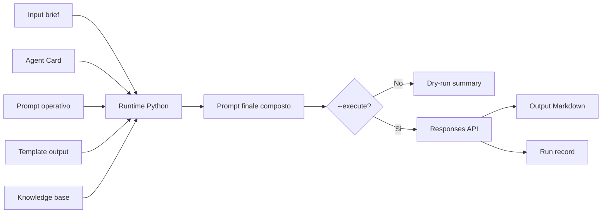

# 17 - Runtime Python minimo per il primo agente reale

## Obiettivo della lezione

Questa lezione crea il primo runtime minimo di AgentFactory.

Nella lezione 16 ho definito:

```text
prompt operativo
input
output
run record
API key fuori dal repository
budget
stop condition
```

Adesso trasformo quel progetto in un primo script Python controllato.

L'obiettivo non e' ancora costruire una piattaforma multi-agent completa.

L'obiettivo e':

```text
eseguire un solo agente,
con un solo input,
con un solo prompt,
salvando un solo output,
tracciando un solo run record.
```

Questa e' la prima pietra tecnica della factory reale.

## Perche' questa lezione conta

Finora il repository conteneva soprattutto conoscenza, template e simulazioni manuali.

Questa lezione introduce una cosa diversa:

```text
un programma che puo' eseguire un agente.
```

Questo cambia il progetto.

Da qui in avanti AgentFactory non e' solo manuale.

E' anche laboratorio operativo.

Pero' devo restare disciplinato.

Un errore comune e' pensare:

```text
Adesso ho uno script, quindi posso automatizzare tutto.
```

No.

In questa fase lo script deve fare poco, ma bene:

- leggere file;
- comporre prompt;
- mostrare cosa farebbe;
- bloccare esecuzioni pericolose;
- chiamare l'API solo se autorizzato;
- salvare output;
- salvare run record;
- non usare tool esterni;
- non creare altri agenti;
- non fare retry automatici.

Questo e' il modo giusto di imparare.

Prima controllo il singolo passo.

Poi costruisco la pipeline.

## Prerequisiti

Prima di questa lezione devo avere chiari:

- che cos'e' un prompt operativo;
- che cos'e' un runtime minimo;
- dove va salvata una API key;
- che cos'e' un run record;
- perche' un output deve essere versionabile;
- perche' il primo agente reale non deve avere loop automatici;
- differenza tra dry-run ed execute.

## Dry-run ed execute

Il runtime nasce con due modalita':

```text
dry-run
execute
```

### Dry-run

La modalita' dry-run non chiama nessuna API.

Serve a controllare:

- quali file vengono letti;
- quale modello sarebbe usato;
- quale output sarebbe scritto;
- quale run record sarebbe scritto;
- quanto e' grande il prompt finale;
- se il prompt viene composto correttamente.

Dry-run significa:

```text
vedo il piano tecnico,
ma non spendo,
non chiamo il modello,
non genero output finale.
```

### Execute

La modalita' execute chiama davvero il modello.

Per partire richiede:

- `OPENAI_API_KEY` presente come variabile ambiente;
- `OPENAI_MODEL` configurato o passato da comando;
- output path chiaro;
- run record path chiaro;
- nessun overwrite accidentale, salvo `--force`.

Execute significa:

```text
sto usando soldi veri,
sto generando un artefatto reale,
sto creando una traccia da valutare.
```

Quindi non deve essere la modalita' predefinita.

La modalita' predefinita e' dry-run.

## Diagramma del runtime



Il punto chiave e':

```text
il runtime non inventa il comportamento dell'agente.
```

Il comportamento viene dai file versionati:

- Agent Card;
- prompt operativo;
- template;
- knowledge base.

Il runtime e' il meccanismo che li mette insieme.

## Artefatto tecnico creato

Questa lezione crea:

```text
runtime/run_requirement_analyst.py
```

Lo script e' volutamente piccolo.

Non usa framework multi-agent.

Non usa OpenAI Agents SDK.

Non usa tool.

Non orchestra handoff.

Fa solo il primo passo:

```text
Requirement Analyst Agent reale
```

## Perche' uso Python

Uso Python per tre motivi:

1. e' lo standard piu' comune per prototipi agentici;
2. ha SDK ufficiali e molte librerie disponibili;
3. permette di leggere file, comporre prompt e salvare Markdown con poco codice.

Questo non significa che tutta AgentFactory dovra' essere Python per sempre.

Significa che Python e' il modo piu' semplice per imparare bene il primo runtime.

## Struttura del runtime

Il runtime legge questi file:

```text
experiments/001-agentfactory-static-site-requirements-input.md
agents/requirement-analyst-agent.md
prompts/requirement-analyst-agent-prompt.md
templates/requirement-analysis-output-template.md
knowledge-base/requirement-analysis-rules.md
```

Poi compone il prompt finale sostituendo i placeholder del prompt operativo.

In dry-run stampa:

```text
DRY RUN
agent card path
input path
prompt path
template path
knowledge base path
model
output path
run record path
prompt size
```

In execute salva:

```text
experiments/002-agentfactory-static-site-requirements-ai.md
experiments/002-agentfactory-static-site-requirement-analyst-run-record.md
```

## Comando dry-run

Il primo comando da usare e':

```powershell
python runtime\run_requirement_analyst.py
```

Questo non chiama l'API.

Serve solo a verificare che il runtime sappia leggere e comporre i file.

Se Windows risponde:

```text
python non riconosciuto
```

significa che Python non e' installato o non e' nel PATH.

In quel caso devo prima sistemare l'ambiente Python.

Due controlli utili sono:

```powershell
python --version
py --version
```

Se entrambi falliscono, devo installare Python e poi riaprire il terminale.

## Configurazione della API key

La API key non va mai scritta nel repository.

In PowerShell si configura cosi':

```powershell
$env:OPENAI_API_KEY = "[valore segreto reale]"
```

Il modello si configura cosi':

```powershell
$env:OPENAI_MODEL = "gpt-5.5"
```

Il valore del modello resta configurabile perche' i modelli cambiano nel tempo e anche l'accesso dell'account puo' variare.

Se un modello non e' disponibile, non cambio il codice.

Cambio la variabile:

```powershell
$env:OPENAI_MODEL = "[modello disponibile]"
```

## Comando execute

Quando API key, modello e budget sono decisi, il comando reale sara':

```powershell
python runtime\run_requirement_analyst.py --execute
```

Questo comando:

- controlla la presenza della API key;
- controlla il modello;
- rifiuta overwrite accidentali;
- chiama il modello;
- salva il Requirement Analysis Document generato;
- salva il run record.

## Perche' lo script rifiuta overwrite accidentali

Un output agentico e' un artefatto.

Non deve essere sovrascritto per sbaglio.

Se un file esiste gia', il runtime si ferma.

Per sovrascrivere intenzionalmente serve:

```powershell
python runtime\run_requirement_analyst.py --execute --force
```

Questa regola sembra piccola, ma e' importante.

In una Agent Factory professionale gli artefatti non devono sparire.

Devono essere versionati.

## Perche' non installo automaticamente dipendenze

Il runtime richiede il pacchetto ufficiale:

```text
openai
```

Ma non lo installo automaticamente.

Perche'?

Perche' installare dipendenze e' un privilegio.

Serve una decisione esplicita.

Il file:

```text
runtime/requirements.txt
```

contiene la dipendenza necessaria.

Quando vorro' eseguire davvero, il setup sara':

```powershell
python -m venv .venv
.\.venv\Scripts\Activate.ps1
pip install -r runtime\requirements.txt
```

Questo passaggio e' separato dal runtime per mantenere controllo.

## Cosa succede dopo il primo output

Dopo il primo execute non devo dire:

```text
funziona, andiamo avanti.
```

Devo fare review.

Il flusso corretto e':

```text
output AI
  -> checklist Requirement Analysis Review
  -> confronto con output manuale
  -> finding
  -> decisione
  -> eventuale knowledge absorption
```

Solo dopo posso migliorare prompt, template o Agent Card.

## Anti-pattern ed errori comuni

### Errore 1 - Eseguire subito senza dry-run

Errore:

```text
python runtime\run_requirement_analyst.py --execute
```

senza aver prima controllato input e output.

Correzione:

```text
prima dry-run, poi execute.
```

### Errore 2 - Mettere la API key in un file

Errore:

```text
salvare la chiave in config.example.env compilato
```

Correzione:

```text
solo variabile ambiente reale, esempio senza valore segreto nel repo.
```

### Errore 3 - Far scegliere tutto allo script

Errore:

```text
lo script decide modello, output e retry.
```

Correzione:

```text
modello, output e retry devono essere governati.
```

### Errore 4 - Confondere runtime con agente

Errore:

```text
lo script e' l'agente.
```

Correzione:

```text
lo script e' il runtime; l'agente e' dato da Agent Card, prompt, template, regole e modello.
```

### Errore 5 - Credere che un output bello sia un output valido

Errore:

```text
il documento sembra scritto bene, quindi e' valido.
```

Correzione:

```text
validare con checklist, criteri e confronto.
```

## Esempio semplice

Immagino di avere questo brief:

```text
Voglio un sito statico per consultare il manuale AgentFactory.
```

Il runtime non deve rispondere direttamente.

Deve:

1. prendere il brief;
2. prendere la Agent Card;
3. prendere il prompt operativo;
4. prendere il template;
5. produrre un Requirement Analysis Document;
6. salvarlo;
7. registrare il run.

La differenza e' che ora il risultato entra nel repository.

Diventa studiabile.

## Esempio professionale

In una pipeline aziendale, un runtime simile potrebbe essere usato per:

- analizzare ticket Jira;
- trasformare email cliente in requisiti;
- generare handoff per architetti;
- preparare test plan;
- estrarre rischi da documenti;
- creare review preliminari.

Ma la regola resta la stessa:

```text
input tracciato
prompt versionato
output salvato
review obbligatoria
knowledge absorption governata
```

## Collegamento con AgentFactory

Da questa lezione la pipeline reale diventa:

```text
Brief versionato
  -> Runtime Python
  -> Requirement Analyst Agent reale
  -> Requirement Analysis Document AI
  -> Run record
  -> Review
  -> Knowledge absorption
```

Questo e' il primo punto in cui posso davvero misurare:

- qualita' del prompt;
- robustezza del template;
- chiarezza della Agent Card;
- utilita' della knowledge base;
- qualita' dell'output del modello.

## Artefatti prodotti

Questa lezione produce:

```text
lessons/17-runtime-python-primo-agente-reale.md
runtime/run_requirement_analyst.py
runtime/README.md
runtime/requirements.txt
runtime/config.example.env
experiments/001-agentfactory-static-site-requirements-input.md
.gitignore
```

Aggiorna anche:

```text
MANUAL.md
ROADMAP.md
GLOSSARY.md
CHANGELOG.md
tools/build-site.js
docs/
```

## Verifica personale

Dopo questa lezione devo saper rispondere:

```text
1. Che cosa fa il runtime?
2. Che cosa non fa?
3. Che differenza c'e' tra runtime e agente?
4. Perche' dry-run e' la modalita' predefinita?
5. Perche' --execute richiede API key e modello?
6. Perche' non sovrascrivo output per default?
7. Perche' non installo dipendenze automaticamente?
8. Dove viene salvato l'output AI?
9. Dove viene salvato il run record?
10. Quale review devo fare dopo il primo execute?
```

## Conoscenza da assorbire

- Il runtime minimo deve essere semplice, tracciabile e prudente.
- Dry-run prima di execute e' una regola di sicurezza e apprendimento.
- La API key vive fuori dal repository.
- Il modello deve essere configurabile.
- Output e run record sono artefatti, quindi non vanno sovrascritti accidentalmente.
- Il primo output reale non chiude il ciclo: apre review e knowledge absorption.

## Prossimo passo

Il prossimo passaggio sara' eseguire il primo run reale solo dopo aver deciso:

```text
API key disponibile
modello
budget massimo
conferma su output path
conferma su un solo run
```

Dopo l'esecuzione, la lezione successiva dovra' essere:

```text
review del primo output AI del Requirement Analyst Agent
```
