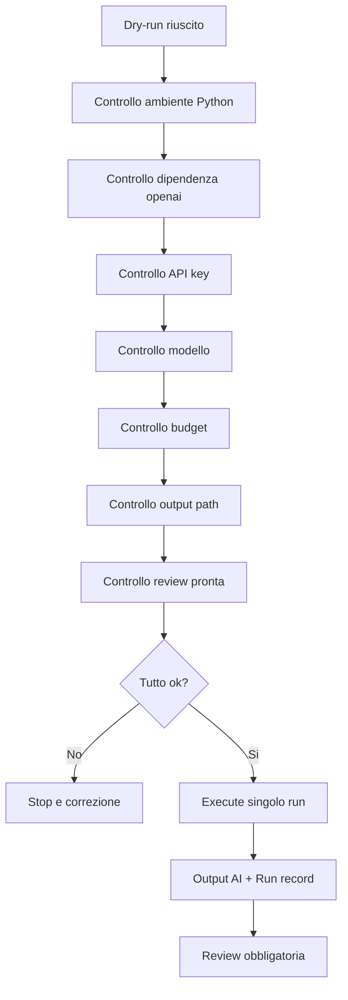

# 18 - Pre-flight del primo run API

## Obiettivo della lezione

Questa lezione prepara il primo run reale via API del Requirement Analyst Agent.

Nella lezione 17 ho creato il runtime Python minimo:

```text
runtime/run_requirement_analyst.py
```

Il runtime funziona gia' in dry-run.

Questo significa che sa:

- leggere il brief;
- leggere la Agent Card;
- leggere il prompt operativo;
- leggere il template;
- leggere la knowledge base;
- comporre il prompt finale;
- indicare output e run record previsti.

Ma non ho ancora fatto la chiamata reale al modello.

Prima di farla serve una fase molto importante:

```text
pre-flight
```

Il pre-flight e' il controllo prima del decollo.

Nel nostro caso significa:

```text
prima di spendere token,
prima di generare un artefatto AI,
prima di salvare un output reale,
controllo che ambiente, modello, budget, input, output e review siano pronti.
```

## Perche' questa lezione conta

Un agente reale non fallisce solo perche' il modello risponde male.

Puo' fallire anche per motivi molto piu' banali:

- Python non e' installato;
- la API key non e' impostata;
- il modello scelto non e' disponibile;
- il pacchetto `openai` non e' installato;
- l'output path e' gia' occupato;
- il budget non e' deciso;
- il prompt contiene input sbagliato;
- il run record non viene salvato;
- non e' chiaro chi fara' review;
- si fa un secondo run per impulso senza confrontare il primo.

Questi errori sono importanti perche' insegnano una cosa:

```text
un sistema agentico professionale non e' solo intelligenza.
e' anche procedura.
```

Il pre-flight e' una procedura.

Non rende l'agente piu' intelligente.

Rende il sistema piu' affidabile.

## Prerequisiti

Prima di questa lezione devo avere:

- lezione 16 compresa;
- lezione 17 compresa;
- runtime Python presente;
- prompt operativo presente;
- brief input versionato;
- template di output presente;
- run record template presente;
- regole di execution governance presenti.

Devo anche accettare una regola:

```text
se un controllo pre-flight fallisce,
non eseguo il run.
```

## Che cos'e' un pre-flight

Un pre-flight e' una checklist operativa prima di una esecuzione rischiosa o costosa.

Nel nostro caso il rischio non e' enorme, ma e' reale:

- posso spendere soldi;
- posso produrre output deboli;
- posso sovrascrivere artefatti;
- posso confondere un test con un risultato validato;
- posso committare file non pronti;
- posso credere che il modello abbia ragione perche' scrive bene.

Il pre-flight serve a rallentare il momento giusto.

Non rallenta tutto.

Rallenta solo il passaggio da:

```text
dry-run
```

a:

```text
execute
```

## Diagramma del pre-flight



Il punto chiave e':

```text
execute non e' l'inizio del processo.
execute e' una conseguenza di controlli superati.
```

## Controllo 1 - Python

Prima domanda:

```text
Python e' disponibile nel terminale?
```

Comandi:

```powershell
python --version
py --version
```

Se almeno uno risponde con una versione, posso procedere.

Se entrambi falliscono, non devo forzare il runtime.

Devo installare Python o sistemare il PATH.

## Controllo 2 - Ambiente virtuale

Un ambiente virtuale isola le dipendenze del progetto.

Comandi:

```powershell
python -m venv .venv
.\.venv\Scripts\Activate.ps1
```

Se uso `py` invece di `python`:

```powershell
py -m venv .venv
.\.venv\Scripts\Activate.ps1
```

L'ambiente virtuale non va committato.

Per questo `.gitignore` contiene:

```text
.venv/
```

## Controllo 3 - Dipendenza OpenAI

Il runtime usa il pacchetto ufficiale:

```text
openai
```

Installazione:

```powershell
pip install -r runtime\requirements.txt
```

Verifica:

```powershell
python -c "import openai; print(openai.__version__)"
```

Se questo comando fallisce, non devo eseguire il run.

Devo prima correggere l'ambiente.

## Controllo 4 - API key

La API key deve essere una variabile ambiente.

Comando PowerShell:

```powershell
$env:OPENAI_API_KEY = "[valore segreto reale]"
```

Verifica senza stampare il valore:

```powershell
if ($env:OPENAI_API_KEY) { "OPENAI_API_KEY presente" } else { "OPENAI_API_KEY mancante" }
```

Non devo mai fare:

```powershell
echo $env:OPENAI_API_KEY
```

Perche' mostrerebbe la chiave nel terminale.

## Controllo 5 - Modello

Il modello deve essere configurato prima dell'esecuzione.

Comando:

```powershell
$env:OPENAI_MODEL = "gpt-5.5"
```

Il valore puo' cambiare nel tempo.

Per questo il runtime non lo fissa nel codice.

Se il modello non e' disponibile sull'account, si sceglie un modello disponibile e adatto al task, senza cambiare lo script.

Regola:

```text
il modello e' configurazione, non comportamento cablato nel runtime.
```

## Controllo 6 - Budget

Per il primo run il budget deve essere banale e stretto:

```text
1 agente
1 input
1 chiamata API
0 retry automatici
0 loop automatici
0 tool esterni
```

Questo non e' per risparmiare pochi centesimi.

E' per imparare correttamente.

Se il primo output e' debole, devo capire perche'.

Non devo rigenerare subito cinque volte.

## Controllo 7 - Output path

Il runtime scrivera':

```text
experiments/002-agentfactory-static-site-requirements-ai.md
experiments/002-agentfactory-static-site-requirement-analyst-run-record.md
```

Prima del run devo controllare che quei file non esistano gia'.

Se esistono, devo decidere:

- li tengo come artefatti storici;
- creo path nuovi;
- uso `--force` solo se voglio sovrascrivere intenzionalmente.

La regola sana e':

```text
non usare --force nel primo run reale.
```

## Controllo 8 - Review pronta

Prima di eseguire il modello devo sapere come valuterò l'output.

Review prevista:

```text
templates/requirement-analysis-review-checklist.md
```

Confronto previsto:

```text
experiments/001-agentfactory-static-site-requirements.md
```

Questa e' una cosa molto importante:

```text
non genero prima e poi decido come valutare.
decido come valutare prima di generare.
```

## Il documento pre-flight

Da questa lezione nasce:

```text
templates/real-agent-preflight-checklist-template.md
```

Questo template serve per qualsiasi agente reale futuro.

Non solo Requirement Analyst Agent.

Poi creo una prima compilazione concreta:

```text
experiments/002-requirement-analyst-real-agent-preflight.md
```

Questa compilazione dice cosa deve essere vero prima del primo execute.

## Comando finale previsto

Quando tutti i controlli sono verdi:

```powershell
python runtime\run_requirement_analyst.py --execute
```

Oppure, se il sistema usa `py`:

```powershell
py runtime\run_requirement_analyst.py --execute
```

Il comando deve essere eseguito una volta sola.

Dopo il run, stop.

Poi review.

## Cosa non faccio ancora

In questa lezione non faccio ancora:

- loop di miglioramento;
- auto-retry;
- tool use;
- handoff automatico ad Architect Agent;
- aggiornamento automatico della knowledge base;
- scelta dinamica di agenti;
- orchestrazione LangGraph o Agents SDK;
- n8n workflow.

Questo arrivera' dopo.

Prima devo completare il ciclo minimo:

```text
run -> output -> review -> conoscenza candidata
```

## Anti-pattern ed errori comuni

### Errore 1 - Eseguire per curiosita'

Errore:

```text
Vediamo cosa succede.
```

Correzione:

```text
So gia' input, modello, budget, output e review.
```

### Errore 2 - Stampare la API key

Errore:

```powershell
echo $env:OPENAI_API_KEY
```

Correzione:

```powershell
if ($env:OPENAI_API_KEY) { "presente" } else { "mancante" }
```

### Errore 3 - Cambiare modello dopo un output debole senza capire

Errore:

```text
L'output non mi piace, cambio modello.
```

Correzione:

```text
Prima capisco se il problema e' input, prompt, template, modello o aspettativa.
```

### Errore 4 - Rigenerare subito

Errore:

```text
Riprovo finche' viene bene.
```

Correzione:

```text
Primo run singolo, review, poi decisione.
```

### Errore 5 - Confondere run eseguito e output validato

Errore:

```text
Il run e' andato, quindi il documento e' valido.
```

Correzione:

```text
Il run produce un output da validare.
La review decide se e' valido.
```

## Esempio semplice

Pre-flight debole:

```text
Ho la chiave, lancio.
```

Pre-flight professionale:

```text
Python ok.
Ambiente virtuale ok.
Dipendenza openai ok.
API key presente ma non stampata.
Modello scelto.
Budget: 1 run.
Output path libero.
Review checklist pronta.
Confronto manuale pronto.
```

La differenza e' che nel secondo caso sto costruendo metodo.

## Esempio professionale

In azienda, prima di lanciare un agente su documenti cliente, una checklist simile dovrebbe includere anche:

- classificazione dati;
- permessi;
- logging;
- retention;
- compliance;
- costo massimo;
- proprietario del run;
- audit;
- review umana;
- rollback o annullamento.

AgentFactory parte piccola, ma con lo stesso principio:

```text
prima governance minima,
poi automazione.
```

## Collegamento con AgentFactory

Con questa lezione la pipeline reale diventa:

```text
Brief versionato
  -> Runtime dry-run
  -> Pre-flight
  -> Execute singolo
  -> Output AI
  -> Run record
  -> Review
  -> Knowledge absorption
```

Questa e' la prima forma completa di ciclo operativo.

Non e' ancora multi-agent.

Ma e' gia' una base professionale.

## Artefatti prodotti

Questa lezione produce:

```text
lessons/18-preflight-primo-run-api.md
templates/real-agent-preflight-checklist-template.md
experiments/002-requirement-analyst-real-agent-preflight.md
```

Aggiorna anche:

```text
MANUAL.md
ROADMAP.md
GLOSSARY.md
CHANGELOG.md
tools/build-site.js
docs/
```

## Verifica personale

Dopo questa lezione devo saper rispondere:

```text
1. Che cos'e' un pre-flight?
2. Perche' viene prima di execute?
3. Come verifico Python?
4. Come verifico il pacchetto openai?
5. Come verifico la API key senza stamparla?
6. Perche' il modello e' configurazione?
7. Qual e' il budget del primo run?
8. Perche' non uso --force?
9. Quale checklist usero' dopo l'output?
10. Perche' un run riuscito non significa output validato?
```

## Conoscenza da assorbire

- Execute deve essere preceduto da controlli espliciti.
- La API key deve essere verificata senza essere stampata.
- Il modello deve essere configurabile e scelto prima del run.
- Il primo run reale deve essere singolo, senza retry e senza loop.
- La review deve essere definita prima della generazione.
- Il pre-flight e' il primo passo verso audit e governance professionale.

## Prossimo passo

Il prossimo passaggio sara':

```text
eseguire davvero il primo run API
```

solo quando:

- Python e' pronto;
- dipendenza `openai` e' installata;
- API key e' disponibile;
- modello e' scelto;
- budget e' confermato;
- output path e' libero;
- review e' pronta.
