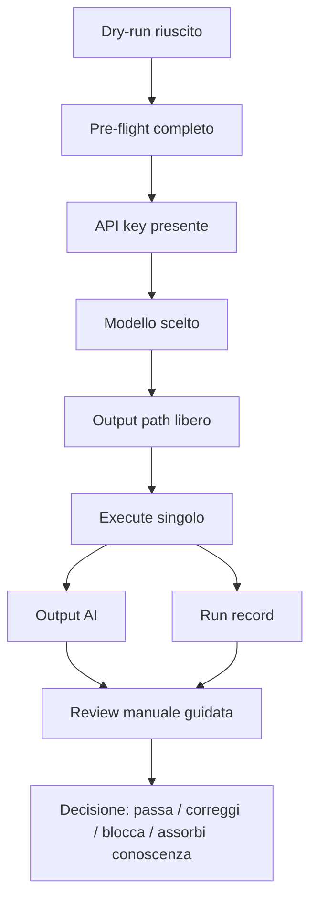

# 20 - Primo execute del Requirement Analyst Agent

## Obiettivo della lezione

Questa lezione serve a preparare il primo vero passaggio da:

```text
dry-run
```

a:

```text
execute
```

del Requirement Analyst Agent.

Nella lezione 17 ho creato il runtime Python minimo.

Nella lezione 18 ho preparato il pre-flight.

Nella lezione 19 ho capito che un agente, in futuro, verra' attivato tramite trigger, skill e orchestratore.

Adesso torno al ciclo operativo reale.

Il prossimo obiettivo e':

```text
eseguire una chiamata API singola,
produrre un Requirement Analysis Document AI,
salvare un run record,
fermarmi,
e preparare la review.
```

Questa lezione non deve creare entusiasmo incontrollato.

Deve creare metodo.

## Perche' questa lezione conta

Il primo execute e' un momento delicato.

Per la prima volta AgentFactory non produce solo documenti scritti a mano.

Produce un artefatto generato da un modello tramite runtime.

Questo cambia il significato del repository.

Prima:

```text
sto progettando come dovra' funzionare un agente.
```

Ora:

```text
sto eseguendo davvero un agente minimo.
```

Ma devo evitare una confusione pericolosa:

```text
run riuscito = output valido
```

Questa equivalenza e' falsa.

Un run riuscito significa solo:

```text
lo script ha chiamato il modello,
ha ricevuto una risposta,
ha salvato output e run record.
```

Non significa che:

- il documento sia buono;
- i requisiti siano corretti;
- l'agente abbia rispettato il template;
- l'output sia pronto per Architect Agent;
- la knowledge base debba essere aggiornata;
- il prompt sia gia' ottimo.

La qualita' arriva dopo:

```text
review
```

Questa lezione insegna proprio a separare:

```text
successo tecnico
```

da:

```text
successo agentico
```

## Prerequisiti

Prima di fare execute devo avere:

- runtime presente;
- dry-run riuscito;
- pre-flight compilato;
- ambiente virtuale attivo;
- pacchetto `openai` installato;
- API key configurata come variabile ambiente;
- modello scelto;
- budget confermato;
- output path libero;
- run record path libero;
- review checklist pronta;
- decisione umana di fare un solo run.

Se manca uno di questi punti, non eseguo.

Non e' prudenza eccessiva.

E' disciplina operativa.

## Stato attuale del runtime

Il runtime e':

```text
runtime/run_requirement_analyst.py
```

In dry-run legge:

```text
experiments/001-agentfactory-static-site-requirements-input.md
agents/requirement-analyst-agent.md
prompts/requirement-analyst-agent-prompt.md
templates/requirement-analysis-output-template.md
knowledge-base/requirement-analysis-rules.md
```

In execute produce:

```text
experiments/002-requirement-analysis-ai-output.md
experiments/002-requirement-analyst-run-record.md
```

Questi nomi sono generici.

Il brief attuale riguarda AgentFactory Static Site, ma il runtime non deve essere legato per sempre a quel caso.

Se in futuro daro' un altro brief, potro' cambiare input e output da comando.

## Comando corretto dalla root del repository

Il comando va lanciato dalla root:

```powershell
cd C:\Users\Erry\Documents\AgentFactory
```

Poi:

```powershell
python runtime\run_requirement_analyst.py
```

oppure, se sto usando il virtual environment creato in `agentfactory-test`:

```powershell
.\agentfactory-test\.venv\Scripts\python.exe runtime\run_requirement_analyst.py
```

Questo comando e' ancora dry-run.

Non chiama API.

Serve a verificare che il runtime legga i file giusti.

## Perche' non devo lanciare il comando dalla cartella sbagliata

Se mi trovo in:

```powershell
C:\Users\Erry\Documents\AgentFactory\agentfactory-test
```

e lancio:

```powershell
python runtime\run_requirement_analyst.py
```

Python cerca:

```text
agentfactory-test/runtime/run_requirement_analyst.py
```

Ma il file non e' li'.

Il file e':

```text
AgentFactory/runtime/run_requirement_analyst.py
```

Quindi ho due possibilita':

```powershell
cd C:\Users\Erry\Documents\AgentFactory
python runtime\run_requirement_analyst.py
```

oppure:

```powershell
cd C:\Users\Erry\Documents\AgentFactory\agentfactory-test
python ..\runtime\run_requirement_analyst.py
```

La prima e' piu' pulita.

Per AgentFactory usero' come regola:

```text
i comandi del runtime si lanciano dalla root del repository.
```

## Configurazione API key

La API key non deve mai stare nel repository.

Va configurata nel terminale.

In PowerShell:

```powershell
$env:OPENAI_API_KEY = "[valore segreto reale]"
```

Verifica sicura:

```powershell
if ($env:OPENAI_API_KEY) { "OPENAI_API_KEY presente" } else { "OPENAI_API_KEY mancante" }
```

Non devo fare:

```powershell
echo $env:OPENAI_API_KEY
```

Perche' stamperebbe il segreto nel terminale.

## Configurazione modello

Il modello deve essere deciso prima del run.

In PowerShell:

```powershell
$env:OPENAI_MODEL = "[modello scelto]"
```

Il modello e' configurazione, non comportamento.

Questo significa:

```text
se cambio modello, non sto cambiando il codice dell'agente;
sto cambiando il motore che esegue quel comportamento.
```

Il comportamento resta definito da:

- Agent Card;
- prompt operativo;
- template;
- knowledge base;
- runtime;
- regole di governance.

## Controllo dipendenza OpenAI

Prima di execute devo controllare che il pacchetto sia installato:

```powershell
python -c "import openai; print(openai.__version__)"
```

Se uso il Python del venv:

```powershell
.\agentfactory-test\.venv\Scripts\python.exe -c "import openai; print(openai.__version__)"
```

Se fallisce, installo:

```powershell
pip install -r runtime\requirements.txt
```

oppure:

```powershell
.\agentfactory-test\.venv\Scripts\python.exe -m pip install -r runtime\requirements.txt
```

Non devo fare execute finche' questa verifica non passa.

## Controllo output path

Prima di execute devo verificare che questi file non esistano gia':

```text
experiments/002-requirement-analysis-ai-output.md
experiments/002-requirement-analyst-run-record.md
```

Il runtime rifiuta overwrite accidentali.

Questa e' una cosa buona.

Se quei file esistono gia', ho tre opzioni:

### Opzione 1 - tengo lo storico e scelgo nuovi path

```powershell
python runtime\run_requirement_analyst.py --execute --output experiments/003-requirement-analysis-ai-output.md --run-record experiments/003-requirement-analyst-run-record.md
```

### Opzione 2 - decido consapevolmente di sovrascrivere

```powershell
python runtime\run_requirement_analyst.py --execute --force
```

Questa opzione non va usata nel primo run reale.

### Opzione 3 - mi fermo

Se non so cosa fare, mi fermo.

In AgentFactory fermarsi davanti a un dubbio e' un comportamento corretto.

## Comando execute

Quando tutti i controlli sono verdi:

```powershell
python runtime\run_requirement_analyst.py --execute
```

Oppure con il venv:

```powershell
.\agentfactory-test\.venv\Scripts\python.exe runtime\run_requirement_analyst.py --execute
```

Questo comando:

- legge input, Agent Card, prompt, template e knowledge base;
- compone il prompt finale;
- chiama il modello;
- riceve la risposta;
- salva output Markdown;
- salva run record;
- stampa i path prodotti.

Deve essere eseguito una volta sola.

Dopo il run:

```text
stop.
```

Non rigenero subito.

Non cambio modello subito.

Non modifico prompt per impulso.

Prima review.

## Diagramma del primo execute



Il punto importante e':

```text
execute non decide la qualita'.
execute produce materiale da valutare.
```

## Cosa contiene l'output AI

L'output AI dovrebbe essere un Requirement Analysis Document.

Deve rispettare:

```text
templates/requirement-analysis-output-template.md
```

Quindi mi aspetto sezioni come:

- metadati;
- sintesi;
- brief ricevuto;
- fatti;
- ipotesi;
- domande aperte;
- scope;
- out of scope;
- requisiti funzionali;
- requisiti non funzionali;
- vincoli;
- rischi;
- criteri di accettazione;
- human gate;
- handoff.

Se il modello produce un testo bello ma fuori struttura, non va bene.

L'agente deve produrre un artefatto.

Non una risposta piacevole.

## Cosa contiene il run record

Il run record serve a sapere cosa e' successo.

Deve tracciare:

- data;
- agente;
- Agent Card;
- prompt;
- modello;
- input;
- output prodotto;
- run record prodotto;
- presenza API key;
- token se disponibili;
- errore se presente;
- prossimo step.

Il run record non valuta la qualita' del documento.

Registra l'esecuzione.

Questa distinzione e' importante:

```text
run record = audit tecnico.
review = valutazione qualitativa.
```

## Come leggere il risultato

Dopo execute posso avere tre scenari.

### Scenario 1 - Successo tecnico

Il terminale mostra:

```text
Wrote output: experiments/002-requirement-analysis-ai-output.md
Wrote run record: experiments/002-requirement-analyst-run-record.md
```

Significa:

```text
run tecnico riuscito.
```

Non significa:

```text
output validato.
```

### Scenario 2 - Errore prima della chiamata

Esempi:

```text
OPENAI_API_KEY is missing.
OPENAI_MODEL or --model is missing.
Missing dependency: install with pip install -r runtime/requirements.txt.
```

Questi errori sono buoni.

Significa che il runtime ha bloccato un execute non pronto.

### Scenario 3 - Errore durante la chiamata API

Possibili cause:

- modello non disponibile;
- API key errata;
- rete non disponibile;
- quota o billing non attivi;
- errore temporaneo del servizio;
- input troppo grande;
- problema SDK.

In questo caso non devo modificare subito il prompt.

Prima devo capire:

```text
errore di ambiente?
errore di configurazione?
errore di modello?
errore di runtime?
```

## Cosa non fare dopo il primo execute

### Non rigenerare subito

Errore:

```text
L'output non mi convince, rilancio.
```

Perche' e' sbagliato:

```text
perdo l'occasione di capire il problema.
```

Prima devo revieware.

### Non cambiare modello subito

Errore:

```text
Provo un modello piu' potente.
```

Possibile, ma non come prima reazione.

Prima devo capire se il problema e':

- brief;
- prompt;
- template;
- Agent Card;
- knowledge base;
- modello;
- aspettativa umana.

### Non committare come se fosse validato

Un output AI appena prodotto deve avere stato:

```text
Da validare
```

Solo dopo review potra' diventare:

```text
Validato
```

o:

```text
Validabile con riserve
```

o:

```text
Da correggere
```

### Non passarlo subito ad Architect Agent

Il passaggio corretto e':

```text
output AI
  -> review
  -> decisione
  -> eventuale handoff
```

Non:

```text
output AI
  -> Architect Agent
```

## Review successiva

La review usera':

```text
templates/requirement-analysis-review-checklist.md
```

Confronto utile:

```text
experiments/001-agentfactory-static-site-requirements.md
```

Perche' ho gia' un output manuale di riferimento.

Questo e' prezioso.

Mi permette di chiedere:

- l'agente ha capito il brief?
- ha rispettato il template?
- ha separato fatti e ipotesi?
- ha prodotto requisiti verificabili?
- ha preparato handoff utili?
- ha inventato cose non dette?
- ha saltato vincoli importanti?
- ha scritto troppo o troppo poco?
- il manuale umano resta migliore?
- quali parti dell'output AI sono riutilizzabili?

## Collegamento con skill e trigger

Nel futuro, questo execute non sara' sempre manuale.

Potrebbe partire da:

```text
Trigger: nuovo brief validato
```

L'orchestratore potrebbe decidere:

```text
Agente: Requirement Analyst Agent
Skill: requirement-analysis
Runtime: run_requirement_analyst.py
Output: nuovo RAD
Review: obbligatoria
```

Ma oggi non automatizzo ancora quel trigger.

Oggi faccio:

```text
trigger manuale umano
```

Perche' sto imparando e voglio vedere ogni passaggio.

Questa e' la progressione corretta.

Prima:

```text
manuale e controllato
```

Poi:

```text
semi-automatico
```

Poi:

```text
orchestrato
```

Poi:

```text
adattivo e governato
```

## Esempio semplice

Voglio generare un documento requisiti da un brief.

Approccio debole:

```text
apro ChatGPT e chiedo "fammi i requisiti".
```

Problema:

- output non tracciato;
- prompt non versionato;
- nessun run record;
- nessuna checklist;
- nessun confronto;
- nessun controllo su overwrite;
- nessun budget.

Approccio AgentFactory:

```text
brief versionato
Agent Card versionata
prompt versionato
template versionato
knowledge base versionata
runtime controllato
output salvato
run record salvato
review obbligatoria
```

Questa e' la differenza tra usare un modello e costruire una factory.

## Esempio professionale

In un'azienda potrei avere un agente che analizza richieste cliente.

Il processo serio non sarebbe:

```text
manda la richiesta al modello e fidati.
```

Sarebbe:

```text
ticket ricevuto
classificazione dati
controllo permessi
budget
modello approvato
prompt versionato
output salvato
review umana o automatica
audit trail
handoff al team corretto
knowledge absorption se emergono pattern ricorrenti
```

Il nostro primo execute e' piccolo, ma segue gia' la stessa logica.

## Anti-pattern ed errori comuni

### Errore 1 - Execute come esperimento casuale

Errore:

```text
Lancio per vedere cosa succede.
```

Correzione:

```text
Eseguo solo quando so input, modello, budget, output e review.
```

### Errore 2 - Confondere output generato e output approvato

Errore:

```text
Il modello ha scritto il documento, quindi lo uso.
```

Correzione:

```text
Il modello ha prodotto un candidato. La review decide se usarlo.
```

### Errore 3 - Usare `--force` per comodita'

Errore:

```text
Sovrascrivo tanto era solo un test.
```

Correzione:

```text
Gli output sono artefatti. Se serve, creo un nuovo path.
```

### Errore 4 - Non leggere il run record

Errore:

```text
Guardo solo il documento generato.
```

Correzione:

```text
Leggo anche il run record per capire contesto, modello, input e stato.
```

### Errore 5 - Correggere tutto insieme

Errore:

```text
L'output e' debole, cambio prompt, modello, template e brief.
```

Perche' e' fragile:

```text
non sapro' quale modifica ha migliorato o peggiorato il risultato.
```

Correzione:

```text
Una modifica alla volta, motivata da review.
```

## Collegamento con AgentFactory

Questa lezione porta AgentFactory in una fase nuova:

```text
manuale
  -> runtime
  -> execute
  -> output reale
  -> review
```

Non sto piu' solo progettando.

Sto iniziando a misurare.

Il primo execute mi dara' informazioni su:

- qualita' della Agent Card;
- qualita' del prompt operativo;
- chiarezza del template;
- utilita' della knowledge base;
- capacita' del modello scelto;
- robustezza del runtime;
- qualita' del processo di review.

Questo e' il primo vero feedback loop tecnico.

## Artefatti prodotti

Questa lezione produce:

```text
lessons/20-primo-execute-requirement-analyst-agent.md
```

Quando verra' eseguito davvero il run, produrra':

```text
experiments/002-requirement-analysis-ai-output.md
experiments/002-requirement-analyst-run-record.md
```

Aggiorna anche:

```text
MANUAL.md
ROADMAP.md
lessons/README.md
CHANGELOG.md
tools/build-site.js
docs/
```

## Verifica personale

Dopo questa lezione devo saper rispondere:

```text
1. Che differenza c'e' tra dry-run ed execute?
2. Perche' execute non e' la modalita' predefinita?
3. Perche' devo configurare API key fuori dal repository?
4. Perche' il modello e' configurazione?
5. Perche' non devo usare --force nel primo run?
6. Che cosa significa successo tecnico?
7. Perche' successo tecnico non significa output valido?
8. Che cosa contiene il run record?
9. Quale checklist usero' dopo il primo output AI?
10. Perche' dopo il primo execute devo fermarmi?
```

## Conoscenza da assorbire

- Il primo execute produce un candidato, non una verita'.
- Output AI e run record sono artefatti distinti.
- Run record significa audit tecnico; review significa valutazione qualitativa.
- Un solo run controllato insegna piu' di molti retry impulsivi.
- Il modello non va cambiato prima di capire se il problema sta in prompt, template, input o aspettativa.
- L'output AI non passa al prossimo agente senza review.

## Prossimo passo

Dopo questa lezione il passo naturale e':

```text
eseguire il primo execute reale
```

solo quando:

- API key e' configurata;
- modello e' scelto;
- budget e' confermato;
- output path e run record path sono liberi;
- review checklist e' pronta.

La lezione successiva dovra' essere:

```text
review del primo output AI del Requirement Analyst Agent
```

Se non abbiamo ancora eseguito l'API, la prossima lezione potra' preparare la review in anticipo.
